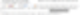
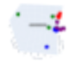

# 제 말 맞져?
**Date:** 2026. 2. 1. 5:00
**Category:** 다이어리
**Original URL:** https://blog.naver.com/xpfkwh56/224167140205
---

​

**1. 결국 기계를 사게 됨**

​

3090 24gb 는 있어야 된다

→ 악마는 디테일에 있음

​

**'최소'** 24gb 라는 것이지,

​

말씀하신 조건을 제가 아는 한

상식 내에서 시도하면 24gb 로는

아마 무리가 있을 확률이 꽤 높음

​

특히, **'모델 학습'** 으로 들어간다면

현실적으로 지금 대안은 둘 입니다

​

1) 임대 **(h100 이상)**

2) 지금이라도 컴퓨터를 산다

​

아마? 말씀하신 정도를 훈련 하려면

발품 나름이겠지만 **20만원 쯤** 할겁니다

​

퀄리티 타협을 한다면 지금으로도 가능,

제 소견으로는 **'일단'** 있는 걸로 하십시오

​

지금은 **'아 있어야 된다네?'** 정도지만,

​

**'경험'** 이 쌓이면 **'시발 이건 사야된다'****​**

가 되는데요, 그게 **진짜 사야 될 때** 입니다

​

2. **이걸 AI로 자동화해보려**

**이것저것 시도해봤는데** 에 관한 훈수

​

포기가 너무 빠릅니다

​

**툴의 한계던가요? 정말**

**해보니까 안 되던건가요?**

​

풍요 속의 빈곤이라고,

​

**'대부분'** 모델이 많으면

​

많으니 골라서 쓰겠다는

생각을 하게 되는데요

​

그건 좋은 접근이 아닙니다

​

마치 스팀에서 게임 하나 하나를

찍먹하고 버리고 찍먹하고 버리다,

​

결국 게임 불감증에 빠지게 되는

원리와 비슷한 결론이 나오게 됨요

​

**3. 궁금한게 있는데 주변에**

**여쭤볼 분이 아무도 없어서**

​

지극히 **정상** 입니다

​

영어를 할 줄 알든, 불란서 말을 할 줄 알든,

고대 인디언 말을 할 줄 알든 상관없이

​

말씀하시는 고민을 같이 하는 사람은

이 세계에 극히 희박할 것이고,

​

그 안에서도 몇 있지도 않습니다

​

저만 해도, 일부 저도 아는 모델 빼고

말씀하신 ㄹXXXㅍ? 진심으로다가

**머리털 나고 처음 들어보는 단어** 입니다

​

**\* 이런 것이 있는 줄도 몰랐음**

​

아는 것이라곤 퀘인 딱 하나 있네요

​

**\* 이건 모를 수가 없죠**

​

본인의 영역을 찾으신 것을 축하드리고,

앞으로 이제 풀어나가시면 됩니다

​

**운이 좋다면**, 비슷한 고민을 하는 사람을

만날 수 있을 것이고 **불운하면** 이 세계에서

유일하게 그 문제를 푸는 인간이 될 겁니다

​

**님 말고는 그거 아무도 모름**

​

> **4. 오픈소스의 장점은**
>
> **사실 쉽게 쓴다가 아닙니다**

**​**

코드를 뜯어볼 수 있다

가 진짜 장점이죠

​

​

오픈소스 텍스트 인코더인데,

3차원 공간 안에서의

임베딩 스페이스 입니다

​

​

위 사진은 4096차원 벡터 공간에서

확인할 수 있는 히트맵 매트릭스 입니다

​

**님 뭐하시는 것?**

​

**'기계'** 가 **'인간의 언어'** 를

어떻게 인식하고 이해하는가?

​

이게 제 호기심 중 하나 입니다

​

**\* 저는 제 비서들과 앞으로 더**

**원활하게 대화하고 싶습니다**

**​**

**외국인 직원 있으면 그 직원의**

**문화나 언어에 관심을 가지듯요**

​

**'동탄룩'** 이라고 했을 때,

아는 사람은 그 단어로부터

자연스럽게 뭔가 떠올립니다

​

근데, 잘 모르는 사람은 동탄?

삼성? 대기업? 이쯤 연결하죠

​

저는 그 원리가 궁금해요

​

직접 파일을 뜯어보세요

그리고 구동 원리를 읽으세요

​

그럼 **'커스텀'** 할 수 있어요

​

**5. 결론**

**​**

저도 몰라요