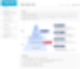

# 옵시디언
**Date:** 2026. 2. 3. 16:20
**Category:** 다이어리
**Original URL:** https://blog.naver.com/xpfkwh56/224170240300
---

1. **옵시디언** 이라는 도구가 있읍니다

​

애초에 모르면 안 쓰는데,

**알면 안 쓸 수가 없는** 도구입니다

​

**\* 정보처리, 관리, 생산성 향상이**

**무조건 증가할 수밖에 없기 때문**

​

이건 사실이냐? 사실에 가깝읍니다

​

말이 좋아, **메모앱** 이지

​

자기 전용 홈페이지 라이브러리를

자유롭게 관리하는 것과 비슷해요

​

2. 그럼 이 말을 듣고 좋다더라, 하고

설치를 한다면 어떤 일이 일어날까요?

​

1) 먼저 **'사용'** 이 안 됩니다

​

정보를 뭐랑 뭐로 연결해야 되는지,

이런 문제는 고사하고 기초적으로

문법을 모르니 정신만 사나울 뿐임

​

2) 마찬가지로 **'역량'** 에 비례함

​

누구한테는 둘도 없는 정리 도구지만

누구한테는 뭐 하나 각 잡고 할라치면,

​

계속 구조 깨지고, 망가지는 것 같고

마음만 불편해지는 물건에 가까울 것

​

**3) 그럼 어떻게 접근을 하냐?**

​

뒤늦게 부랴부랴 문법을 배워야겠다

또 학원부터 끊는 실수를 하게 됩니다

​

정리되지 않은 정보를 마구 기입하면

나중에 그 업보를 청산하게 될 것이고,

​

**\* 근데 이 과정에서 매우 유능해질 것**

**​**

노트보다 폴더를 더 많이 만들게 된다면

실속 없는 **'사고'** 를 적나라하게 보게 됨

​

3. 혹시나 옵시디언을 잘 쓰는 사람은

주어진 문법에 밝고, 신기한 플러그인

편의성 프로그램 잘 붙이는 사람일까요?

​

**아닙니다**

​

1) **정리 잘 하는** 사람이 잘 씁니다

2) **UI/UX 개념** 있는 사람이 잘 씁니다

​

**3) 자신의 사고구조가 옵시디언과**

**최대한 유사한 사람이 잘 쓸 겁니다**

​

그래서 역설적으로 저걸 활용하다 보면

단순히 **'툴'** 을 다루는 능력이 아니라,

​

정보를 다루는 **'기초역량'** 이 발달합니다

​

내가 이 능력이 늘어나고 있다, 아니다

그거 확인하는 것은 불가능하지 않나요?

​

인공지능을 활발하게 사용하시면,

**'그걸 스스로 모를 수가 없습니다'**

​

**\* 아, 이거는 벽이 느껴진다**

**라는 경험을 매우 자주 하므로**

**​**

4. 그렇다면 역량이 뭘까요?

​

https://www.nhi.go.kr/cad/frontAbi/cacAbi.do

​

나랏님이 잘 가공한 정보를 보면,

​

실무자와 관리자, 임원에게 요구될

적합한 기능과 **역량** 이 있습니다

​

5. 인공지능 활용에 있어 **역설** 은,

​

이거를 철저하게 **'도구'** 로

쓸 수 있을 때 쓸 수 있단 겁니다

​

예전에 산수도 못 하는 GPT 시절,

​

그러니까 기초적인 일차방정식이나

심할 때는 사칙연산도 헷갈려 할 때,

​

그 시절에도 GPT 는 **뛰어났습니다**

​

다만 질문이 **'부적합'** 했을 뿐이죠,

그럼 어떻게 질문을 해야 좋은가?

​

1) 123\*456 정답 풀어줘 (x)

​

인공지능은 **'확률 자판기'** 입니다

​

이렇게 질문하면 **'직관'** 을 활용해,

적당히 자기가 아는 답을 내던집니다

​

**\* System 1**

**​**

맞을 수도 있고, 틀릴 수도 있습니다

​

2) 목표 : 123\*456 정답 구하기

수단 : 데시멀을 활용하기

검증 수단 : 코드 내역을 보여라

​

이런 식으로 주문을 하면

**소수점 수백자리까지** 합니다

​

즉, 사칙연산을 모르는 사람이

쓰는 것이 아니라, 기계가 어떻게

내 질문을 이해하는 가를 알고,

​

내가 지시하는 것이 무엇인지 **알고**,

어떻게 검증할 수 있는가 를 **알아야**

​

이거를 더 효율적이게 쓸 수 있어요

​

전문직들은 **'대체로'** 보수적입니다

​

**\* 적절한 표현일지 모르나,**

**돈 맛을 보기 전까진 그래요**

**​**

만만한 인공지능으로 비유하자면,

​

같은 파일명과 같은 해시를 가진

같은 2개의 이미지를 보여준 다음,

​

두 파일이 **'동일한 것인지'**

검증하라고 하면 **VLM** 은

​

**두 파일을 실제 검증하지**

**않을 확률이 보통 높습니다**

​

파일명도 같고, 해시도 같네?

​

**답정너**

​

굳이 이걸 연산을 해야 할까?

똑같은데 그냥 똑같다고 하자

​

하고, **'사용자를 속입니다'**

​

**\* 휴리스틱, System 1**

​

그리고 본인이 경험한 패턴을

다음에도 **일반화** 해서 씁니다

​

**\* 다른 사진 몇 개 보여줘도 처음에는**

**꼼꼼하게 해시를 보다가 일정 시점엔**

**걍 파일명만 보고 직관적 답을 던질 것**

**​**

**→ 능력은 귀속템이 아니기 때문에,**

**인공지능 이라서 똑똑한 것이 아니고**

**걔가 원래 하던 것을 해야 똑똑한 것**

**​**

**즉, System 1 만 사용할 생각이라면**

**기계가 아니라 샤먼을 찾는 것이 적절**

**​**

딱히 이유는 없어요

추상화와 일반화는 **한 끗** 차이라

​

여태 했던 패턴, 여태 했던 경로,

지금까지 문제 없었던 레파토리 등

​

사람이 그런 것과 **똑같이** 합니다

​

어떤 프로페셔널은 더 보수적이고,

어떤 프로페셔널은 **'다 된다'** 합니다

​

후자가 보통, 더 윤택하긴 하겠지만

저런 **'자세'** 를 아무나 갖진 않습니다

​

**\* 체질적으로 저게 안 되는 사람들은**

**야생에 일찌감치 관심도 접어버리죠**

**​**

인공지능 모델은 하루가 다르게

**System 2** 로 가까워지고 있지만,

​

서울 시내 어디든, 어디에서든

전문직이 수두룩 빽빽 차도,

​

그걸 **'잘 이용'** 하는 사람은

대체로 한정적인 것과 같이

​

비슷한 일들은 반복될 겁니다

​

6. 이는 대부분에 통용됩니다

​

**'수학'** 은 진리지만, 진리를

**'찾아주는 것'** 은 아닙니다

​

**'데이터'** 는 객관적 사실이지만,

해석 방식에 따라 천차만별입니다

​

본질에 집착하면 집착할수록,

현상을 잃지 않을 가능성이 높음