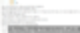
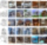
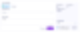

# 스펙
**Date:** 2026. 2. 4. 16:13
**Category:** 다이어리
**Original URL:** https://blog.naver.com/xpfkwh56/224171535037
---

​

1. **컨트롤넷** 이라는 것이 있습니다

​

​

간단히 말하면, **옵션 부착** 입니다

​

​

다양한 방식으로 이미지 생성시,

조건을 통제할 수 있는 기술인데요

​

병렬적으로 2개, 3개 연결도 되고,

1개만 사용해도 됩니다

​

**병렬적으로 2-3개?**

​

1) 외곽선

2) 색감

3) 명암, 깊이감

​

이런 식으로 3개를 넣으면

더 정밀하게 통제할 수 있죠

​

문제는 이 과정이 **연산** 입니다

​

**'최적화'** 를 했다는 전제하에,

깡성능 차이는 따라잡을 수 없고

​

**\* 깡성능 차이 = 남, 녀 근력 차이**

**​**

**고성능 최적화 → 남자 프로 운동선수**

**고성능 비최적 → 남자 아마 운동선수**

**저성능 최적화 → 여자 프로 운동선수**

**저성능 비최적 → 여자 아마 운동선수**

​

높은 연산을 하려면,

​

즉, 더 무거운 것을 들거나

더 빠르게 뛰거나 하려면

​

**그에 맞는 모델을 써야 됩니다**

​

모델의 숫자는 세상에 있는

바벨의 숫자 만큼 많습니다

​

3kg, 5kg, 10kg,

3.5kg, 5.5kg, 10.5kg

​

소수점 5자리, 10자리도 있어요

​

내가 생활체육 레벨에서 최소한

건강관리 하겠다 하면 저바벨도 됨

​

근데 올림픽 나가겠다 하면

태릉급 모델로 운동을 해야 됨

​

집에서 가만히 놀고 있던 아녀자가

500kg 바벨을 들 수는 없겠죠?

​

그래서 고성능 인프라가 필요합니다

​

1660 이면 제 예전 노트북과 같은데,

​

구형 컨트롤넷 3개 정도 섞어 놓으면

10분 이상의 연산이 필요 했었습니다

​

**\* 신형은 가동불가, 혼신의 최적화로**

**2년 이상 지난 모델 2개 정도 사용 가능**

**​**

**2. 맥북에어 스펙만 갖추면 충분하겠죠?**

​

여기에는 중대한 오해가 있습니다

​

1) DA3 GIANTLARGE-1.1

모델은 용량이 **6.76gb** 정돕니다

​

하드에 6.76gb 안 들어가는 컴터?

찾기가 더 어려울 겁니다

​

문제는, 하드에 들어간다는 것과

로드를 한다는 것이 **아예** 다릅니다

​

2) 개발사는 **'모든 하드웨어'** 를

전부 다 호환하게 만들지 않습니다

​

지금 DA3 모델이 2개월 지났고,

12월에는 스트리밍 추론 모델이 나옴

​

근데 DA2 Large 모델도 막상 쓰려면

본인 글카에 맞게 고쳐서 써야 됩니다

​

**\* 나에 맞는 코드를 찾아서 바꿔야 됨**

​

그 과정은 **'딸깍'** 정도 수준이지만,

그렇게 바꿨을 때 어떤 일이 생기냐?

​

이거는 이제 **'알 수 없음'** 입니다

​

개발사는 유한 락스를 팔았어요,

​

그거를 끓여서 쓰면 안 된다 정도는

**열심히 찾아서 배우면** 알 수 있지만

​

우리집 화장실, 세탁실 청소를 할 때

몇 비율로 써야 될진 **내가 찾아야** 됨요

​

청소솔이 뭐냐에 따라서 반응이 다르고,

공간 온도, 오염도 이런 것들이 달라요

​

그래서 **'다'** 알아야 하고, 할 수 있다면

가능한 최대한 **'많이'** 갖춰야 쉽습니다

​

**3. 판례/법률 학습시켜서**

**개인 변호사/법무사 만들기**

​

컴퓨터랑 대화를 하려면, 할 수 있는

최대한 **'낮은 언어'** 로 말해야 됩니다

​

만약 내가 컴퓨터한테

앞머리를 그리게 하고 싶다

​

**어떻게 표현하면 좋을까요?**

​

​

한글로 앞머리를 쓰면

total tokens 33

​

​

영어로 bangs 쓰면

total token 26

​

**26% 정도 차이 납니다**

​

​

Fringe 는 어떨까요?

똑같이 26 토큰 먹네요

​

위와 같은 방식으로 **'같은 표현'** 을 함에 있어서,

**'언어'** 에 따른 차이가 있음을 확인했습니다

​

쉽게 말해, 한글로 지시하면 연봉 +30%

영어로 지시하면 연봉 -30% 싸게 쓴단 뜻

​

이제 리눅스 컨테이너로 확인해보겠습니다

​

T5-BASE 토크나이저를 사용하면

​

bangs 는 3개의 토큰으로 분해됩니다

\_ban, g, s

​

앞머리는

\_, 앞머리 2개 토큰입니다

​

fringe 는 1개 토큰이네요

​

똑같이 **'앞머리'** 그려 라고 할 때,

bangs 를 쓰면 3배 더 씁니다

​

한글은 **'2배'** 밖에 안 되지만,

T5 모델은 한글을 할 줄 모릅니다

​

즉, 이 결론에 따르면

fringe 를 써야 됩니다

​

문제는 fringe 랑 임베딩 된 경로가

대체로 **'처마'** 같은 구조 표현입니다

​

그래서 앞머리에 정확히 연결되는

경로를 본인이 알아내야 됩니다

​

뭐를 쓰면 좋을까요?

만만한 것이 **front hair** 입니다

​

한편 SD CLIP 같은 경우는,

bang 을 1토큰으로 읽습니다

​

CLIP 모델과 Text Encoder 가

서로 다른 메시지를 읽었을 때,

​

무엇에 어떻게 가중되는가?

이런 부분은 **돌려봐야** 압니다

​

판례를 읽히게 할 수는 있는데,

**'어떻게'** 가르칠 것인지에 대한

​

**기본적 도메인 지식** 이 없다면

**'무엇을'** 가르칠지 모르게 됩니다

​

**\* 인공지능 엔지니어**

**몸값이 천정부지인 이유**

​

토크나이저 모델은 1천개가 넘고,

기초를 이루는 원리는 비슷하지만,

​

**'정밀한'** 모델일수록, 미시적입니다

​

즉, 같은 법을 알고 있다고 해도

​

변호사냐, 노무사냐, 세무사냐

좋문가냐, 갓반인이냐, 아예 모르냐

​

그리고 구사하는 언어가 영어냐,

한글이냐, 중국어냐에 따라 다릅니다

​

노무사도 다 같은 노무사가 아니죠

임금 체불이냐, 산재냐 가 다를 것이고,

​

그들은 **'같은 글자'** 도 다르게 읽습니다

​

또한, 그걸 **'아는 것'** 과

**'설계하는 것'** 은 다릅니다

​

**4. 제일 쉽게 시도하는 방법**

​

1) PDF 또는 이미지 모델 안에서

글자를 읽어내는 프로그램이 있음

​

**\* 여기까진 표준적**

**​**

2) 대체로 저성능 모델로도 충분함

1차적으로 텍스트를 추출한 다음에

그 텍스트가 온전히 추출된 것인가?

​

라는 것을 LLM 로 검증할 수 있음

**​**

**\* 여기서부턴 이제 각자도생**

​

3) 그럼 동음이의어나, 유사어 등

각종 다양한 어휘들이 섞여있을 것임

​

법률적으로 적합한 표현과 아닌 표현,

한글의 경우, 맞춤법 이슈가 제일 심각

​

**\* 트릭이라면 먼저 영어로 처리한 다음,**

**연산에 관계없이 출력단만 한글로 하면**

**조금 더 효율적이게 처리할 수는 있는데**

**이게 다른 경우도 되는 줄은 잘 모르겠음**

**​**

그걸 **'정규화'** 라는 것을 해서,

하나로 통합해 분류하는 것을 하면 좋음

​

**\* 안 해도 되긴 하는데, 각자 판단**

**​**

4) 정규화한 텍스트 테이블 안에서,

컴퓨터가 읽을 수 있게 정리한 다음

​

**\* 위의 예시에 의하면 bangs 는**

**text encoder가 읽지 못하므로**

**bangs 라고 해봤자 외계어로 해석**

**​**

**\_ban, g, s 셋을 모두 다르게 임베딩**

**​**

거기에 가중값을 **'직관'** 대로 하거나,

​

**\* 진짜 느낌 말고는 표준이 없음**

​

다양한 실험을 통해서 파악하면 좋음

​

**\* 마찬가지로 안 해도 돌아는 감**

​

**5) 잠깐, 임베딩이 뭔데요?**

​

콜라, 사이다, 오렌지 쥬스

셋 중 가장 이질적인 것은?

​

0.1초 만에 수냉 바이오 장비가

오렌지 쥬스라고 말하게 될 것임

​

**'왜?'**

​

모름, 그냥 이질적임

​

그럼 콜라, 사이다, 오렌지쥬스, 빵

​

이렇게 했을 때,

2 묶음으로 나누면?

​

**음료/비음료**

​

너무 아무렇지도 않게 할 수 있음

​

콜라, 사이다, 포카리

여기까지도 해봄직 한데,

​

콜라, 사이다, 맥콜

​

이제 이러면 좀 헷갈림

​

콜라 ↔ 맥콜

콜라 ↔ 사이다

**​**

**둘 중 뭐가 더 가깝지?**

답은 **상황마다 다르다** 임

​

이게 **임베딩** 임

​

시중에 있는 상용 ai 를 사용할 때,

나에 대한 정보가 많으면 더 많을수록

그에 맞게 적절한 답을 줄 확률이 높음

​

**\* 컨텍스트 윈도우 한계는 있겠지만**

​

내가 최근, 어떤 검색어들을 검색했다

​

그러면 그 값에 더 가중한 다음에

일정 확률로 반응을 하게 될 것임

​

예를 들어, 내가 최근 감기/병원

이렇게 열심히 검색을 했었다면,

​

육아 상담을 하고 있을 때,

​

인공지능이 **'님 애기 아픔?'**

이라고 물어볼 수 있단 것임

​

**\* 의료 정보를 찾더라**

**→ 의료 정보 찾던 사람이**

**육아에 대한 관심을 보인다**

**​**

**아이가 있을 확률이 x%**

**통상 그 나이 애들이 아플 확률 y%**

**칼큘레이션 지이이잉, z%**

​

이걸 하는 것이 **'파인튜닝'** 임

​

6) **'정확한 자료'** 를 선별해냈다면

이제 그걸 **'주관적으로'** 해석한 다음,

​

잘 지시하면 말씀하신 것이 나오게 됨

​

7) 그리고 문제 없이 작동하는 것인지,

​

밖에 팔아먹고 싶으면 호환성 테스트를

내가 쓸 것이면 신뢰성 테스트만 하면 됨

​

어플을 만든다고 쳤을 때,

또는 블로깅을 한다고 쳤을 때,

​

휴대폰에 볼 때, 아이폰에서 볼 때,

갤럭시에서 볼 때, 티비에서 볼 때,

​

어떤 해상도에서 볼 때, 등등 을

더 정밀하게 결정할수록 더 좋듯

​

여기도 마찬가지 내용이 적용 됨

​

그 기준은 어떻게 잡나요?

​

본인이 만약 사회과학자라면 95%

신뢰구간 안에서 돌아가면

충분하다고 맞는다고 할 것이고,

​

본인이 항공기 부품 엔지니어라면

95%? 시발 너 제정신이야? 하겠죠

​

**5. 질문 정리**

​

1) ~하려구요, 맥북에어

스펙만 갖추면 충분 하겠죠?

​

**하기 나름**

​

2) 챗지피티나 제미나이

유료버전 쓰는게 나을까요?

​

**'불가능'**

​

3) 지금 컴퓨터나,

조건으로 가능한가요?

​

사실과 법적 사실을

구분하는 정도인지,

​

이슈를 도출한 다음에

양측의 쟁점을 분리하고

어떤 판단이 필요한 건지,

​

법률 간의 위상을 비교해서

적절성을 파악하는 것인지,

​

경우에 따라 **많이** 다를 듯함

​

**\* 셋은 아예 다른 영역,**

**​**

**관공서, 경찰서, 검찰청,**

**법원, 헌법 재판소, 로펌,**

**개인 사무소가 다른 것처럼**

**​**

그 과정에서, **'필요한 옵션'** 이 있다면

제가 사지 말라고 바짓가랑이를 잡아도

아마 구입하게 되실 가능성이 더 높음