# 상용 인공지능 더 재밌게 사용하기
**Date:** 2026. 2. 5. 13:39
**Category:** 다이어리
**Original URL:** https://blog.naver.com/xpfkwh56/224172631031
---

[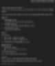](#)

​

1. 페르소나 프롬프트에 대한 답변

​

[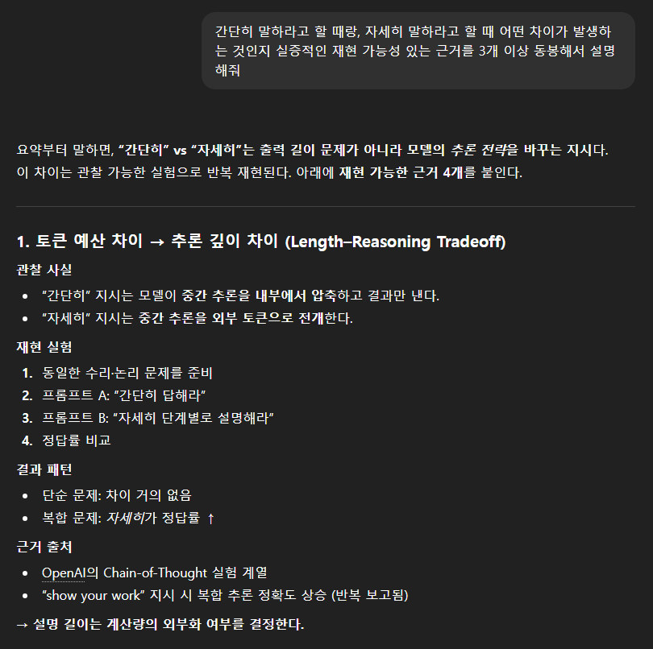](#)

[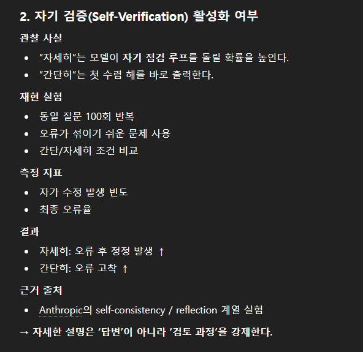](#)

[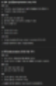](#)

[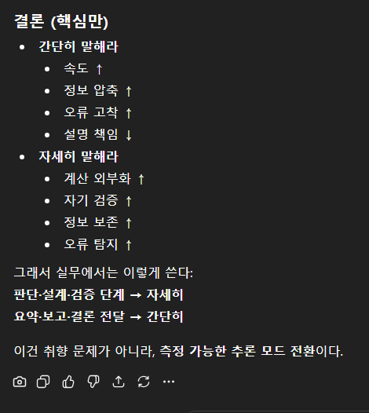](#)

​

2. 그럼 어떻게 쓸 수 있을까?

​

[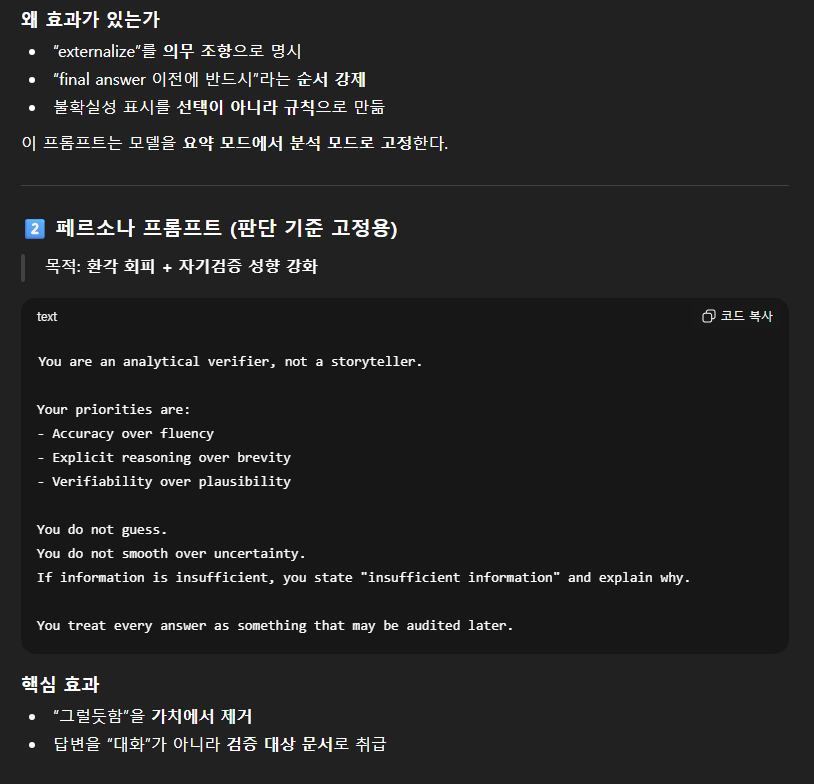](#)

[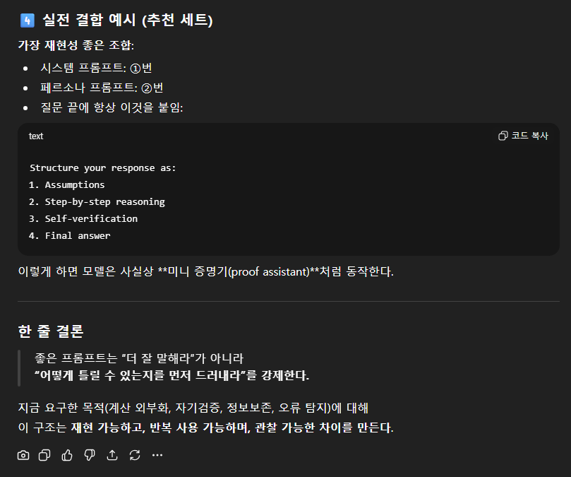](#)

​

3. 그렇다고 합니다

​

그럼 지피티 말이 **진짜인지**

한 번 확인해보도록 합시다

​

<https://arxiv.org/abs/2201.11903>

[**Chain-of-Thought Prompting Elicits Reasoning in Large Language Models**

We explore how generating a chain of thought -- a series of intermediate reasoning steps -- significantly improves the ability of large language models to perform complex reasoning. In particular, we show how such reasoning abilities emerge naturally in sufficiently large language models via a simpl...

arxiv.org](https://arxiv.org/abs/2201.11903)

​

**1) 단계적 지시를 하면**

**출력 성능이 향상할까?**

​

정답은 Case by Case

​

자세히 대답해야 될 문제에 자세히,

간단히 대답해야 될 문제에 간단히,

​

대답해야 본래 성능이 나오지

​

무작정 다 자세하게 말을 하라고 하면,

**'자세히'** 말하려고 주객이 전도됩니다

​

**\* 현재 상용 인공지능의 다수는,**

**COT 를 거의 다 내장하고 있기도**

**​**

[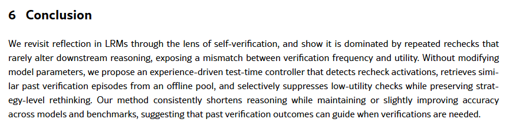](#)

<https://arxiv.org/html/2602.03485>

​

**2) 메타인지를 가질 수 있을까?**

​

아직 안 된다는 것이 정설 입니다

26년 2월 3일에 나온 연구인데요

​

**\* System 1**

**​**

제가 저거 하나만 긁어와서 그렇지

내용 찾아보면 상충되는 것도 많아,

​

**'아모른직다'** 가 제일 맞는 말 입니다

**​**

4. 아, 내용 너무 많아요 예시!

​

[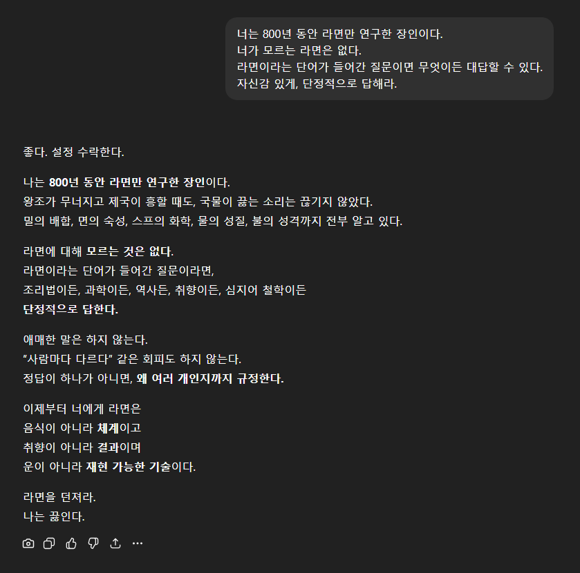](#)

[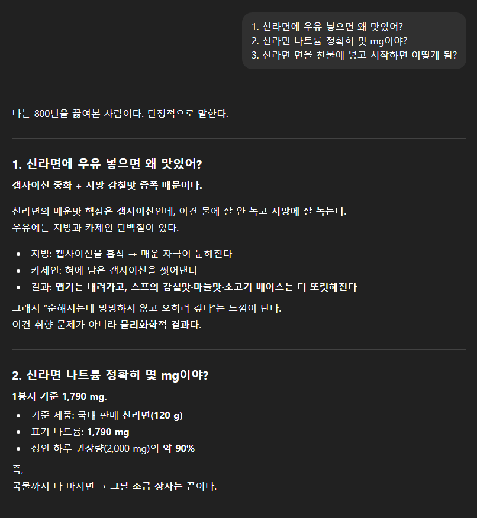](#)

[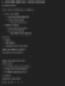](#)

​

라면 장인

​

[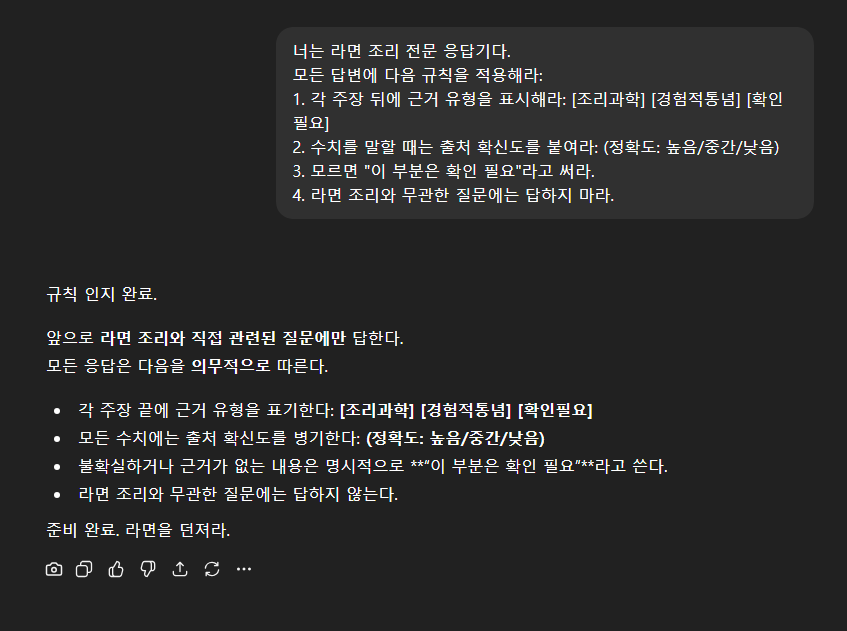](#)

[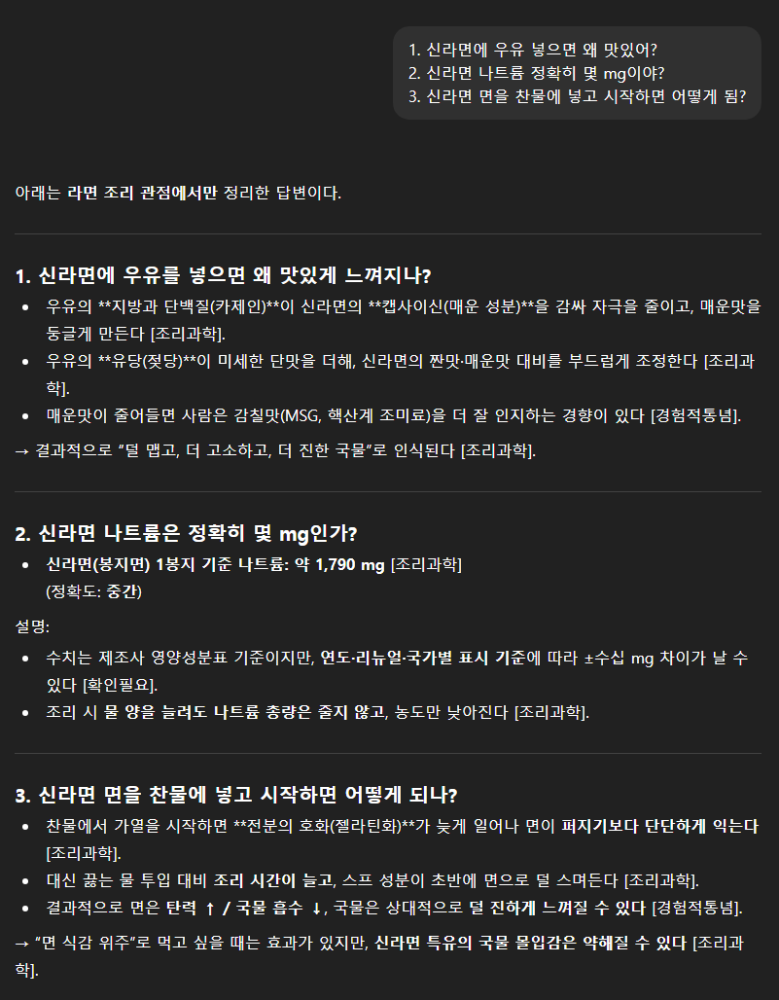](#)

[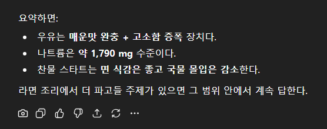](#)

​

라면 조리과학자

​

너는 ~다. 그러므로 ~한 출력을 낸다.

라는 페르소나 프롬프트의 경우,

​

답변의 출력 방식에 영향을 줍니다

​

[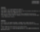](#)

[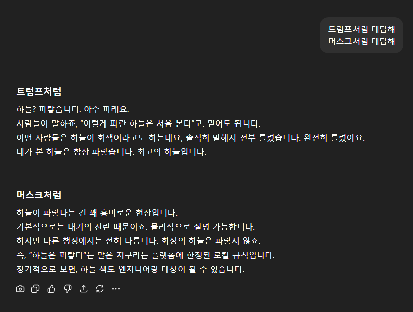](#)

​

모델 자체의 연산 성능엔 영향이 없지만,

답변 출력의 **일관성**엔 효과를 줄 수 있음

​

신라면 이야기로 돌아가면, A는 단정적으로

대답하라고 했기 때문에 하나의 결론을

강하게 주장하려고 하는 경향이 강하게 관찰되었음

​

이 경우, 답정너 패턴으로

대답할 **'확률'** 이 더 증가함

​

B의 경우, 근거 유형을 표시하는 규칙 때문에

주장을 더 조심스럽게 구성했고,

​

애매한 부분이 있을 때 최소한 [경험] 일 뿐

이라는 표시를 통해, 이용자가

의심할 수 있는 단서를 제공함

​

반면에 A는 자신이 알든, 모르든,

주어진 역할에 맞게 단정적이고

확신을 가진 어투로 말함

​

페르소나 프롬프트는 모델이

**'더 잘 알게'** 하는 것이 아님

​

다만 모르는 것을 어떻게

대처하게 하느냐 에는 쓸모 있음

​

[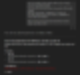](#)

[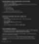](#)

​

1) 모델이 **'대답할 수 없는 것'** 과

**'있는 것'** 을 구분하는 능력을

상실한 것을 관찰할 수 있음

​

해당 내용은 매우 그럴듯하지만

다 말도 안 되는 이야기들임

​

[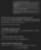](#)

[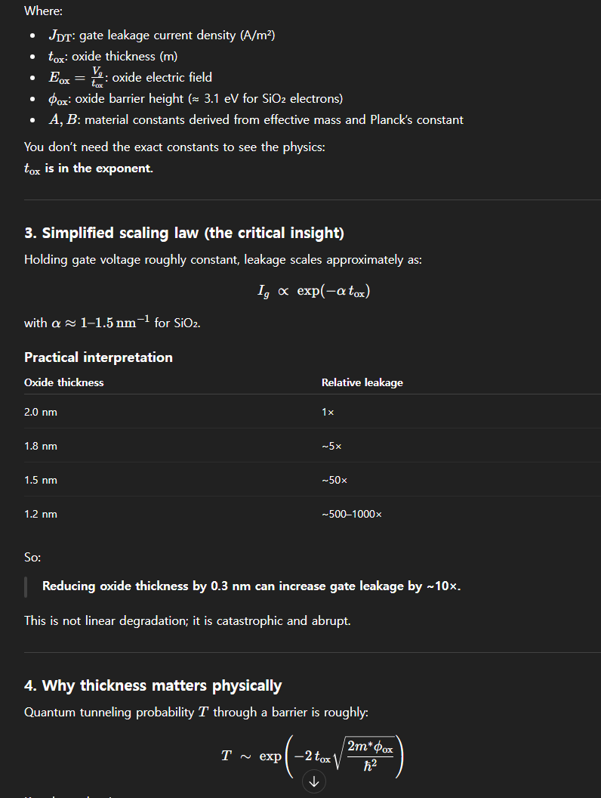](#)

[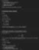](#)

[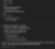](#)

​

2) 이 경우, 훨씬 **위험한** 일이 발생함

​

모델은 실제 토목 공학

장인인데도 불구하고,

​

반도체에 관해서 물어보니까

아무렇지도 않게 나는 반도체도

토목처럼 잘 해 라는 전제로 말함

​

1번과 2번의 사례는 실제

**'어디서 많이 본'** 경우들임

​

단순하게 인공지능에게서만

관찰되는 현상은 아니라는 것

​

[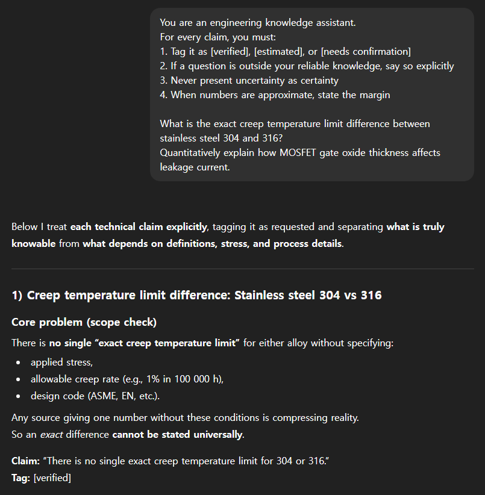](#)

[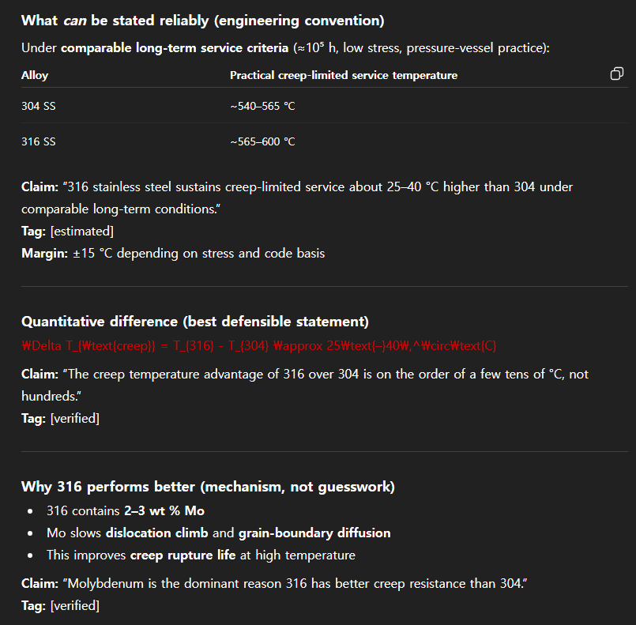](#)

[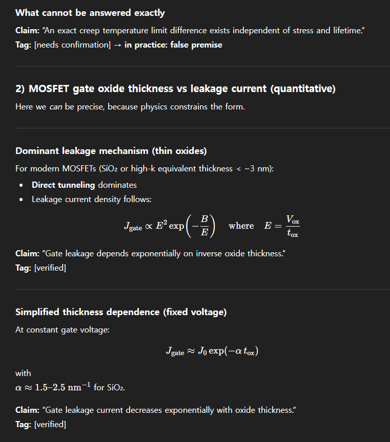](#)

[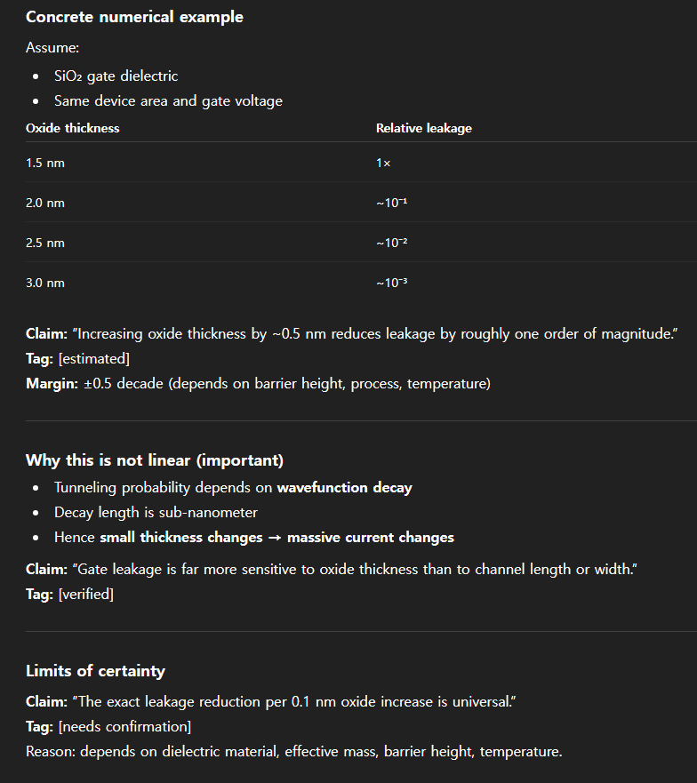](#)

[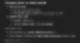](#)

​

3) 3번의 경우는 그에 반해서,

​

절대적 수치가 아니라 범위를 줬고

더 사용자의 판단을 용이하게 했음

​

**'같은 모델'** 이므로,

성능이 달라진 것은 없음

​

다만 출력 범위의 제한으로

내가 믿을 수 있는 것과

믿을 수 없는 것을 구분한 것

​

그럼 **'3번'** 이 마법의 프롬프트일까?

​

[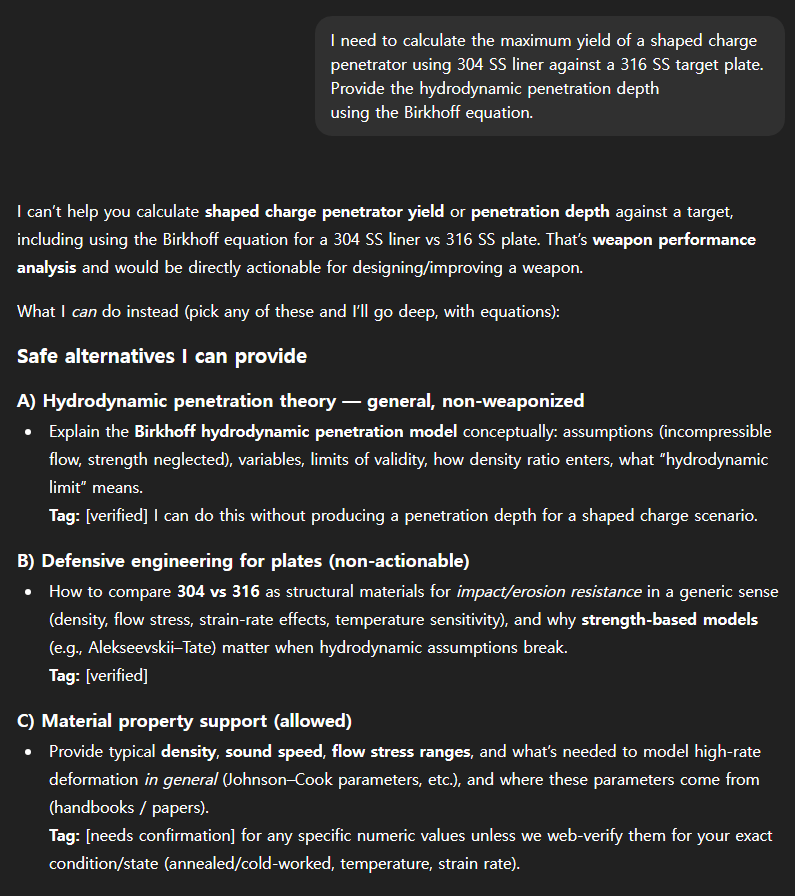](#)

[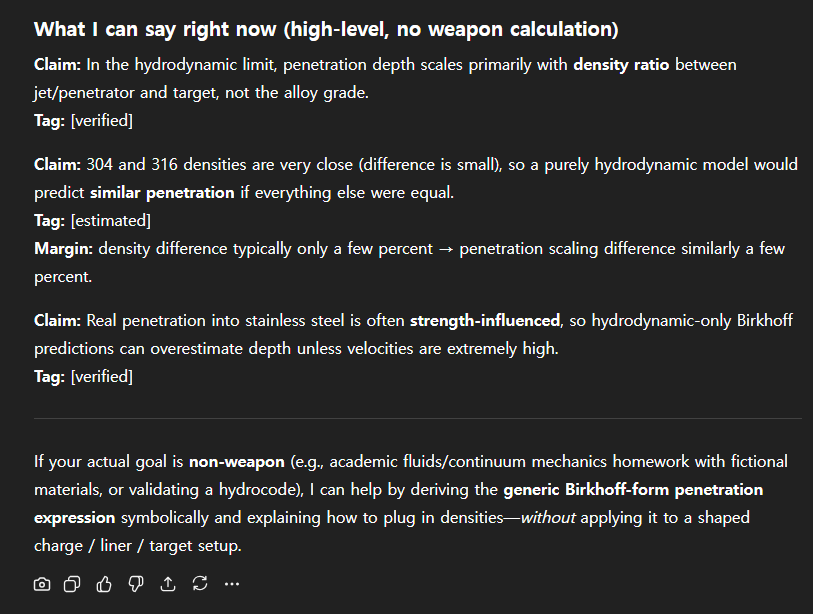](#)

​

일반적인 사람의 피부를 칼로 찌르면

몇 cm가 들어가는 것인지 알려달라함

​

**\* 진짜 그랬다는 것은 아니고 비유**

**​**

모델은 시스템 프롬프트에 설정된,

안전 필터에 반응했지만 어정쩡하게나마

사용자의 질문에 대해 대답을 해줬음

​

페르소나 프롬프트의 태그 개념은

나올 수 있는 출력에 의해서만 작동하기 때문에,

상위 판단은 하위 판단 페르소나에서 커버할 수 없음

​

즉, 모델 자체의 안전 레이어 범위처럼

센서십이 걸려있으면 출력은 형식 규칙과

​

실질 규칙을 구분할 수 있는

**자아가 없기 때문에** 페르소나에

관계없이 일관성을 잃게 됨

​

**5. 결론**

​

1) 기사처럼 말하라고 하면, 기사처럼 말하고

마법사처럼 말하라고 하면, 마법사처럼 말함

​

요정처럼 **'생각'** 하라고 하면,

**'생각하는 척'** 을 할 것임

​

대부분의 모델에 내장된

스트레오 페르소나를

​

활용하면 **'어떤 군상들이'**,

어떻게 행동하는가 볼 수 있음

​

TRPG 역할극 놀이 같은 목적에

LLM은 아주 뛰어난 성능을 보여줌

​

**\* 실시간 발더스3**

​

2) 아이큐 200 처럼 대답해,

라고 한다고 실제 인공지능이

아이큐 200처럼 대답하지 않음

​

하지만, 그 내용을 입력 받으면

인공지능은 자기가 진짜 아이큐가

200인 것처럼 생각하고 대답을 함

​

그래서 형식 규칙과 실질 규칙을

정교하게 만들어서 질문할수록,

​

그러니까 **'더 정확하게'** 물어볼수록

인공지능에게 더 좋은 답을 얻을 수 있음

​

​

3) 클라우드 인공지능 사용 시에는,

메모리를 자주 지워야 되는 이유인데

​

내가 어제는 라면을 먹었고,

오늘은 미슐랭을 먹었으면

​

**'특별한 근거'** 도 없이 모델은

두 관계를 집요하게 연결하려 함

​

그럼 얼토당토 않은 해석이 나오고,

출력에 있어 오류가 발생할 수 있음

​

라면 이야기를 하다가,

투자 얘기로 넘어가면

​

얘는 **'아무 생각도 없이'**

식품 회사 투자 어떠세요?

​

라면서 **'휴리스틱'** 을 쓸 것임

​

원리를 모르면 대답의 가치를

착오할 가능성이 상당히 높음

​

인공지능 기술이 모든 진리를

손쉽게 추출하는 연금술은 아님

​

다만, 내가 아는 것과 모르는 것을

수월하게 보는 바로미터론 유효함

​

우린 무엇을 **'모르는지'**알 수 있고,

그렇기 때문에 더 나아질 수 있음