# 여러가지 눌러보기
**Date:** 2026. 2. 5. 5:20
**Category:** 다이어리
**Original URL:** https://blog.naver.com/xpfkwh56/224172190295
---

[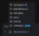](#)

​

제미나이에 보면, 딥 리서치 라는

기능이 있는데 이거를 누른 다음에

​

[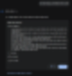](#)

​

이렇게 물어보면,

​

[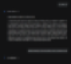](#)

​

군말없이 조사 해줍니다

​

​

사람이면 도망갈 것 같은 짓도,

​

[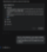](#)

​

군말없이,

​

[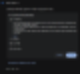](#)

​

도와줍니다

​

[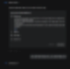](#)

​

적당히 진행 했으면,

​

[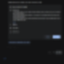](#)

​

연구시작 버튼을 누르고,

​

[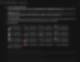](#)

​

기다리면 이렇게 나오는데요

​

[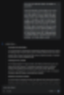](#)

​

기다리는 동안, 저기 있는 키워드를 뽑아서

​

[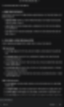](#)

​

[사고 모드] 를 누르고,

​

[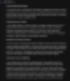](#)

​

위에 접힌 내용을 복사한 다음,

​

[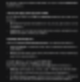](#)

​

물어보면 메타적인 대답도 나옵니다

​

​

다시 딥 리서치로 돌아가서,

​

[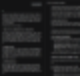](#)

답을 주는 도구로 사용하면 위험한 이유

​

**이 친구가 어떻게 생각하나**, 를 보면

기능을 유용하게 사용할 수 있읍니다

​

제미나이 뿐만 아니라,

눌러보면 뭐가 많을 것임요