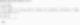

# 음, 제가 감을 잡았음
**Date:** 2026. 2. 5. 4:59
**Category:** 다이어리
**Original URL:** https://blog.naver.com/xpfkwh56/224172183300
---

​

어제 6시 즈음, 본 댓글

​

​

흐음

​

<https://huggingface.co/learn/agents-course/en/unit0/introduction>

[**Welcome to the 🤗 AI Agents Course - Hugging Face Agents Course**

We’re on a journey to advance and democratize artificial intelligence through open source and open science.

huggingface.co](https://huggingface.co/learn/agents-course/en/unit0/introduction)

​

영어 안 되는데요?

​

<https://chromewebstore.google.com/detail/deepl-translate-and-write/cofdbpoegempjloogbagkncekinflcnj?utm_source=deeplcom-en&utm_medium=desktop-web&utm_campaign=pageID1406-d-first-button>

​

회원가입 후, 30일 무료체험

​

**\* 구글 계정 계속 많이 만들면서**

**공짜로 쓰는 방법도 있긴 합니다**

**​**

복붙 하는 것 안 귀찮으면

돈 안 쓰고 해도 무관합니다

​

피차 분야가 빠르기 때문에

​

저런 것을 시작부터 끝까지 쭈욱

보면서 달달 외우는 것은 비추고,

​

보면서 키워드들이 나올 것인데

그거만 선별해서 이거 나 필요하다

​

이거 궁금하다 싶은 것만 골라서

챙겨 먹으면 조금 빨리 갈 수 있고

​

나는 여유를 갖고 차근차근 원한다

그러면 그렇게 해도 상관 없읍니다