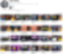

# 조금 더 말랑한 것은 없나요?
**Date:** 2026. 2. 5. 13:57
**Category:** 다이어리
**Original URL:** https://blog.naver.com/xpfkwh56/224172652514
---

<https://www.youtube.com/@leonvanzyl/playlists>

​

회원가입 필요 X

복잡한 절차 필요 X

​

일부 영상 자동더빙 지원

그래도 영어가 안 박힌다

​

그럼 검색어들 찾아가지구,

한국인이 말한 설명을 찾거나

​

<https://lilys.ai/ko/>

[**Summarize Videos, Audio, PDF & Websites - Lilys AI**

Get the best summaries with Lilys AI. Whether it's videos, audio, PDFs, websites, or text, we create the best summary notes.

lilys.ai](https://lilys.ai/ko/)

<https://livewiki.com/ko>

[**라이브위키 | 누구나 유튜브, PDF 핵심 요약을 순식간에!**

길고 복잡한 영상과 PDF, 더 이상 겁내지 마세요. 라이브위키가 빠르고 똑똑하게 요약해 줄게요.

livewiki.com](https://livewiki.com/ko)

​

이런 서비스 찾아서, 내용 빨리 파악하고

내가 필요한 정보를 구해서 읽으면 됩니다

​

**1) 중국인이 답 입니다**

​

세계적인 기술 선도는 모르겠지만,

활용하는 사람은 중국을 뺄 수 없음

​

서구 엘리트들이 연구를 하면,

그걸 중국은 다 상품으로 전환함

​

서구 엘리트 = 기술자

중국 엘리트 = 마케터 같은 느낌

​

**2) 제 3국가들 위주로 찾아보세요**

​

파키스탄, 루마니아, 러시아,

뭐 이런 약간 낯선 국가들에는

​

일찍 기술 배워가지고 유튜브로

강의나 콘텐츠 파는 애들 있는데

​

얘네들이 **'생각보다'** 잘 깎습니다

​

유료 콘텐츠라고 다를 건 크게 없고,

​

**\* 똑같은 내용을 더 편의성 있게**

**전달해서 주는 것인데 개인 연구라**

**가려들을 수 있을 때나 의미 있음**

​

혹시 깃허브나 허깅 페이스 익히면

거기에서 메인 카드도 안 띄워놓고,

**​**

**지 혼자 뭐 열심히 하는 애들** 있는데

제 경험상, 이런 애들이 **알짜** 입니다

​

거기 찾아서 물어보면 **거의** 다 뚫려요

**​**

**\* 애니프사 = 실력자 확률 +60%**

**​**

**3040 연령대에 자기 회사 이름이랑**

**직함 올려놓은 담백한 아저씨 셀카**

**= 실력자 확률 +30%**

​

**뭐야, 이런 언어도 있어?**

**= 실력자 확률 + 15%**

**​**

**인도인, 중국인**

**= 실력자 확률 +100%**

**​**

오픈소스 개발자 저자직강 1:1

Q&A 서비스도 저기서는 됩니다

​

세상 어딜 가서 오픈 AI 엔지니어,

빅테크 인공지능 개발자를 보겠음

​

구경할 일도 없죠

​

아마 전 세계 다 뒤져도

10만명 차마 안 될건데

**​**

**3) 듀얼코어**

​

둘을 동시에 가져가세요

​

하나는 이거 그래서 어떻게 하지?

다음은, 이 사람이 왜 이렇게 가르치지?

왜 이렇게 설명하지? 같은 다른 관점

​

그러면 배우는 속도가 빨라집니다

​

**\* 동기화 속도 = 학습 속도**

**​**

4) 매일 2-4시간씩

유튜브 백그라운드로

​

틀어놓고 각종 억양, 각종 단어,

각종 표현 계속 듣고 있으시면

​

영어를 **못할 수가** 없습니다 ,,

​

하루 이틀이죠 맨날 보는 단어에

맨날 듣는 소린데 어떻게 안 들림