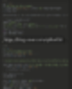
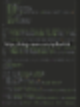
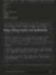
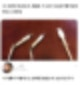

# 클로드 COT 를 활용한 사례
**Date:** 2026. 2. 5. 17:33
**Category:** 다이어리
**Original URL:** https://blog.naver.com/xpfkwh56/224172943353
---

​

답변이 아니고, **'사고 과정'** 입니다

그 어떤 클라우드로도 구조상, 불가

​

**\* 출력 제한**

**일부러 장황하게 떠들게 한 것 아님**

**​**

오퍼스로 했는데 세션이 터졌네요

​

COT 원리 를 활용해서,

질문을 더 정교하게 하면

​

출력을 다르게 쓸 수 있음

​

1) 딸깍딸깍 한다는 말은 구라다

​

그렇게 말하는 사람들의 90% 는

인공지능 성능 **5%** 도 안 쓰는 것

​

**\* 사장이 대충 지시하면**

**직원도 대충 일을 한다**

**​**

**사장이 구체적으로 지시하면**

**직원은 도망을 간다**

**​**

2) 데이터, 모델링, 도메인 지식

​

코딩, 수학, 영어는 수단에 불과하고

진짜 **'차이'** 를 만드는 것은 저 셋 임

​

저 셋을 간단하게 일상어로 표현하면?

​

노가다(디테일) + 직관 + 경험

​

**\* 셋 다 배울 수 없음**

**​**

이게 인공지능을 다룰수록

**'역량'** 이 발달하는 이유 임

​

**그럼 회사는 왜 출력 제한을 둘까요?**

​

그렇게 좋은 성능이 있으면,

한 번에 잘 나오게 하면 되는데!

​

​

이걸 **'사는 입장'** 말고,

**'파는 입장'** 에서 보세요

​

묻는 이가 틀려야 또 물어보고,

버그가 나야 또 쓸 것 아님니까맠ㅋ