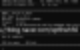

# 단기에 개발 실력 늘리는 법
**Date:** 2026. 2. 6. 18:10
**Category:** 다이어리
**Original URL:** https://blog.naver.com/xpfkwh56/224174286593
---

​

1. 이걸 쓰면, **'진짜'** 성능이 좋아지나?

​

2. 어떤 원리로 성능이 좋아지는 것이지?

어떻게 하면 그 성능을 측정할 수 있을까?

​

같은 조건에서 동일한 일을 시켜보고,

누가 더 빨리, 정확히 하나 체크를 하자

​

**빨리, 정확히** 는 어떻게 기준을 잡을까?

​

3. 이게 더 정확한 것 같아,

이게 더 빠른 것 같아 많이 생각

​

4. 지금 이 수치가 **'맞는 측정'** 인가?

오차는 없나? 더 필요한 정보는 없나?

​

믿을 수 있는 건가? 확실한가?

내가 놓친 부분은 없나?

​

**\* 어디서 멈춰야 하지?**

**​**

5. 매번 껐다 켰다 하기 귀찮네,

연속해서 쓸 수 있도록 만들자

​

글자로 보니까 영 불편하네

표로 만들어서 나오게 하자

​

표도 보기에 불편하네,

시각화 이미지로 바꾸자

​

...

​

이거도 있으면 좋겠는데?

저거도 있으면 좋겠는데?

​

이건 이렇게 해야겠는데?

​

**\* 평생 가도 해결 안 남**

**​**

**GUI 로 구현 한다면 아마?**

**3개월은 더 박아야 될 것**

​

6. 아, 그래도 이 쯤이면

일단 내가 쓰기엔 괜찮겠다

​

**\* 누더기**

​

저거는 이렇게 구현할 것이 아니라,

이렇게 구현하는 것이 나을 듯한데 ,,

​

**\* 컴터 앞에만 있을 수 없으니**

**나는 본래 내 할 일 하면서**

**버릴 코드, 남길 코드 생각**

​

7. 붙들고 있다가, 이건 아니다

​

이건 오버 엔지니어링 이다

이건 진짜 여기서 **멈춰야 된다**

​

라는 생각 들면 스돕하고,

남들이 만든 것 뜯어서 구경

​

나는 이렇게 했는데,

쟤는 저렇게 했네?

​

1) 저는 구조체 메모리 불러오는 것보다

그냥 직접 오프셋 입력하는 것이 **쉬워서**

​

당연히 내가 직접 기재할 불편은 있지만

훨씬 더 가볍고 빠르게 구현을 해냈음

​

2) 상용 제품들은 oc가 파일명에 안 떴음

그러면 내가 측정하는 실험 지표를 볼 때,

​

물론 추출해서 바로 봐도 크게 상관 없지만

그냥 파일명 슥 보면서 아 내가 저 설정에서

​

저렇게 했을 때, 이런 결과가 나왔구나 를

보는 것이 저는 더 **편했기** 때문에 저렇게 함

​

8. 이렇게 하면 **'개발'** 을

잘 할 수 있는 진 모르겠지만

​

내 문제를 해결할 수 있는

하나의 도구는 확실히

빠르게 얻을 수 있음

​

**질문 자체가 다름**,

​

파이썬 어떻게 해요? (x)

​

나는 내 컴퓨터 온도를

내가 직접 재지 않고,

누가 알아서 재줬음 좋겠 (o)

​

한전에서 고시한 전기세 기준으로,

내가 컴퓨터 쓸 때마다 1초에 대체

얼마의 돈을 쓰나 계산해주면 좋겠다

​

**→ 있나? 찾아보고, 없으면? 이제 ,,**

​

전자는 파이썬을 배워야 하지만

후자는 온도만 재면 뭐든 상관 X

​

**하필** 그게 되는 것이 저거일 뿐

​

주식을 하려고 주식을 하고,

사업을 하려고 사업하는 사람 없음

​

결국 돈을 벌기 위한 목적인 것이고,

그 안에서 자기 기준에 맞게 행동하면

당연한 행동의 당연한 결과가 나옴