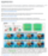
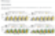
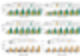
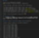
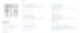

# 따거가 뭐에요?
**Date:** 2026. 2. 6. 17:28
**Category:** 다이어리
**Original URL:** https://blog.naver.com/xpfkwh56/224174236990
---

<https://github.com/thu-ml/SageAttention>

[**GitHub - thu-ml/SageAttention: [ICLR2025, ICML2025, NeurIPS2025 Spotlight] Quantized Attention achieves speedup of 2-5x compared to FlashAttention, without losing end-to-end metrics across language, image, and video models.**

[ICLR2025, ICML2025, NeurIPS2025 Spotlight] Quantized Attention achieves speedup of 2-5x compared to FlashAttention, without losing end-to-end metrics across language, image, and video models. - th...

github.com](https://github.com/thu-ml/SageAttention)

​

**1. 세이지 어텐션**

​

​

칭화대 연구팀에서, 품질을 손해보고

몇 배 더 빠르게 결과를 얻을 수 있는

최적화 기술에 대해서 연구 발표를 함

​

​

똑같은 글카를 갖고 쓰는데,

**적어도 2배 이상 많으면 5배**

​

속도를 곱하기로 올려버리니까,

이걸 안 쓸래야 안 쓸 수가 없음

​

사진에 보이는 arxiv.org 가 논문이고,

하단에 있는 것이 **'나 이거 했어'** 임

​

우리가 익히 아는 형태로 예를 들면,

​

1) 이렇게 이렇게 하면 돈 법니다

2) 보세요! 이게 제 계좌 입니다!

​

같은 구성으로 이루어진 것에 불과함

​

**그럼 무슨 생각이 들겠음?**

​

진짜 되나? 나도 해볼까? 이듯이,

여기도 마찬가지로 시도할 수 있음

​

​

무난한 벤치 세팅값을 잡고,

파이썬을 통해서 프로그래밍

​

그 다음, 실제 벤치를 굴리면

​

​

세이지 모델이 적게는 3배,

많으면 5배 정도 속도가 빠르고

​

품질은 원본과 거의 차이가 없음을

내가 직접 실험으로 확인할 수 있음

​

**\* 재현 가능성**

​

소수점 **4단위 오차**를 **손해**보고,

속도는 3-5배를 더 가져가는 것임

​

**\* 물론 실험 조건이 좀 다르긴 함**

**​**

2. 문제는, **'쟤네가 활용하는 법'** 과

**'내가 활용하는 법'** 의 차이에서 발생함

​

​

어느 따거가, 세이지 어텐션을

윈도우에서 쉽게 돌릴 수 있고,

​

버전이 맞지 않아도 쓸 수 있는

방법을 찾아내서 깃에 올렸음

​

<https://huggingface.co/Wildminder/AI-windows-whl>

[**Wildminder/AI-windows-whl · Hugging Face**

We’re on a journey to advance and democratize artificial intelligence through open source and open science.

huggingface.co](https://huggingface.co/Wildminder/AI-windows-whl)

​

그걸 보고, 어떤 사람이

여기저기 찾을 것이 아니라

​

이거 한 곳에서 보면 더 편하겠다

하고 그걸 모아놓는 걸 만들었음

​

<https://github.com/mengqin/SageAttention>

[**GitHub - mengqin/SageAttention: [ICLR2025, ICML2025, NeurIPS2025 Spotlight] Quantized Attention achieves speedup of 2-5x compared to FlashAttention, without losing end-to-end metrics across language, image, and video models.**

[ICLR2025, ICML2025, NeurIPS2025 Spotlight] Quantized Attention achieves speedup of 2-5x compared to FlashAttention, without losing end-to-end metrics across language, image, and video models. - me...

github.com](https://github.com/mengqin/SageAttention)

<https://github.com/mobcat40/>

[**mobcat40 - Overview**

Software Architect. mobcat40 has 5 repositories available. Follow their code on GitHub.

github.com](https://github.com/mobcat40/)

​

SA 2.2 는 sm120

네이티브 커널이 없음

​

sm89 커널을 sm120 으로

크로스컴파일하여 사용하는 것임

​

실제 직접 휠 파일을 다운 받아서

메타 데이터를 읽어보면 확인 됨

​

**\* 직접 빌드도 가능**

**​**

2명의 따거가 기존 모델을 개선해서,

디버깅을 하고 문제점을 개선해냈음

​

다 올릴 수는 없지만 이 과정에서

깃 프로필로 애니프사 걸어놓고,

​

땡땡 대학교, 땡땡 연구실,

땡땡 스타트업, 땡땡 기업 소속

​

이라는 사람들도 여기에 참여함

​

그러면 이제 네이버나 구글에서,

세이지가 뭐임? 어케 까는 것임?

​

ㅇㅇ 그거 여기 가서 깔면 됨

이라는 식으로 이용하게 되는 것

​

2. 메타에서 만든 기술이

xformer 라는 것임

​

마찬가지 최적화 기술인데,

​

과거 파이토치 환경이 나빴을 때

획기적으로 좋아서 많이 썼었음

​

근데 pip install xformers

==0.0.35.dev1120

​

라고, nightly ver 받으면

​

**분명 자기들이** 2.10 지원이라고

공지에 써놨으면서 실제 돌리면,

​

해당 기능이 누락된 것을 볼 수 있음

​

그리고 메타 연구실에 있는 사람이

우리 지금 커널 지원할 시간이 없어서

​

그거 하려면 아직 멀었음 ㅇㅇ

이라고 직접 글을 쓰기도 했음

​

**\* 쓰고 싶으면 주석 처리해서,**

**해당 부분을 누락 시켜서 써야 됨**

​

얘네 입장에선 h100 같은

짱짱한 글카 굴리는 기술이 좋지,

​

**저런 기술에 집착할 이유 없어서** 임

​

그리고 같은 최적화 기술인데도,

​

어떤 사람은 된다, 안 된다

이러니 되더라, 저러니 되더라

​

사람마다 다 말이 **전부** 다른데,

​

내가 했던 것처럼 직접 내 환경에서

내가 직접 굴려보면 차이 알 수 있음

​

**3. 결론**

​

뭐 다운 받아요? (x)

​

해봐야 압니다