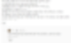

# 시간의 제약과 돈의 제약
**Date:** 2026. 2. 6. 16:39
**Category:** 다이어리
**Original URL:** https://blog.naver.com/xpfkwh56/224174167379
---

​

돈의 제약은 생각 하시는 것보다?

그렇게 크지 않을 수도 있어요

​

**\* 물론 욕심이 있다, 라는 관점에선**

**로컬 말고는 답이 없단 판단은 여전함**

**​**

<https://www.ptt.cc/bbs/index.html>

[**熱門看板 - 批踢踢實業坊**

Gossiping 5715 綜合 ◎[八翻] 小胖老師ＲＩＰ Stock 4116 學術 ◎[股票] 股票板 C\_Chat 2597 閒談 ◎[希洽] 邦邦2場對邦 in Taipei ! NBA 2122 NBA. ◎[NBA] 板主募集開始收件 Baseball 2016 棒球 ◎[棒球] 新年快樂外出跨年平安開心 LoL 658 遊戲 ◎[LoL] HLE放假/LR擊敗G2 HatePolitics 589 Hate ◎[政黑] 不要拿悲劇開玩笑 Lifeismoney 536 省錢 ◎[省錢] 省錢板 home-sale 315 房屋 ◎[房版] 請詳閱新板規避免違規 car 286...

www.ptt.cc](https://www.ptt.cc/bbs/index.html)

<https://thetawave.ai/ko>

[**Thetawave AI – Best AI Note Taker for College Students**

10배 더 빠르게 배우세요, ThetaWave 배우기 싫은 것을 즐길 수 있는 형식으로 바꾸세요. 실시간으로 강의 노트를 캡처하고 오디오, 텍스트, 파일 및 YouTube 비디오를 형식화된 노트, 마인드맵, 퀴즈, 플래시카드, 팟캐스트 등으로 손쉽게 변환하세요. 무료 사용 전 세계 대학의 학생들이 신뢰합니다

thetawave.ai](https://thetawave.ai/ko)

​

2개의 **도메인** 모델입니다

​

**\* 프로바나나, 지피티**

**요약과 비교해보세요**

**​**

평범한 직장인이라고 하셨는데,

​

아마 저 둘만 해도

쓰실 일이 있을 수 있고,

​

쓰고 안 쓰고는 큰 차이가 있을 것

​

하나는 이미지를 다루고,

하나는 글, 정보를 다룹니다

​

인공지능 파트는

마치 모바일 게임 같아서,

​

3천원 9천원만 결제해도

안 쓰는 것보다 차이가 큽니다

​

**\* 아주 큽니다**

**​**

어려운 것은,

​

주어진 자원을 얼마나

효율적이게 집행하느냐

​

알고 쓰냐, 모르고 쓰냐 차이

​

무료, 유료, 도메인, 블라블라

그거는 그대로 밟으란 것 아님

​

총체적으로 사고할 때 쓰는 것

​

x값을 구하려는 사람과

방정식 = 미지수, 해 구하기

​

라는 것을 구분하는 사람은

문제를 보는 눈이 다를 겁니다