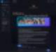

# 너무 재밌음
**Date:** 2026. 2. 8. 1:29
**Category:** 다이어리
**Original URL:** https://blog.naver.com/xpfkwh56/224175647043
---

Qwen3-VL-30B-A3B-AWQ-16.67GB

​

프론트엔드 페이지 만들어서,

​

서버 연결해서 사용하면,

전용 VLM 스튜디오 나옴

​

아, 이거 불편한데?

​

하면 그 자리에서 바로

기능 추가하면 되고,

​

색감이 별론데? 하면

디자인 바꿔쓰면 되고,

​

이거 있으면 편할 것 같은데?

하면 추가해서 쓰면 그만

​

무슨 프로그램 좋아요? 는

로칼에서 의미가 없어요

​

본인이 상상하고, 기획하고,

구상할 수 있는 만큼이 한계임