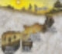
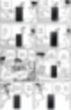
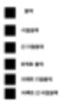

# 닭 잡는 칼과 소 잡는 칼
**Date:** 2026. 2. 10. 12:19
**Category:** 다이어리
**Original URL:** https://blog.naver.com/xpfkwh56/224178550010
---

<https://github.com/facebookresearch/sam3>

[**GitHub - facebookresearch/sam3: The repository provides code for running inference and finetuning with the Meta Segment Anything Model 3 (SAM 3), links for downloading the trained model checkpoints, and example notebooks that show how to use the model.**

The repository provides code for running inference and finetuning with the Meta Segment Anything Model 3 (SAM 3), links for downloading the trained model checkpoints, and example notebooks that sho...

github.com](https://github.com/facebookresearch/sam3)

**​**

1. 메타 리서치에서

연구한 Sam3 라고 있음

​

Sam3는 PCS 라고 하는

패러다임을 제시했는데,

​

Sam1에서 Sam3 까지

얘네가 무슨 장애를 겪고,

​

그걸 어떻게 개선했고,

각자 목적과 쓰임이 뭔지,

​

자세한 것은 검색하면 나옴

​

모든 것을 sam3 로

해결하면 안 되나요?

​

자원이 **엄청 많으면** 가능

​

쿠팡, 다이소 안 쓰고 달달이 집에서

사소한 모든 것들을 편의점 가서 산다

​

뭐 이런 느낌으로 쓰고 싶으면,

그래도 되는데 **비효율적** 일 것임

​

극단적이지만 쉬운 예시를 들자면,

​

상용 인공지능 서비스들은

**컷 오프 시점** 이란 개념이 있음

​

24년, 25년 이렇게 잘랐으면

그 시점 정보까지는 갖고 있는데,

이후 정보는 업뎃이 안 된 것임

​

그래서 사용자가 최신 정보를 원해?

​

가볍게는 오늘 날짜를 알려주거나

어디 있는 정보를 참고하라 해야 됨

​

**'알아서'** 하게 할 순 없을까?

​

사람을 앉혀놓고 이걸 지시하는 것임

​

어제랑 오늘 세상이

바뀐 것을 전부 알아와

​

이거 일주일만 시켜도, 컴퓨팅 성능이

어지간한 산업용으로는 **답이 없음**

​

2. Qwen3-VL-30B

A3B-AWQ, 16.67GB

​

제가 사용하는 VLM 중 하나임

​

얘가 뭘 할 수 있나요?

​

아주 쉽게 말하면 이미지나, 비디오,

시각적인 무언가를 입력해주게 되면

그걸 **'읽고'** 이야기하는 것이 가능함

​

**여기서 문제가 생김**

​

sam3 로 풀비디오 옵션 달고,

연산 돌리면 32gb 전부 써야됨

​

근데 **'구분'** 만 한다고 끝이냐?

구분을 했으면 해석도 해야 됨

​

병렬로 처리하냐, 직렬로 처리하냐,

구분한 대상들을 어찌 활용하냐,

같은 문제는 이후로 차치하더라도,

​

선, 명암, 세그먼트 단위 대상 등을

하나씩 조절하면 **매 집행마다** 먹음

​

**\* 적어도 내 돈으론 해결할 수가 없음**

**30B 비양자화 = Vram 60gb**

**​**

왼쪽에 있냐, 오른쪽에 있냐?

라는 것을 **'자주'** 헷갈려 하는데

​

이걸 풀고 싶으면 70B 에서

100B 사이 모델을 쓰면 풀림

​

70B 는 Vram 140gb

100B 면 Vram 200gb 임

​

모델이 멍청하다

→ 더 큰 모델 필요?

​

**답을 풀기 전에는, 애초에**

**답이 있나부터 아는 것이 순서**

**​**

집을 연구실로 꾸며야 될까 말까고,

​

Vram 200gb 집에서 굴리려면

지붕에 태양광이라도 붙여놔야 됨

​

**\* 서버 관리하는 직원도 두고**

​

3. 근데 저는 저거 안 쓰고도,

17gb 만으로도 본래 모델에서

​

좌우 구분, 저해상도 고해상도에서

위치 정보를 불러오고, 그걸 통해서

저연산 마스킹까지 하게 만들었음

​

일단 이걸 설명하려면 또 말이 좀 길어짐

​

1) 컨트롤넷 이란 것이 있음

​

포즈, 깊이, 외곽선, 색감, 등을

지정해서 제어할 수 있는 모듈임

​

이걸 사용하면 내가 어떤 깊이감,

어떤 형태감, 어떤 색감 등으로

마치 필터를 씌운 것처럼 쓸 수 있씀

​

2) 1개만 쓸 때는 문제가 안 됨

​

근데 1step 에는 A 포즈

2 step 에는 B 포즈 또는

​

포즈 + 명암,

명암 + 색감 등으로

​

복합해서 사용하려면

컨디셔닝이 혼합됨

​

그래서 방법이 다양함

​

**\* 알려진 방식**

​

3) 하나는 그냥 1개만 쓰는 것임

​

복합 연산 모델이 있는 줄 모르겠지만

본인이 기존 엔진을 커스텀해서 쓰면 됨

​

**\* 능력이 된다면**

**​**

다음은, 직렬로 연결하고

컨디셔닝 패러미터 조정

​

**\* 합산 연산값은 비선형값이라**

**정확하게 제어하는 것이 불가능**

**​**

**단, 샘플링과 수치해석을 통해서**

**불확실하지만 거의 유사치는 가능**

**​**

다음은 파이프라인을 구분해서,

직렬이지만 병렬처럼 트릭 쓰는 것

​

여기서 만만하게 할 수 있는 것이

2번과 3번의 선택지인데, 2번의 경우

​

이미지 또는 비디오마다 차이가 있고,

3번의 경우, 파이프라인이

복잡하고 길어지는 문제가 생김

​

**\* 매 공정이 구분되므로**

**​**

**'제 상황'** 에서는 방법이 필요했음

​

**\* 이 컨텍스트를 다 설명하려면 너무 ,,**

**​**

**어케햇누?**

​

VLM 은 **'기계'** 임

​

인간은 왼쪽인지, 오른쪽인지,

이게 가려진 것인지, 아닌 것인지,

흰색인지, 빨간색인지 걍 구분함

​

근데 얘네는 그걸

**'패턴'** 으로 알 뿐임

​

조금 더 구체적으로 설명함

​

**\* 이런 것이 이제 도메인 지식**

​

​

**'검은색'** 이 뭐임?

​

​

다 똑같은 검정 아님?

​

​

아님

​

​

**쓴다** 가 아니고, 입장을 바꿔

이걸 **설계** 한다고 생각하면 됨

​

밤에 보는 검정과 낮에 보는 검정과

쿨톤 조명이 있을 때 검정과,

웜톤 조명이 있을 때 검정이 다름

​

RGB, HEX, HSL 로 표준화 하면

분명 뭔 색깔 이라는 것이 존재하나,

​

그 모든 색깔을 다 일일히 입력해서

연산하게 하는 것은 실익이 별로 없음

​

여기서 쓸 수 있는 것이

**'이데아'** 개념임

​

빨강색이 무엇이냐? 정의해라,

하면 사람은 그걸 정의할 수 없지만

​

우리는 무엇이 빨갛냐, 빨갛지 않냐

라는 고유한 개념으로 기억해 활용함

​

대부분의 VLM 모델은 같은 방식으로

수만, 수십만 장의 이미지를 보여주고,

​

그 **'패턴'** 을 학습한 상태로 있음

​

확실한 것과 불확실한 것을 구분하면,

구조적으로 어떤 값이 임베딩 된 상태로

기계가 번역하는가는 **'알 수 없지만'**,

​

**얘가 어떻게 인식하는 것인가?** 는

이해를 가져간 상태로 하는 것이 됨

​

**\* 데이터와 모델링이 전부인 이유**

​

4. 그럼 여기서 발상을

더 가져갈 수 없을까?

​

만약에 확실한 것이 무엇이고,

불확실한 것이 무엇인지 안다면?

​

**2D/3D 마커 공간인식 벤치 점수 (x)**

공간을 어떻게 인식하는가? (o)

​

**\* 정확한 숫자는 알 수 없지만,**

**대체로는 이렇게 학습할 것이다**

**​**

사물 A가 있고, 사물 B가 있음

​

우리는 A가 왼쪽에 있다를 알고,

B가 오른쪽에 있다는 것은 알지만

좌우는 동적 정보로, 계속 변화함

​

제 아이디어는 학습 과정에 있어서,

​

위치값 좌표를 정해서 배운

모델을 찾는 것이었음

​

이 역시, 사실 일상적인 방식인데

하버드 로스쿨 졸업한 사람보다,

​

**\* 하버드 로스쿨 졸업한 사람이**

**미국법은 한국 변호사보다 잘 알겠지만**

**국내 실정은 더 어두울 확률이 높다**

**​**

나는 한국 법에 밝은 국내 로스쿨 변호사,

그리고 국내 로스쿨 변호사 중에서,

내 목적에 맞는 사람을 찾는 것과 같음

​

그냥 단순한 감기 몸살에 걸렸는데,

3개월씩 대기하면서 대학병원 진료를

빅5 까지 가서 받을 필요는 없는 것임

​

그래서 여러 목적을 고려했을 때,

해당 모델이 내 상황에 적합함을 찾음

​

그 다음은, vlm 에게 이렇게 지시함

​

Output format:

{

"landmarks": {

"A": [x, y],

"B": [x, y],

},

"regions": {

"C": "a, b, c, K1+ words.",

"D": "d, e, f, K2+ words.", words."

},

"objects": [{"name": "...", "position": [x,y]}]

}

​

**이뭔씹 ,,**

​

자연어로 뭐 찾아, 라고 하는 것보다

저렇게 했을 때, **'훨씬'** 더 잘 찾아냄

​

랜드마크를 지정하고, 해당 좌표값에서

박스를 쓰든, 지역값 변수 설정을 하든,

​

**\* object: [200, 100, 500, 400]**

**What is inside {"bbox\_2d":**

**[200, 100, 500, 400]}?**

**​**

각 값을 뽑아낸 다음에,

object 를 동적으로 읽게 하면

​

내가 전부 지시하지 않아도

절대 좌표값을 인식한 상태로

해당 정보를 정규화 할 수 있음

​

**\* 20개를 뽑아라, 30개를 뽑아라**

**​**

뽑아낸 각 데이터를 필터링 하고,

임베딩된 값을 **'기준'** 잡아서 쓰면

​

내 목적과 쓰임에 맞게 쓰겠다

라는 것이 제 아이디어 였고,

​

**\* 2+ Step**

**​**

몇 번의 실험을 통해서 확인한 후,

기술 문서를 찾아보니 내용이 없었음

​

**\* 오픈소스 = 공짜지만, 정보는 비밀**

​

다른 모델에도 통하냐? **모름**

​

안 해봤으니까

​

5. 절대 좌표값을 기준으로,

​

생성 정보의 패치 모델을 추론해

상대적 위치 정보값을 뽑은 다음,

​

전처리 정보와 후처리 정보 사이에

연결 관계에 대해서 가설을 세웠음

​

예를 들어, 특정 오브젝트가

**'바람에 날린다고'** 한다면,

​

굉장히 어려운 물리 엔진을 돌려야

간신히 여기에 닿는 것이 가능한데,

​

**\* 유체는 신의 영역**

​

외곽 좌표를 4개가 아니라 각 중심에

1개씩 추가해서

​

. . .

. .

. . .

​

점을 4 → 9 로 바꾸면, 아마도

더 민감한 연산을 할 수 있을 것이다

​

라는 생각으로 정보를 찾기 시작했고,

나랑 **똑같은 고민을 하던 따거** 를 찾음

​

따거를 통해, 내 고민이 박스 문제가 아니라

폴리곤 닷 최적화 문제라는 것을 알아냈고,

​

**\* 정해서 하지 말고, 각 점의 변화량을**

**계산해서 재조정 하면 cpu 도 쓸 수 있다**

**​**

**이렇게 하면 오프로드 병목이 안 걸린다!**

**산수 잘 하면 돈을 덜 써도 문제가 풀린다!**

**​**

데이터 학습에 있어서는 통상 32-64

비정밀 정형 데이터는 128 이하로 쓴다

​

까지 알아낸 다음, 다시 실험을 시작했음

​

개발사가 몇 개로 학습을 시켰나는

거기 취직하기 전까진, 알 수 없지만

​

16개 에서 오차율과 연산의

스윗 스팟임을 확인했고,

​

자주 사용하는 오브젝트들의 값을 찾음

​

프리셋으로 몇 가지는 뽑아놓고,

만들면서 알게 된 정보들을 바탕으로

​

내가 의도한 형태의 변화 마다,

**'대강'** 이렇게 하겠다 통밥이 잡힘

​

그래서 비연산 17gb 모델만으로

원래는 최소 60gb 이상 쓸 것을 품

​

**6. 그래서 저거로 뭐 하시는데요?**

​

**\* 본문에 전부 담은 것은 아님**

​

17gb 모델 껐다 켰다 하면서,

​

집에 있는 물건들 뭐가 바뀌었나

스냅샷 형태로 해석할 때 씁니다

​

나중에 또 비슷한 문제가 보이면,

**어? 나 그거 해봤어** 정도도 되겠죠