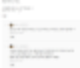

# 인공지능 활용 사례
**Date:** 2026. 2. 10. 14:09
**Category:** 다이어리
**Original URL:** https://blog.naver.com/xpfkwh56/224178693217
---

​

발더스에 **'채팅창'** 이 있다면?

​

컨텍스트 기반으로 등장인물들과

**계속 대화하면서** 플레이 한다면?

​

이런 것도 다 **인공지능의 활용** 임

​

문명을 하는데, 보좌관들이 있고

회의를 열어서 참여하게 한다던가

같은 게임을 다르게 해볼 수 있음