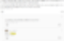
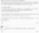
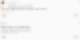

# 번역기
**Date:** 2026. 2. 12. 15:17
**Category:** 다이어리
**Original URL:** https://blog.naver.com/xpfkwh56/224181459341
---

​

1. 카페 창업이 옛날 같지 않아요

​

원래 연남동이다, 힙지로다 하면서

개성 있는 매장들도 많이 있었고,

​

퍼포먼스 좋은 업자들이 자기 시장에서

니치하게 접근하는 것도 수요가 있었고,

​

실제로 **'실력'** 이 있는 사람들은

살아남는 구조로 흘러가곤 했는데

​

300평, 3000평 대형 매장 깔거나,

​

프차에서 먹기 좋게 판을 깔아주니까

내가 손님이라도 거기 갈 것 같습니다

​

제가 아메리카노 1잔 4천원 받고 파는데,

무한리필 카페 이용권을 3만원 받으니까

이게 앞으로 비전이 있나 회의스럽습니다

​

혹시 이게 단순한 좋소 사장의

막연한 걱정이나 기우가 아니라,

시장 전체가 재편된단 신호일까요?

​

→ **정확한 뷰 입니다**

​

남녀가 만나, 결국 그 끝에 도달하면

​

구조적으로 아이를 몸에 담고,

낳을 수 있는 것은 여자인 것처럼

필연적인 **섭리 차원 흐름** 입니다

​

다정한 남자고, 여자를 잘 아는 남자고,

남자는 임신, 출산을 그냥 할 수 없습니다

​

여자가 아무리 운동을 하고, 약을 빨아도

남자의 근력, 신체 능력은 못 따라갑니다

​

오픈 소스 시장은, 단 한 번도

엔터프라이즈를 이긴 적 없습니다

​

**왜 why?**

​

**오픈 소스로 잘 풀리면,**

**스카웃 되기 때문이지욬ㅋ**

​

내가 이겨야 되는 것은 돈이 아닙니다

​

돈으로 **'쓸어모은'** 인재들을

시장에서 이겨야 되는 것인데,

​

이건 **불가능** 하죠

​

뉴진스도 하이브 울타리 나오니까,

세련된 맛에 살짝 빛이 바랬었는데

​

그게 **'제도권'** 의 파워 입니다

​

​

2. 개인 BJ, 스트리머 활동중입니다

​

소속사 들어가는 것보다,

혼자 하는 것이 벌이도 좋고

일도 재밌어서 하는 중인데,

​

전반적으로 **'제가 타깃한 시장'**

자체가 축소되고 있다는 느낌이

강하게 듭니다

​

→ 엄밀히 **'시장'** 이 작아지는 것이 아니고

본인이 먹은 **파이** 가 계속 작아지는 겁니다

​

3. 두 가지 옵션을 생각 중입니다

​

1-1) 정부지원 프로그램에 참가하고,

지금 하고 있는 서비스를 개선해서

​

**\* 아마도 짬이 있으신 것으로 추정,**

**왜냐면 아 이거 자원의 문제다 라는**

**시점에 들어갔다는 것은 기술적으로**

**본인이 슬슬 천장을 봤다는 뜻이므로**

​

상용 서비스를 실제 흉내내보는 것

​

1-2) 로컬 온디바이스 시장이 좋다?

​

그럼 내 기존 서비스를 로컬 고객들에게

제공하면서 초기 진입 장벽을 낮춰주고,

거기서 내 마진을 가져갈 수 있지 않을까?

​

2) 빠른 복학 후, 제도권 다시 돌아가기

​

**제 답변은?**

​

2번, 이유는 다음과 같음

​

**사실 정부 지원으로 답을 얻는 것은**

**거기서 뭘 배워서 한다 가 아닙니다**

​

B2B 와 마찬가지 입니다

​

B2B 는 기술로 돈을 버는 것이 아니고,

네트워크와 비즈니스 구조에 대한 이해,

​

더 정확히는, 특정 기업과의 관계를

깊게 가져가는 **배타권 점유** 입니다

​

내가 자주 가는 친한 단골집이 있는데,

옆집 밥이 2천원 더 저렴하고, 반찬이

1개 더 나온다고 옮기는 일 없습니다

​

**\* 잘 쓰고 있으면, 관심도 없음**

**​**

식사 전체를 개선할 것이 아니고,

눈치껏 인사 잘 하고 가끔 생각나면

​

김치 볶음밥 시킬 때,

계란 후라이 주면 좋아한다

​

정도 기억해서 관리하면 됩니다

​

서울대 로스쿨을 나와야만이

변호사 대우 받는 것이 아니고,

​

**저 사람이 알고 있는 접근 가능한**

**인맥풀 안에 내가 변호사면 됩니다**

​

법으로 뭐 궁금한 일이 생겼어,

아 누구 없나? 할 때, 내가 나온다

​

그럼 그냥 흐르듯, 내가 되듯이

B2G 도, B2B 도 논리가 똑같음

​

정부에 **'납품하는 구조'** 를 배우려고

시간과 돈을 써서 혜택 **'까지'** 얻자 지

​

그냥 도움받을 생각 있으면,

**굳이** 저걸 고를 이유는 없음요

​

> 대학 왜 감?

​

인생 잘 살아보겠다고 얼추 비슷비슷한

20대 초중반 몰아놓는 **'판'** 이 그거니까요

​

그렇다면 좋은 대학가면 분위기만 잘 타도,

대충 내가 어디에 있을 것인지 결정되겠네?

​

**'X'**

​

이 사람들이 이런 생각을 하고,

이런 결정을 하는구나 를 알았으니

​

**'다음 스텝'** 을 볼 해상도를 얻는 것

​

​

이건 **자살 행위** 입니다

​

내가 영업으로 밥 먹고 사는 사람인데,

**내 지인, 휴대폰 연락처 공유하는 꼴** 임

​

**코어 로직** 을 알아야 됩니다

​

소개로 밥을 먹는 나까마가,

클라이언트랑 일 봐주는 사람을

둘이 만나게 한다? **바보짓** 임

​

**\* 비즈니스 관점만 볼 때 그렇고,**

**본인이 무슨 대단한 철학이나**

**가치관이 있다면 그건 예외가 됨**

**​**

**4. 제도권 가라고 권한 이유**

​

본인의 강점은 **'법인 안 가도'**,

밥을 먹고 산다 하나 만은 아님

​

진짜 강점은 뭐냐?

​

**'본인이 당장 하고 있는, 하고 있던 것들은**

**법인에서도 굉장히 관심이 많을 것이란 것'**

​

즉, **뒷단을 빠르게 닿을 수 있는 길** 입니다

​

다음으로 저야 자세히는 모르지만,

어깨 너머로 볼 때 전문직의 가치는

​

합격증에서 오는 것이 아니고,

합격증을 기반으로 **'갈릴 때'** 옵니다

​

컴퓨터 사고, 올라마 깐다고 되나요?

​

**'그래서 이걸 어떻게 써먹는데?'**

이거를 익히는 것이 **'진짜'** 입니다

​

법인은 헤리티지를 기반으로,

**'수요'** 를 잡고 있는 곳들입니다

​

돈만 많으면 빅5, 돈만 많으면 빅로펌

​

이런 식으로 고민이 빠른 사람들을

​

가장 쉽게 가져갈 수 있는 마치,

**번화가 1층 코너자리 업자들** 임

​

이 사람들은 인프라는 있는데,

**늘 팔아먹을 상품** 이 없습니다

​

그래서 자본을 통해, **'바꿉니다'**

​

일을 하면서, 고객들의 니즈가 뭐구나

이런 문제를 해결하려고 돈을 쓰는구나

​

**이걸 배우러** 취직하는 것이지,

​

파트너 달면 몇 억 번다더라

요거 하려고 취직하는 것 아님

​

내 1시간 시급은 얼마고,

근무 복지는 어쩌고 저쩌고 (x)

​

시장의 니즈가 뭘까?

요즘 이게 잘 팔리네? (o)

​

둘은 시야가 다릅니다