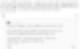
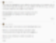
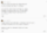
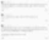
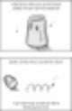
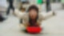

# 답변
**Date:** 2026. 2. 14. 16:04
**Category:** 다이어리
**Original URL:** https://blog.naver.com/xpfkwh56/224183820359
---

피차 다 알아야 되는데, 문 ↔ 이의 순서만 달라졌을 뿐

​

1. 어제까지, 오늘까지 평범한

28살 문과 취준생 이었던거지

​

오늘 내가 뭘 하면,

​

~를 하고 있는 평범한

28살 문과 취준생이 되고,

​

~를 더 할 수 있게 되면 ~도 할 수 있는

평범한 28살 문과 취준생이 되는 것임

​

**\* 정체성은 누적되는 행동의 부산물**

​

​

내 라벨이 고정되었다고

생각할 필요 없음

​

하물며 28,

​

82살도 아니고

무엇이 걱정이겠음

**​**

**\* 여든도 뭐 안 될 것은 없지만**

**신체적인 제약이 지금보다 클 것**

**​**

82살에도 본인이 평범한 문과

취준생으로 남을 리가 없잖음

​

내 아들은 자궁에 있을 때,

혼자 숨도 못 쉬었는데

​

​

이제 호흡 정도는 가뿐히 하고,

인어 아저씨처럼 움직이기도 함

​

나중에는 서고, 걷고, 뛸 것임

​

**선생님은 이미 이런 과정을**

**전부 다 충실히 겪으신 분임**

**​**

유전자가 대단하고 뭐 그래서가 아니고,

원래 인간은 **'가변적인'** 존재라는 것임

​

적응력 S+ 티어가 현존하는 인류를

지구의 주인으로 만든 핵심 종특이므로

​

2. 인간은 본인이 원한다면

얼마든지 바뀔 수 있는 존재임

​

최근만 해도, 수치해석/컴퓨터 공학/

전자전기/물리 이런 것들 **다 처음 해봄**

​

내가 더 많이 알수록, 더 많은 맥락을 갖고,

더 깊은 구조와, 더 풍부한 해상도를 가진 채

​

세상을 향유하고, 해석할 수 있게 되었음

​

이거로 뭐 내가 더 얻었다, 말았다를 떠나

이게 내 행복에 지대한 영향을 줬음은 **확실함**

​

**\* 앞으로 내가 어떻게 될 줄이야 몰라도**

**나는 10년 전보다, 지금 더 나은 인간이다**

**​**

3. 저는 평생 염원했던 것이

**'힘'** 임을 종종 실감함

​

**내가 내 인생을 통제할 수 있는 힘**,

휘둘리지 않고 판단할 수 있는 역량

​

내가 무엇이 부족하고, 모르는지 알면

**'출발선'** 에 설 자격은 충분하다고 봄

​

영원히 사는 인간은 없음

인생은 **구독제** 임

​

100년 산다 치면, **72년** 남았네요

​

관뚜껑 들어갈 때, **태어난 김에 해봤어야**

**될 것이 몇 가지 정도나 남길 바라시나요**

​

그걸 채워 나가시면 됩니다