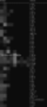
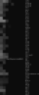
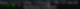

# 영어와 수학의 현실적인 쓰임
**Date:** 2026. 2. 14. 13:24
**Category:** 다이어리
**Original URL:** https://blog.naver.com/xpfkwh56/224183689507
---

**1. 영어**

​

한글로 된 글자가 있다면 그냥 읽겠지만,

정보가 없으니까 **불가피하게** 쓰게 되는 것

​

많아야 4가구 정도 사는 시골 살고 있으면

여기 있는 식구들이 모르는 것은 모르게 됨

​

그러니, 저긴 이걸 아는 사람이 있지 않을까?

​

하고 서울 가는 느낌으로 영어가 가치 있지

갖고 있다고 뭐가 대단히 달라지진 않읍니다

​

**2. 수학**

​

내가 갖고 있는 돈은 100원

근데 사고 싶은 것은 500원

​

**이럴 때, 어떻게 하면 잘 쓸 수 있을까?**

라는 것을 풀 때는 수학이 유용합니다

​

근데 일단 더 벌어서 해결하자, 또는

없으면 없는 대로 살자 로 가면 필요 없음

​

즉, 수학을 알아야 효율적이고

최적화를 할 수 있는 것이 아니고

​

효율과 최적화를 하고 싶으면

자연스럽게 수학을 알게 되는 구조

​

3. 입문 단계에서는 무엇이 **'정보'** 인지

분간하는 것도 불가능에 가깝기 때문에

영어를 하든, 아랍어를 하든 상관이 없고,

​

KT 통신사 VVIP 할인을 사용할 때는,

​

베스킨 파인트 공짜 1회 이용권 보다

도미노 3만원 직권 할인이 효율이 좋다

​

같은 것을 알려면 일단 **먹어봐야** 아는거라

​

**\* 내가 도미노로 3만원 이득 보는 것보다**

**아이스크림 먹는 것을 좋아할 수도 있으니**

​

효율을 운운할 단계가 아닐 가능성이 높음

​

4. 아무나 할 수 있지만 막상 하려면 귀찮은,

**'설명서 읽기'** 가 제일 처음에 해야 될 일인데

​

이건 수학 몰라도 되고, 영어 몰라도 됨니다

다만 거-업나 복잡하고 귀찮을 뿐입니다

​

**5. 예시**

​

CUDA 생태계 기준으로,

패키지 라는 것이 있습니다

​

특정한 모델을 돌리기 위해서는

그 모델에 호환되는 **의존성** 이라고

부르는 보조 프로그램들이 필요함

​

요리로 비유를 하자면,

라면 끓이는 레시피 같은 것임

​

물 x ml, 면 y ml, 간장 z ml

고춧가루 몇 스푼 이런 식으로

​

이렇게 해야 이런 결과가 나온다

​

이런 조건에서는 이렇게 된다 같은

것이 **이미 다 정해져 있는 것** 이지요

​

그래서 pip install 이라는 명령어를 쓰면

내가 원하는 패키지를 찾아 쓸 수 있어요

​

문제는, **얘네가 서로 연결되어 있습니다**

​

모델 A 를 쓰려면 패키지 B가 있어야 하고,

B 를 쓰려면 C 가 있어야 되는 구조 인데요

​

단 하나라도 의존성이 충돌하면 **안 됩니다**

​

​

작은 프로그램 1개 돌리는

의존성 패키지들입니다

​

카카오톡 다운 받아서 쓰는데,

카카오톡 테마 받는 것과 비슷함

​

​

pip list -o 는 일종의

최신 업데이트 목록이

무엇인지 확인하는 건데

​

얼추 10개가 넘는 것들이

**전부** 구형 서비스 입니다

​

내가 낸데! 하고 만약에 제가

​

저걸 다 업데이트 하면

어떤 일이 생길까요?

​

**그 자리에서 하루 날립니다**

​

패키지 의존성 충돌은 마치,

​

사이 나쁜 여자 5명을 중재해

서로 친하게 만드는 일 같아서

​

아주 번거로운 일이기 때문이죠

​

그래서 설치 전에, dry-run 이나

다른 여러 가지 방법들을 통해서,

​

충돌이 있는지, 제대로 호환되는지

개발자가 **'진짜'** 제대로 만든 것인지

​

이런 것들을 알고 쓰면 덜 고생합니다

​

**\* 해보면 내 의지와 관계없이 빌드해서**

**내가 필요한 것을 만들어서 쓸 때도 많음**

​

근데 꼭 알아야 되냐?

그건 아니에요

​

1) **맞다 보면 알아서 익히게 되고**,

2) 그냥 꼬이면 꼬인 대로 풀면 됩니다

​

**\* 그냥 지우고 새로 깔면 간단**

**​**

​

최신 파이썬이 **3.15** 입니다

​

3.10 에서 3.11 로 넘어가면

속도가 50% 이상 더 빠르고,

​

3.11 에서 3.12 로 넘어가면

더 많은 기능이 포함된 상태고,

​

3.12 에서 3.13 으로 넘어가면

**'진짜'** 멀티코어를 쓸 수 있습니다

​

26년이니, 3.15 도 쓸 수 있습니다

문제는? **뭐가 없습니다**

​

최적화 패키지 같은 것을 쓰려면,

​

**해당 반도체가 구동될 수 있게 하는**

특정한 패키지를 깔아야만 하는데,

​

일단 Pytorch, Cuda, Python

3박자가 맞는 것이 **기본 조건** 임

​

파이썬 3.12, Cuda 128

파치토치 2.8x 랑

​

파이썬 3.13 cuda 130

파이토치 2.10 은

​

**'아예 다른 환경'** 입니다

​

​

저 뒤에 있는 sm\_120은 뭐냐?

​

sm\_80

sm\_90

sm\_100

sm\_120

​

이렇게 그래픽 카드마다

지원 조건이 다른 겁니다

​

내가 5090 쓰고 있으면

sm\_120 인데

​

sm\_90 에 있는 기능은

깔아봤자 **해골물**만 됨니다

​

5090 이면 좋으니까 좋겠지?

​

좋은 것은 맞지만 그걸 돌리려면

그거에 맞는 환경을 구비해야 하고,

​

구비한 다음에는, **'진짜'** 내 환경에서

진짜 돌아가는 것이 맞나 확인해야 됨

​

일전에 말했던 것처럼, 최적화 중 하나인

x-former 의 경우, 페이스북 리서치에서

​

**공식으로 파이토치, 쿠다 지원 한댔는데**

**코드 뜯어보면 해당 기능이 아예 없습니다**

​

**\* 일부 기능은 구현, 일부 버전은 미구현**

**​**

삼성에서 자기들 휴대폰에 ~ 기능 있다

했는데, 막상 까보니 없는 그런 상황인 것

​

근데 이게 여기는 **'비일비재'** 한 일입니다

​

​

이거는 중국에 있는 아주아주 유명한

명문 대학 연구진이 배포한 오픈소슨데,

​

메모리 계산값이 고시 내용과 틀립니다

​

제가 제 상황에 맞게 고쳐놨던 것이지,

​

그냥 시키는 대로 했으면

30gb 넘게 써야 됩니다

​

**\* 특별한 이유도 없이**

**​**

논문에 있는 내용이랑 실제 구동원리도

차이가 있어서, 그거도 **전부** 바꿨습니다

​

광고만 봤을 때는, 10배 정도 낫다고 했는데

막상 열심히 익혀서 적용해 보니까 이 기술보다

원래 있던 것을 쓰는 것이 **훨씬 더** 낫기도 했음

​

저두 코딩을 이제 아쉽게 하진 않는 것 같은데,

​

**'척'** 본다고 머리에서 촤르르르 프로그램이

어떻게 될 것이다 그려지고 이런 것은 **전혀** 고

​

**\* 모국어가 어셈블리어가 아닌 이상**

​

쓰다가 어? 이상한데? (직관) 하고,

​

​

이러고 읽는 것 뿐임

​

**\* 속도 차이만 있을 뿐,**

**누구나 할 수 있는 노가다**

**​**

**모르겠으면 AI 도 있고요**

​

사칙연산 못하면, 그래서 메모리 로드될 때

몇이 되는 것인지 계산할 수가 없겠지요?

​

산수는 대개 그 정도 레벨로만 사용 됩니다