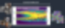
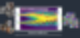

# 내가 돈만 있었어도
**Date:** 2026. 2. 15. 15:37
**Category:** 다이어리
**Original URL:** https://blog.naver.com/xpfkwh56/224184659015
---

​

1. 예전 이야기지만, 한창 장사하고 살았을 때

중장비, 건기계 관련으로 비쥬니스를 했었읍니다

​

2. 현장에 가면 사진처럼

거친 분들이 **'진짜'** 많은데,

​

가만히 옆에서 관찰하고 있노라니,

공통적인 요소들이 보이곤 했읍니다

​

3. 마치 **일부러** 그러는 것처럼,

​

당장 나한테 주어지지 않은 어떤 것을

해결할 수 있는 도구라고 상정한 다음,

​

내가 할 수 없는 이유를

**찾는 것처럼** 보였읍니다

​

저는 사실 잘 이해가 가진 않았습니다

​

<https://blog.naver.com/xpfkwh56/224069304078>

[**교육비에 대한 생각**

1. 교내 상장 약 3cm 정도 2. 교외 상장 많음 3. 돈 받고 학교 다녔고 돈 받고 공부 했었음 직업 = ...

blog.naver.com](https://blog.naver.com/xpfkwh56/224069304078)

​

4. 흙수저 라는 말을

선호하진 않읍니다만,

**​**

**\* 남조선이 부모 계급 따라갈 정도로**

**전근대적인 시스템을 갖춘 것도 아니고**

​

대부분이 그렇듯, 저 역시 그리 풍족한

성장환경을 갖고 있던 편은 아니었는데요

​

**\* 장학금은 실력만 있다고 주는 것이 아니라,**

**기본적으로 쫌 어려워야 조건/대상이 됩니다**

**​**

**저보다 한참 뛰어난 분들도 계셨지만,**

**제가 더 어려워서 받았던 혜택이 많아요**

**​**

예체능 장르는 알든, 모르든

대부분 돈이 **상당히** 듭니다

​

아빠가 정치를 하고, 엄마가 종교에 빠지고,

아들이 사업을 하고, 딸이 예체능을 하면

집안 뿌리가 송두리째 날아간단 말도 있지요

​

5. 그닥 넉넉하지 않은 집안에서 막연히

예체능 해본답시고 깔짝거리던 시절에

저 또한 비슷한 생각을 했던 적 있읍니다

​

내가 ~중 출신이기만 했어도,

내가 교수 과외만 받았어도,

​

무슨 학원만 갔어도,

누구한테 사사 받았더라면,

​

**요렇게 상황을 찾기 시작하는 것이죠**

**​**

어디서 건너건너 평창동 사는

서울예고 진학한 사람을 봤는데

​

이게 같은 하늘 이고 사는

인생인가? 싶기도 하더군여

​

6. 희한한 것은 이겁니다

​

제가 어릴 적 종종 가졌던 **'가난한 습관'** 은

의지가 아니라 환경의 변화로 나아졌읍니다

​

**늘 없었기 때문에, 있어야 되는 줄 알았는데,**

**막상 있어보니까 그게 전부가 아니던 겁니다**

​

제가 블라그에서 몇 번 언급했던 것처럼,

​

돈이든, 학력이든, 무엇이든 나는

그게 있으면 뭐가 되는 줄 알았는데,

​

**가지면 가질수록, 더 본질적인 문제를**

**드러내는 도구로 기능하고 있었습니다**

​

7. 30-40평대 아파트로

이사가면 집이 화목해질까요?

​

그렇게 믿고 계신 분들이 상당히 많지만,

​

막상 그 집에 자기가 등기를 치게 된다면

**'외면 했던'** 문제를 결국 마주하게 됩니다

​

아마 자기가 1년 전, 10년 전에 했어야 할

**숙제를 뒤늦게 풀어야 될 일** 이 생길 것이고,

​

평면적인 세계에서 입체적인 세계로,

X축만 보던 구조에서 Y/Z 축의 구조로,

​

다른 시야를 갖게 될 확률이 높아집니다

​

​

내용을 봅시다

​

1) SD 를 웹 UI 로 시도 했었다

2) 컴퓨터가 버벅 거렸다

3) 램만 48gb 로 업글 했다

​

4) 미드저니, 나노바나나 써봤다

5) 캐릭터 일관성이 떨어진다

6) 프롬프트 구현성이 약하다

​

7) 프로덕션 퀄리티 뽑으려면

크레딧 소모가 크다

​

8) 울트라 디테일을 원한다

9) 로컬의 가능성이 궁금하다

​

10) 하드웨어 바꾸면 가능하냐?

​

​

램에 대한 이야기부터 합시다

​

RAM은 현장에 있는 대형 자재 창고입니다

시멘트, 벽돌, 철근 등 공사에 필요한

엄청난 규모의 것들을 보관하는 곳 입니다

​

VRAM은 기술자 옆에 있는 작업 선반입니다

당장 기술을 부려야 될 때, 손 닿는 곳에

바로 장비가 있으면 훨씬 편하겠지요

​

인공지능 작업에서 둘 다 중요하지만,

​

VRAM 이 **'막연히'** 먹어주는 이유는

그게 더 작업에 적합하기 때문입니다

​

​

AI 작업은 **'아주 많은 단순한 연산을'**

노가다로 무한 반복하는 행위 입니다

​

​

디퓨전 모델의 원리는,

​

​

특정한 이미지에 노이즈를 넣은 후,

제거하는 순서로 생성하는 것입니다

​

해변에 누워있는 사람이 있을 때,

그 위에 모래를 계-속 덮습니다

​

다 덮은 다음에, 모래를 알갱이 1개씩

걷어내면서 이만큼 모래를 걷어내면,

​

사람이 나오는구나 를 배우는 것이

sd 모델이 그림을 그리는 원리 입니다

​

VRAM 은 이 노가다 작업을

경부고속도로 8T 트럭으로 하는 것이고

​

RAM 은 이 노가다 작업을 할 때,

트럭에 담아서 옮기긴 애매하거나,

​

다른 용도일 때, 쓰는 오토바이 퀵

같은 것과 비슷하다고 보면 됩니다

​

100평 단독주택 이사는

화물차를 빌려 써야 하지만,

​

단칸방 월세는 다마스로도

충분한 것처럼 하드웨어는

용도와 목적이 다릅니다

​

그리고 거의 대부분의 경우에는,

**'엔지니어의 영혼'** 이 담겨있습니다

​

모든 것을 가질 수 없다는 것이

불변하는 자명한 명제이기 때문에,

​

그들은 무엇과 무엇을 바꿔야 할 것인지

깊은 고민을 한 후에, 세상에 내놓습니다

​

**때문에, 우리가 알아야**

**할 것이 그런 것인 겁니다**

​

이 엔지니어는 무엇이 무엇보다

더 좋다고, 아름답다고 느꼈는가?

​

위에 보았던 SD 모델이 그렇듯,

​

무한한 노이즈에서 역추적 하면

우리 역시 원형을 알 수 있습니다

​

8. 다시 원문으로 돌아갑시다

​

**1) 이미지 생성에 있어서, 캐릭터**

**재현성이 떨어지는 이유가 뭘까요?**

​

노이즈 자체가 확률적으로

분포되기 때문입니다

​

그렇다면 **'불가능'** 할까요?

​

아뇨, 원래는 99% 랜덤인데

98%, 97%, 96% 랜덤으로

기술을 배우면 제어할 수 있습니다

​

**\* 하드웨어 부동소수점 오차 때문에**

**현재 기술로 100% 복원은 불가능**

**​**

**단, 인간 눈으로 구분할 수**

**없는 정도는 충분히 가능함**

**​**

밤은 걍 **'원래 까맣다'** 라고 느끼는

사람들만 있었더라면 오늘날의

인류는 이렇게 살 수 없었을 겁니다

​

다양한 도구와 기술들이 있습니다

그런 것들에 관심을 가져봐야 합니다

​

**2) 프롬프트 구현성이 왜 약할까요?**

​

CFG(가이던스), 스텝에 따라도 다르고,

모델이 기존에 학습한 데이터도 다릅니다

​

또한 여러가지 요소들이 있습니다

​

인공지능은 **'배운 적 없는 것'** 을

**'절대로'** 할 수 없는 존재 입니다

​

만약 학습 데이터에 애플 로고가 있다,

​

근데 그게 오버핏이 된 상태다

모든 로고는 핸드폰 뒤에 붙어있다

​

그럼 **'모든 로고'** 를 애플로 그립니다

​

언더핏이 된 상태다, 그럼 못 그립니다

덜 배웠으니 잘 표현할 수가 없겠지요

​

일반적으론, CFG 값은 프롬프트 준수율을

스텝이 높을수록 수렴 가능성이 증가한다

​

**\* 더 정확히는 방향이 조금 더 변화하는 것,**

**증류 모델이냐 비증류 모델이냐 따라도 다름**

**​**

라고 알려져 있지만, 사실 **'해봐야'** 압니다

​

일단 SD 에 있는 모든 버튼을 다 눌러보세요

​

**\* 쓰던 것만 쓰면, 쓰는 것만 쓰게 됨**

**그리고 그게 내 표현의 한계가 될 것임**

**​**

로고를 어디까지 보는 것인지 모르겠지만

상업적인 목적으로 특정 물건에 로고 박거나,

​

모델을 튜닝해서 로고 뽑는 생성기로 만들기

이런 것 정도는 일단 조금 더 해보셔도 될 듯요

​

**9. 결론**

**​**

그래서 **'가능'** 합니까?

​

네 됩니다