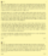

# 주절주절
**Date:** 2026. 2. 15. 20:05
**Category:** 다이어리
**Original URL:** https://blog.naver.com/xpfkwh56/224184844343
---

​

본문에서 주의해서 읽어야 될 부분은,

​

본인이 생각하는 것보다 밑이라는 곳의

심연은 훨씬 더 깊고 낮은 곳에 있다는 것

​

1금융권 대출이 있어? 그럼 2금융, 사금융,

사금융이 있어? 그럼 뭐뭐 ,, 이런 식으로

​

마지막에는 **'인간'** 이라는 이유만으로

보유하는 권리까지 거래창에 올리게 됨

​

통장도 팔 수 있고, 주민번호도 팔 수 있고,

대신 징역을 살아줄 수도 있고, 남의 세금을

내가 대신 물어서 체납자 신분 될 수도 있고

​

요즘은 막혔을건데, 헌혈해서

문상 모은 다음에 깡하기도 있고

​

국내에 일 하고 싶은 사람이랑 가라로

결혼 해다가 비자 만들어줄 수도 있고

​

미련하게 장기 떼다 파는 것 말고도 많죠

​

업비트 실명인증 계정이 얼마일 것 같음?

​

인간의 **'존재'** 자체로 정확하진 않겠지만

그래도 최소 난 3억 이상은 될 것으로 봄