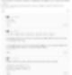

# 서울 부동산
**Date:** 2026. 2. 16. 14:12
**Category:** 다이어리
**Original URL:** https://blog.naver.com/xpfkwh56/224185462047
---

​

근데 제 뷰는 가려 들으셔야 되는 게,

저는 내일을 기약할 수 없는 환경이고

​

**\* 신랑도 장사꾼, 심지어 제조업**

​

일반적인 경우, 부동산 투자에 있어서

**환금성을 고려할 이유가 없는** 반면에

​

**\* 팔아서 어디 갈껀데? ,,**

**​**

저는 저한테 1억이 있든, 10억이 있든

그거를 다양한 방식으로 운용할 수 있음

​

roa, roe가 유동적이니까

몸이 가벼운 것이 더 낫지요

​

**\* 살다 보면 돈만 있으면 거의 리스크 없이**

**돈 놓고 돈 먹기가 되거나, 2배 3배 씩을**

**​**

**큰 액수는 아니지만 거진 확실하게 튀기는**

**그런 기회가 또 없는 것도 아니었기 때문임**

**​**

**1억 넣고, 50% 확률로 2배 띄울 바에야**

**1천 넣고 확실히 2배 띄우는 것이 이득임**

**​**

생애소득 상수로 고정된 사람에다가

1주택으로 이사하면서 평수 늘리고,

​

말년에 그 동네 뿌리 내릴 사람이면

반대로 아파트 말고는 대안이 없지요

​

저야, 아 전기 많이 쓰네 태양광 ㄱㄱ

​

아 충청도가 애 키우기 좋은 것 같네

저기로 이사가야겠다가 되는 반면에,

​

출/퇴근에 묶이면 이런 것도 어려울 것

​

또 이게 마냥 좋은 것은 아닌 것이,

자유로운 보따리 인생인 대신에

​

안정성은 현저히 떨어지고,

이사 한 번 한 번이 **일은 일** 임

​

결국 내가 뭘 하는 것인지 **알아야** 될 일