# 설계 철학
**Date:** 2026. 2. 16. 4:21
**Category:** 다이어리
**Original URL:** https://blog.naver.com/xpfkwh56/224185152176
---

[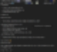](#)

[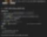](#)

[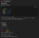](#)

[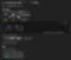](#)

[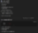](#)

[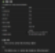](#)

[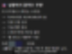](#)

[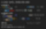](#)

[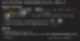](#)

[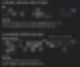](#)

[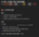](#)

[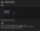](#)

[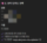](#)

[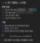](#)

[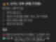](#)

[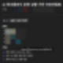](#)

[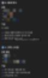](#)

[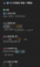](#)

[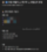](#)

[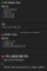](#)

​

번역기가 있을 때, 얘 있으면

나 외국어 몰라도 되네? 말고

​

내가 틀릴 때가 와도, 이거만 있으면

고칠 수 있겠다 접근하는 것이 좋음

​

자꾸 뭘 덜 하려고,

안 하려고 하면 안 됨

​

**\* 이거 시험에 나와요? 금지**

**​**

바이브 코딩도 좋지만, 인공지능을

코딩쌤이라고 생각하고 쓰면 더 좋아요

​

**\* 먼저 내가 예습해보고, 문제 풀고**

**가져가서 채점 받고, 피드백 받고 반복**

**​**

**→ 365일 24시간**

**무한대기 1:1 과외**

**= 초고속 실력상승**

**​**

이보다 더 확실한 저자 직강이 어딨음

모국어가 기계어인 존재가 코딩쌤이라니