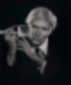

# 아이폰이 작품인 이유
**Date:** 2026. 2. 16. 13:55
**Category:** 다이어리
**Original URL:** https://blog.naver.com/xpfkwh56/224185449954
---

디자인이 예뻐서, 사진 찍으면 잘 나오니까

그냥 애플 감성이 있으니까,

​

라는 식으로 알려져 있지만

​

아이폰이 **'혼모노'** 인 이유는,

​

누구나 사진을 찍는 즉시 0.1초 만에

색 보정을 **'애플 철학'** 으로 따서 그럼

​

보통은 앱으로 보정하구,

조금 더 가면 어도비 쓰는데

​

어도비 딱 켜서, 깔면 눈이 어지러움

버튼도 엄청 많고 다 바꿀 수 있다는데

뭘 알아야 누르지 ,, 같은 생각이 들것

​

어플도 수동보정 일일이 귀찮으니까

노출 ↑ 선명 ↑ 대비 ↓ 정도가 보통인데,

​

**\* 대체적으로 여자가 찍은 사진이**

**남자가 찍은 사진보다 예쁜 이유는**

**구도와 색감에 차이가 있기 때문임**

​

어도비 넘어가도, 디자이너 프리셋 쓰거나

​

**\* 회사에서 배웠으면 사수가 했던 그대로**

​

쓰긴 쓰는데 뭔지를 몰라서 결과가 나와도

이게 왜 이런 결과가 나오는 줄 모를 수 있음

​

애플은 사진을 찍으면, 그 작은 기계 안에서

​

어디가 하늘이고, 어디가 인물이고,

어디가 배경이고, 이건 손이다 발이다,

​

옷이다, 음식이다, 전부 읽은 다음에

가장 그 **'색'** 에 맞는 강도로 보정을 입힘

​

애플의 핵심철학(Aesthetics)은

**미니멀리즘** 과 **경험적 가치** 임

​

**\* 잡스 죽고 장사치가 CEO 되면서**

**이제 애플이 바뀌었단 말 나오던 이유**

**​**

1) 미니멀리즘

​

요란하지 않은데, 딱 뭐를 시키면

바로 행동으로 깔끔하게 보여주는

​

그런 사람이 애플이 제품으로

구현하고 싶은 **'이상'** 임

​

그래서 변태적으로 디테일하고,

​

아주 복잡한 기술이 있음에도

**'고의적'** 으로 과시하지 않음

​

2) 경험적 가치

​

좋은 것을 하려면 더 많이 알아야 됨

​

여행을 가도, 외국어 할 줄 아느냐 모르냐

그 지역에 대한 지식이 있느냐, 없느냐

이런 걸로 경험 가치가 하늘 땅 차이인데

​

애플은 **'애플이 보는 해상도'** 를 떠먹여줌

​

​

아 ,, 거 ,, 존나 까다롭네 ,,

라는 사람이 내 고객이면 싫지만

​

내 이익을 대변하는 입장이라면

저만한 사람이 또 없단 말임

​

**\* 괜히 까다로운 것 같은 애기 엄마가**

**지 새끼 먹이는 이유식 골랐다고 하면**

**그게 뭘까? 궁금해지는 것과 마찬가지**

**​**

도대체 잡스 저 양반은 세상을 어떻게 볼까?

이거도 싫고, 저거도 싫고, 다 싫다는데

​

저 새끼는 뭐를 예쁘다고 느끼는걸까?

라는 생각이 들 수가 있는데,

​

잡스는 시발 쫌 봐봐 다르지?

내가 말하던 게 이거야

​

라고 그걸 **'대중 소비품'** 으로 바꿈

​

마케팅적 측면에서 이 두 가지 철학은,

두 종류의 집단에게 어필될 수 있음

​

우선, 서울대를 나왔다고 나 서울댑니다

마빡에 붙이고 다니는 것은 **'쿨하지'** 않음

​

자고로 명품이란, 로고가

대놓고 보이는 것보다

​

잠바 벗었는데 은은하게 라벨에

**'엇?'** 찍히는 것이 참 맛이고

​

그냥 동네에 마실 나온 사람 같은데

​

알고 보니 강남 3구 주민이고

자동차가 포르쉐, 벤틀리고

​

이런 것이 **'멋'** 있는 것임

​

**\* 근데 또 그걸 멋있다고 느끼고**

**그렇게 행동한다는 것은 짜친 것 ,,**

​

다음은, 나는 잘 모르지만

암튼 나도 저 물에 끼고 싶다

​

즉, **'기왕 하는 것'** 제대로 하고 싶다

라는 부류의 집단 이야기로 갈 수 있음

​

사람들은 내가 어떤 상황에 있음을 막론하고

최고에게 배우고 싶고, 최고를 따르길 원함

​

저 역시, 기본적으로 물건을 살 때는

소비자 대상 물건보다 **'산업용'** 을 보고,

​

**\* 장 볼 때는, 반드시 업소 대상으로**

**영업하는 식자재 마트를 찾아서 보세요**

**​**

**별 희한한 조미료나 수입 제품들 있는데**

**그게 음식 퀄리티를 2배 이상 올려줍니다**

​

전문가들이 무엇을 쓰나를 관찰하곤 함

​

근데 이걸 하려면, 자원이 **많이** 요구됨

​

애플은 주식 뭐 살지, 집 뭐 살지

너 하나하나 알아보기 번거롭고 어렵지?

​

**걍 픽 줄테니까, 그거 그대로 사렴**

을 실현한 사례라고 볼 수 있음

​

그러니, 재주가 좀 더 나은 사람은

나은대로 저 맛에 뽕이 차는 것이고

​

재주가 없는 사람은 없는 대로

너만 따라가면 되는구나 가 되는 것

​

이 짓은 한편 **'잡스'** 의 전유물은 아님

​

앤디 워홀

​

제일 처음 했는 줄은 모르겠지만,

제일 **'잘 활용했던'** 사람은 이 할배고

​

저 사람이 지금 시대에 태어났으면

빅테크 오너로 살고 있을 수도 있음

​

대척점에 있는 철학도 있음,

​

아니 돈을 썼으면 티가 나야지

혼자 볼 생각이면 그걸 왜 사?

​

자고로 명품이면, 나 명품을 샀다!

라고 100보 밖에서도 알아야 맞음

​

안 보여줄 것이면 몸을 왜 만들어?

운동 열심히 했으면 벗어야지!

​

썩어 없어질 몸, 곱게 태어났으면

활짝활짝 벗고 다니는 것이 맞지!

​

또는,

​

데잉, 그렇게 쉽게만 하려고 해서야

결국 대중성을 따르면 품질을 일부

타협하게 될 수밖에 없는 것이 숙명

​

정점에 닿으려는 자는, 입문 장벽이나

학습 곡선을 두려워말고 목표를 정해서

묵묵히 정진하는 것이 바람직한 자세임

​

같은 경우도 있고, 당연히 이런 철학을

자신들의 제품에 녹여서 파는 곳도 있음

​

잡스 시절 애플이 팔던 것은,

단순한 핸드폰이나 테블릿이 아님

​

**잡스가 세상을 보는,**

**해석하는 방식을**

​

팔았던 것임

​

그 유산이 죽은 뒤에도 아예 없어졌냐,

좀 달라지긴 했지만 또 그거도 아니구요