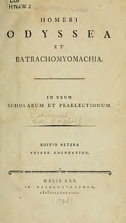

# 오딧세이아
**Date:** 2026. 2. 21. 21:25
**Category:** 다이어리
**Original URL:** https://blog.naver.com/xpfkwh56/224190878198
---

​

**1.** **아킬레우스**

​

> 최고가 되겠다

​

두 가지 운명을 결정할 수 있었음

길고 평범한 삶, 짧고 찬란한 삶,

​

영광을 선택하고 역사에 불멸하길 원함

실제로 기억됨, 근데 죽음

​

**2. 아가멤논**

​

> 정점에 서겠다

​

그리스 연합군 총사령관,

전쟁 자체가 목적이 아님

​

왕 중의 왕 이라는 권력이 목적

언제나 내려다 볼 수 있어야 됨

​

아가멤논이 전쟁 가면서

딸 이피게네이아를 제물로 바쳤음

​

출항할 때 바람이 안 불었는데

아르테미스 여신한테

딸을 바치면 바람을 주겠다니 바침

​

왕이니까, 총사령관이니까,

전쟁이 우선이니까,

​

가오 때문에 딸을 죽임

​

남편이 권력 때문에 내 딸을 죽였다

​

아내 클리타임네스트라가

10년간 그 원한을 품고 있었고,

​

그 사이에 아이기스토스(남자)랑

내연 관계를 맺고, 아가멤논이 돌아오자마자

목욕할 때 그물 씌워서 도끼로 죽임

​

권력을 위해 가족을 희생한

대가가 가족한테 돌아온 것

​

**3. 메넬라오스**

​

> 체면을 지키겠다

​

아내 헬레네를 파리스한테 빼앗김

​

사랑이라기보단 내 아내를 빼앗겼다는

모욕감에 분노하고, 그게 주요 동기 임

​

전쟁이 끝나고, 헬레네를 되찾아 왔음

​

두 부부는 겉으로는 화목함

부유하고, 궁전 크고, 손님 잘 대접함

​

헬레네와 메넬라오스는 같은 사건을

언제나 다른 각도로 기억하고 있음

​

헬레네는 식사 전에 와인에 약을 탐

​

슬픔과 분노를 잊게 하는 약,

이걸 타지 않으면 대화가 안 되는 부부

​

둘은 잘 사는 것이 아님

약 먹고 관계를 버티며 사는 것

​

그래서 잘 살아요? 잘 살아요

​

**4. 파리스**

​

> 욕망을 누리겠다

​

세 여신이 파리스에게 물었음

​

헤라, 아테나, 아프로디테

누가 가장 아름다운지 골라라

​

헤라 = 나를 고르면 왕으로 만들어 줄게 (권력)

아테나 = 나를 고르면 현명함을 얻게 해줄게 (지혜)

아프로디테 = 장원영 vs 카리나? (욕망)

​

파리스는 아프로디테를 고르고, 헬레네를 얻음

​

근데 헬레네는 이미 메넬라오스의 아내

​

가장 좋은 것은 남의 것이었고,

결과적으로 남의 아내를 데려온 것

​

권력도, 지혜도 아닌 욕망을

고른 것이 파리스의 본질

​

본인 욕망 때문에 남을 벼랑 끝으로 밀었고

그 대가는 트로이 전체가 지불하게 되었음

​

욕망으로 시작해서 남에게 대가를 치르게 하고

연관된 모든 이들이 비참한 최후를 맞이하게 됨

​

**5. 헥토르**

​

> 의무를 따르겠다

​

트로이 최고의 영웅,

전쟁을 원한 적 없음

​

파리스의 형,

동생이 싼 똥을 형이 치움

​

아내가 제발 나가지 마, 하는데 나감

그게 내 의무 니까

​

전쟁에 나가기 직전,

핏댕이를 보고 이렇게 말함

​

제우스여, 이 아이가 나보다

더 뛰어난 사람이 되게 하세요.

​

나중에 사람들이 아버지보다

낫다고 말하게 해주세요

​

아기는 나중에 성벽에서 던져진 채, 죽음

아버지보다 낫다는 말을 들을 기회조차 없이

​

전쟁에서 처음 만난 적은, 우승 후보

​

아킬레우스는 어머니 테티스가 만든

신의 갑옷을 입은 반신

​

인간이 이길 수 있는 상대가 아님

​

일단 나갔는데, 너무 무서움

헥토르가 성벽을 세 바퀴 돌며 도망침

​

아테나가 헥토르에게 나타나,

동생 데이포보스로 변장해서

용기를 가지라고 지지를 해줬음

​

헥토르가 각성해서, 아킬레우스를 상대함

창을 던졌는데 빗나감

​

뒤돌아서 동생을 찾았는데, 동생이 없음

​

아테나가 헥토르를 속인 것

신이 나를 버렸구나,

​

신과 운명에 기망 당한 고결한 자,

헥토르는 칼을 뽑아 마음을 다 잡음

​

도망치지 않겠다, 최후까지 싸우겠다

그리고 죽음

​

아내 안드로마케는 집에서 헥토르가 돌아올 때

씻을 따뜻한 물을 데우고 기다리고 있었음

​

남편이 전투에서 돌아오면 목욕시켜주려고

그때 성벽 쪽에서 비명이 들림

​

창문으로 달려가, 성벽 위에서 내려다보니

​

아킬레우스가 헥토르의 시체를

전차에 매달고 끌고 가고 있음

​

남편이 씻을 물을 데우고 있었는데

남편 시체가 먼지 속에 끌려가고 있음

​

안드로마케는 그걸 보고, 기절함

​

안드로마케의 출신은 테베의 공주,

​

아킬레우스는 트로이 전쟁 중 테베를 공격해

아버지를 죽이고 오빠 일곱을 전부 죽임

​

그녀는 헥토르에게 말했음

​

당신이 내 아버지고,

어머니고, 형제고, 남편이에요

​

과장이 아님

​

그녀가 진짜 의지할 존재가

세상에 헥토르 밖에 없는 것

​

아킬레우스도 사정은 있음, 헥토르가

아킬레우스의 절친을 죽였기 때문

​

트로이 전쟁의 마지막 장면은

​

성대한 정전 협정도,

영광스런 승리와 함락도 아님

​

트로이의 늙은 왕

프리아모스가 홀로 적진에 감

​

아들 시체를 돌려달라고,

아킬레우스 앞에 무릎 꿇었음

​

당신의 아버지를 생각해주세요

​

당신 아버지도 늙었을 것이고,

아들이 돌아오길 기다리고 있을 것입니다

​

당신 아버지에게는 아직 희망이 있지만

나는 내 아들을 잃었습니다

​

아킬레우스가 그 말을 듣고 아이처럼 울음

​

자기 아버지 펠레우스를 떠올리면서,

늙은 왕과 젊은 전사가 같이 울음

​

그리고 시체를 돌려주면서 끝남

​

**6. 오디세우스**

​

> 집에 가고 싶다
>
> 어떻게든(polytropos)

​

이타카의 왕, 작은 섬나라

​

아내 페넬로페, 갓난아기 텔레마코스

세 가족은 평화롭게 살고 있었음

​

트로이 전쟁 징집령 등장,

오디세우스는 머리가 쭈뼛함

​

헬레네의 구혼자들은 누가 헬레네를 차지하든,

그 남편이 위험에 처하면 다 같이 싸우자 맹세함

​

이 맹세를 제안한 것이 오디세우스,

사실 오디세우스는 헬레네에 관심 없었고

​

위에 있는 맹세를 제안하는 대가로

페넬로페와 결혼하는데 도움을 받음

​

본인이 만든 맹세에 본인이 묶임

​

전쟁? 죽으면 어캄?

토끼 같은 우리 가족 누가 돌봐?

​

니들이야 대기업 이지만,

나는 좋소 라고, 나 없으면

우리 식구 다 망해

​

가기 싫으니까,

군대 빼려고 미친 척 함

​

팔라메데스가

아기 텔레마코스를

쟁기 앞에 놓음

​

아기를 피해서 쟁기를 돌림

들킴, 끌려감

​

아킬레우스처럼 영광도, 아가멤논처럼 권력도,

메넬라오스처럼 체면도 원한 게 아님

​

집에서 아기랑 아내랑 살고 싶었는데 끌려간 거

​

오디세우스의 역할은 해결사,

​

아킬레우스가 삐졌을 때 설득하러 가고,

정찰 임무를 맡고, 외교를 하는 사람

​

가장 결정적인 기여가 트로이 목마,

​

10년 포위 해도 트로이 성벽을 못 뚫으니까

거대한 목마를 만들어서 접근했고,

결과적으로 이 목마로 트로이가 뚫림

​

트로이의 다른 많은 인물들 중에서,

유일하게 오디세우스만 목표가 귀환임

​

집에 가서, 가족들이랑 그냥 살고 싶어

얘만 제대로 살아서 온전하게 돌아감

​

일리아스 끝

​

**7. 오딧세이아**

​

전쟁 끝나고 12척의 배,

수백 명의 선원과 출발

​

첫 기착지 키코네스에서 약탈

선원들이 더 가져가자고 욕심 부리다가

반격 맞아서 많이 죽음

​

욕심은 언제나 사람을 죽임

​

집으로 가던 길에, 외눈 거인

폴리페모스의 동굴에 들어감

​

거인이 돌로 입구를 막고 선원을

하루에 두 명씩 잡아먹기 시작

​

힘으로 못 이김

거인을 죽여도 안 됨

​

돌을 치울 수 있는 건 거인뿐이니까

죽이면 갇혀서 전원 사망

​

거인한테 술을 먹임

​

거인이 물어봄

이름이 뭐니?

​

아무도 아닌 자(Outis)

​

거인이 취해서 쓰러지자,

나무 말뚝을 불에 달궈서 눈을 찌름

​

거인이 비명을 지름

​

다른 거인들이 와서,

누가 너를 해쳤냐고 물음

​

아무도 아닌 자가 나를 공격했다!

​

다른 거인들이

​

" 아무도 안 했으면 됐네 "

하고 가버림

​

다음 날 아침 거인이 양을 내보낼 때,

양 배에 매달려서 탈출

​

여기서 실수, 배에 타고 떠나면서 소리침

​

나는 아무도 아닌 자가 아니다!

이타카의 왕 오디세우스다!

​

입이 방정이라고,

자존심이 생존 욕구를 이긴 거

​

이게 오디세우스 10년 방랑의 원인

​

완벽한 작전을 짜놓고 마지막에

자존심 때문에 망친 거

​

우여곡절 끝에, 칼립소 섬에 표착

​

여신, 낙원, 영생을 줄게

앞으로 나랑 여기 살자

​

오디세우스는 7년간 매일 바닷가에서

고향만 생각하면서 시간을 보냄

​

바다 건너 이타카를 보면서,

​

밤에는 칼립소와 자고

낮에는 바닷가에서 울고

​

영생과 여신과 낙원인데

그래봤자 여긴 집이 아닌 거

​

제우스가 헤르메스를 보내서

놔주라고 하고, 오디세우스는

뗏목을 만들어 집을 향해 떠남

​

결국 집 도착, 근데 20년 지났음

​

유모가 페넬로페한테 알림

​

주인이 돌아오셨어요

​

페넬로페가 안 믿음

20년이니까, 속임수일 수도 있으니까

​

과부가 혼자 살고 있으니 놔두질 않았고

​

그녀는 구혼자들 물리치면서

20년간 오디세우스를 기다렸음

​

기다리는 동안, 페넬로페는 수의를 짰음

​

" 시아버지 수의를 다 짜면

구혼자 중 하나를 고르겠다 "

​

3년 동안, 낮에 짜고 밤에 풀었음

영원히 수의는 완성되지 않음

​

내려와서 오디세우스를 봤음, 말을 안 함

​

텔레마코스가 답답해서

" 엄마, 아버지잖아요. " 하는데,

페넬로페가 테스트를 시전

​

" 그 사람 맞으면 우리 침대를

다른 방으로 옮겨드려 "

​

오디세우스가 그 말에 화를 냄

​

" 그 침대는 내가 올리브 나무 위에 직접 깎아 만든 거야

나무가 뿌리째 박혀있어, 옮길 수 없는데 잘랐단 것임? "

​

이걸 아는 사람은 세상에 오직 둘 뿐

만든 사람과 거기서 같이 잔 사람

​

페넬로페 무릎이 풀리고,

오디세우스 품에 와락 안김

​

20년 만에

​

아테나가 밤을 길게 만들어줬음

새벽이 안 오게, 두 사람이 할 이야기가 많으니까