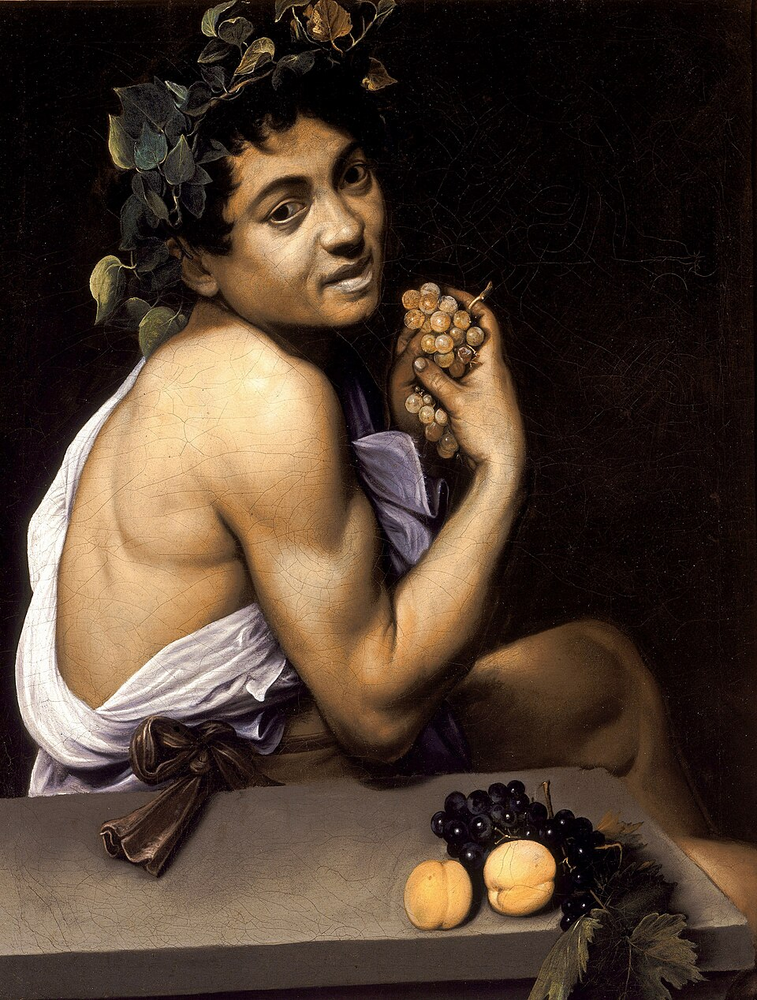
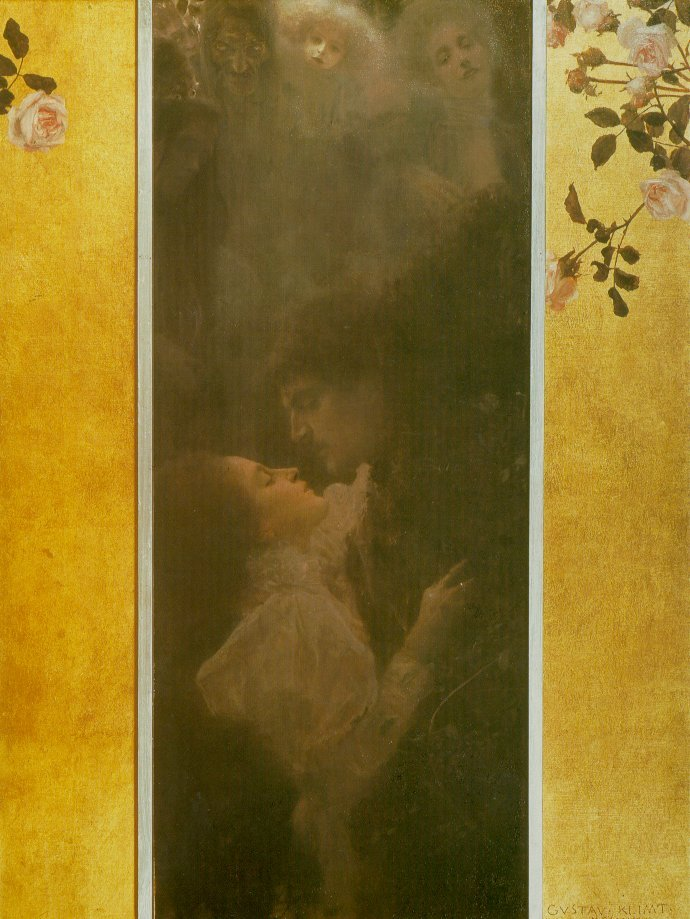
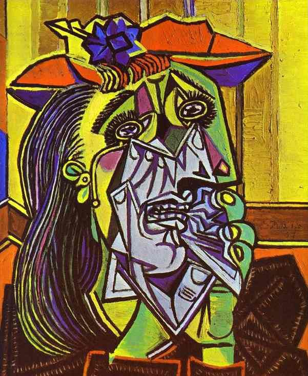
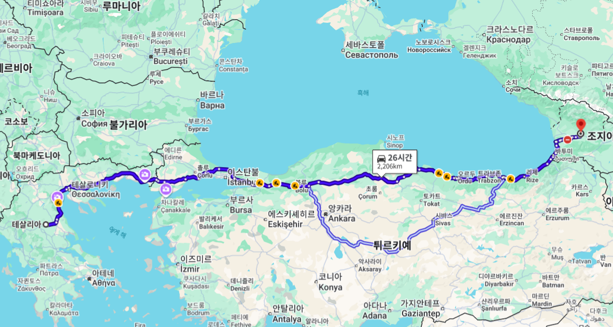
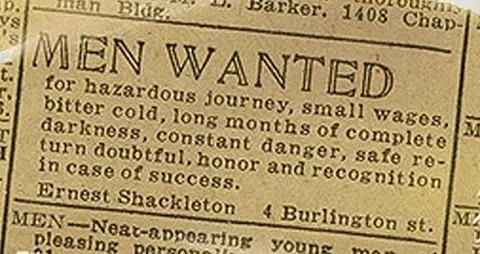
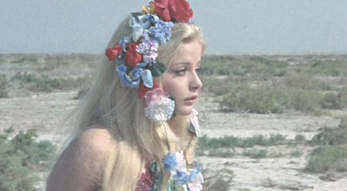
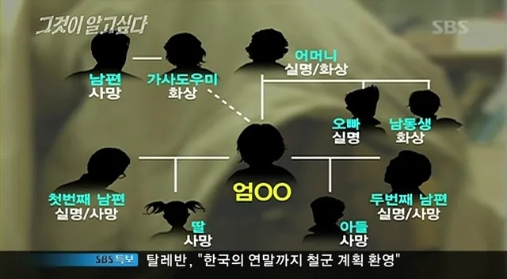
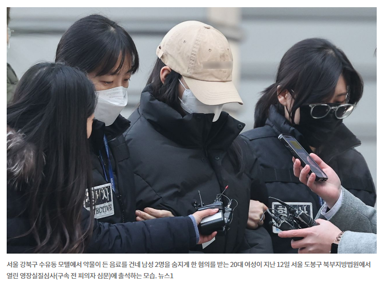

# 에우리피데스
**Date:** 2026. 2. 23. 13:24
**Category:** 다이어리
**Original URL:** https://blog.naver.com/xpfkwh56/224192597568
---

병든 바쿠스 - 카라바조

​

**1-1. 바쿠스의 여신도들**

​

테베의 젊은 왕, 펜테우스

​

펜테우스는 지도자의 덕목을

갖추기 위해 많은 노력을 했고,

​

마침내 오랜 인내와 노력 끝에

정당하게 주인이 될 수 있었다

​

그는 열정적으로 국정에 임하고 있고

누구보다 좋은 통치자가 되길 원한다

​

펜테우스는 최근 고민이 있다

​

디오니소스를 숭배하는

**은밀한 무리** 가 있는데,

​

그들이 사회의 풍기를

어지럽히고 있단 것이다

​

소문에 의하면, 자신의 어머니조차도

그 의식에 참여하고 있다고 하는데

펜테우스는 그 말들이 무척 거슬렸다

​

치안에 해로운 눈엣가시들을

정리하기 위해, 병사를 풀었고

​

그렇게 펜테우스의 앞에는

이방인 사내 하나가 잡혀온다

​

윤기 있는 긴 머리,

창백한 피부,

포도주 빛 눈동자

​

여기, 이방인 청년은 매일 새벽마다

많은 여자들을 이끌고 산으로 떠난다

​

무슨 짓을 하는 줄은 알 수 없지만,

​

여자들은 홀린 것처럼 이를 따르고

있었던 일을 입 밖에 꺼내지 않는다

​

무엇도 지니지 않은 이 청년을

왜 여자들이 그리 미친 듯 따를까

​

펜테우스가 물었다,

대체 너희는 무엇을 하는가?

​

이방인 청년이 답을 한다,

기도를 하고, 경전을 읽습니다

​

너는 사기꾼이다,

​

여신도들이 산에서 술에 취해 남자들과

은밀히 정사를 벌이고 있을 것이다

아프로디테에게 봉사하고 있을 것이다

​

펜테우스는 대답에 대경하여

이방인 청년을 옥에 가뒀다

​

온갖 여자들이 저 청년을

따르는 이유는 얼굴이다,

​

곱상한 사내가 유혹하니

그에 따르지 않을 리 없다

​

그리고 그들은 차마 입에 담기 어려운

더러운 짓들을 하고 있을 것이다

​

의식 이라는 거창한 명분을 빌려,

욕망을 잔뜩 해소하고 있을 것이다

​

순순히 감옥에 갇힌 청년은

스스로 손에 묶인 족쇄를 풀고,

​

기적을 행하며 권능을 행사한다

​

펜테우스는 그 모습에

경외를 숨길 수 없다

​

너는 누구냐,

​

나는 쾌락의 신 디오니소스 다

나는 너의 오해를 이해할 수 있다

​

관용을 베풀겠다,

​

너가 상상하는 그런 일은 없으니

나에 대한 제의와 숭배를 허락하라

​

펜테우스는 그 꼴이 우습다는 듯이,

디오니소스의 얼굴에 침을 뱉는다

​

무슨 속임수를 썼는지 말하라

​

디오니소스가 싱긋 웃더니,

펜테우스에게 제안을 던진다

​

> 산에서 밤마다 여자들이
>
> 뭘 하는지 직접 보고 싶지 않냐?

​

펜테우스의 눈이 떨린다

​

얼마를 내면 되는가?

​

그날 밤,

​

펜테우스는 거울 앞에 앉아

디오니소스에게 몸을 맡긴다

​

디오니소스는 펜테우스의

머리를 소중하게 빗겨주고,

​

아름다운 옷을 입히고

화장품을 얼굴에 발라준다

​

낭창한 가발, 하늘하늘한 옷,

펜테우스는 거울을 보면서 묻는다

​

무엇이 더 예쁜가?

​

신은 너는 웜톤에 가까우니,

이 색깔이 어울린다 조언한다

​

신과 왕은 곱게 차려입고 산에 오르고,

​

가장 전망이 좋은 자리에서

비밀 의식을 훔쳐보기로 한다

​

여인들은 아기 사슴에게 젖을 먹이고,

수다를 떨고, 음식을 나누고 있을 뿐이다

​

동시에 하늘과 땅 사이에

신성한 불기둥이 솟더니,

​

공기가 멈추고, 골짜기의 나뭇잎이 침묵하고,

신도들이 펜테우스에게 비둘기처럼 날아든다

​

죽여라!

​

전쟁의 함성이 사방을 메웠고,

​

그 선두에는 펜테우스의 어미,

아가우에가 있었다

​

아가우에의 입술에서 거품이 흘러내리고,

눈은 완전히 뒤집혀 돌아가고 있었다

​

디오니소스의 힘이 그녀를 사로잡고 있었기에,

아들의 모든 애원은 그 어떤 소용도 없었다

​

펜테우스는 꽃으로 장식된 고운 머리띠를 벗어던지며,

아가우에의 뺨을 손으로 어루만지며 애원했다

​

어머니, 저예요,

당신의 아들 펜테우스입니다

​

에키온 궁전에서 낳은 아이,

테베의 왕, 펜테우스 입니다

​

펜테우스는 남아 있는 숨을 다해 신음했고,

여인들은 기쁨에 환호성을 질렀다

​

한 명은 팔을 들고 있었고,

한 명은 발을 들고 있었다

​

날고기의 광기가 갈비뼈를 벌거벗겼고,

피 묻은 손으로 살점을

공 던지듯 서로 주고 받았다

​

아가우에는 아들 펜테우스의

머리를 지팡이에 꽂고, 왕궁으로 돌아와

​

아버지에게 자랑한다

사자를 잡았다며

​

아가우에의 아버지가 말한다

​

네가 한 일을 깨닫게 되면

끔찍한 고통을 겪을 것이다

​

지금 이 상태로 계속 남아 있을 수 있다면,

행복하지는 않겠지만 적어도

재앙을 만났다고 생각하지는 않을 것이다

​

영문을 모르던 아가우에는,

고개를 돌려 자신의 지팡이에

​

무엇이 꽂혀있나 확인하고

비명 지르며, 극이 끝난다

​

**1-2. 해석**

​

1) 애초에 펜테우스는 왜 산에 갔는가?

2) 진짜 치안 해결이 목적이 맞긴 했나?

3) 왜 디오니소스를 믿지 않았는가?

​

4) 펜테우스는 열등감을 느꼈나?

통제 욕구를 느꼈나? 둘 다 느꼈나?

​

5) 펜테우스는 솔직한 사람인가?

​

6) 왜 하필 저런 식으로

죽이고, 죽게 만든 것인가?

​

7) 디오니소스의 징벌은 정당한가?

8) 이런 신을 믿어야 되는가?

​

9) 아가우에는 무슨 죄를 지었나?

​

사랑 - 클림트

​

**2. 알케스티스**

​

테살리아의 왕, 아드메토스

그에게는 비정한 신탁이 걸려있다

​

대신 죽을 사람이 있으면

죽지 않을 수 있다는 것

​

아드메토스는 부모에게 부탁한다

나 대신 죽어달라고

**​**

**\* 부모님이 나이가 많으니**

**나 대신 죽는 것이, 효율적**

​

아버지도 거절하고, 친구들도 거절하고

그 누구도 그를 도울 수 없다

​

절망하고 있던 그 때,

​

아드메토스의 아내, 알케스티스가

대신 죽어주겠다고 걱정 말라한다

​

> 진짜? 찐이지?
>
> 진짜 그래줄 수 있어?
>
> 고마워! 말 바꾸면 안 된다?

​

알케스티스가 여기서

딱 한 가지 조건을 건다

​

절대 재혼하지 말고,

다른 여자를 들이지 말라

​

그 말에 아드메토스는 옳타쿠나,

​

나는 당신 없이 결코 살아갈 수 없소,

절대 그 어떤 여자와도 엮이지 않겠소,

평생 슬퍼하겠소, 뻐꾸기를 쏘아댄다

​

알케스티스는 죽었고,

아드메토스는 살았다

​

살아남은 내 인생이

죽는 것보다 못하다

​

아드메토스는 후회하지만, 때는 늦었다

​

그녀의 장례식이 끝난 당일,

**​**

**하필** 우연히 그리스의 대영웅

헤라클레스가 나라에 방문한다

​

귀빈을 무시할 수도 없고,

​

이런 영웅을 어설프게 맞이했다가는

이익이 아니라 손해가 생길 수도 있다

​

파티를 열고, 화려한 연회가 열린다

다들 웃고, 떠들고, 춤추고 노래한다

​

헤라클레스는 술을 마시다, 하인에게서

아드메토스와 알케스티스의 이야기를 듣고,

​

이야 그건 아니지~ 하면서 저승으로

내려가 알케스티스를 다시 데려온다

​

헤라클레스는 알케스티스를 데려와,

아드메토스에게 손을 잡으라고 한다

​

문제는 알케스티스의

얼굴이 베일로 가려져 있다

​

아드메토스는 혼란스럽다

​

아내의 장례식이 바로 오늘이다

​

내가 바로 그 날에 파티를 하고

낯선 여자의 손을 잡아도 되는가?

​

어? 안 잡아? 내가 우스워?

​

헤라클레스의 강권에, 아드메토스는

처음 보는 낯선 여인의 손을 잡는다

​

**\* 헤라클레스의 심기를**

**거스르는 것은 외교적 손해**

​

어.쩔.수.없.이.

​

베일을 벗기니 알케스티스다

​

되살아난 알케스티스가 말을 안 한다

헤라클레스가 설명한다

​

3일간 저승의 부정을

씻어야 말할 수 있다

​

실로, 편리한 설정이다

​

알케스티스는 말을 할 수 없다

​

피해자는 종종 입이 있어도

자신이 쓸 단어를 잊곤 한다

​

대신 죽어줬더니 장례식 날 파티 열고,

​

맹세한 지 하루 만에 다른 여자

손 잡고 있는 자기 남편을 보면서

알케스티스는 무엇을 느꼈을까?

​

알케스티스는 죽을 각오로 사랑을 증명했다

​

아드메토스는 그 사랑을 받아들이는 것으로

자기가 그만한 사람이 아님을 증명했다

​

헤라클레스가 되살려줘서 결과는 복구됐지만,

관계의 불균형은 복구 불가능하다 영원히

​

한쪽이 목숨을 줬고, 한쪽이 그걸 받았다

그 사실은 영원히 둘 사이에 있다

​

에우리피데스가 보여주는 건,

선의로 가득 찬 남자가 구조적으로

비열해지는 과정이다

​

아드메토스는 매 순간 합리적 이유가 있다

​

그런데 합리적 이유들을 쌓아올리면

결과적으로 그림이 끔찍해진다

​

배반이 구원의 조건이었다

​

맹세를 지켰으면 아내는 죽은 채로였다

결과만 보면 다 잘 됐다

​

그런데 그 결과에 도달하는 과정에서

아드메토스의 모든 말이 거짓이 됐고,

알케스티스는 그걸 전부 목격했다

​

좋은 결과가 나쁜 과정을

소급해서 정당화하느냐?

​

에우리피데스는 답을 안 준다

​

에우리피데스는 2464년 전,

이걸 기원전 438년에 썼다

​

우는 여자 - 피카소

​

**3-1. 메데이아**

​

테살리아의 왕자, 이아손

​

영앤리치톨앤머슬

육각형 꽉 찬 양남

​

어릴 적 친척에게 왕위를 뺏기고

가문의 재건이라는 운명을 수용

​

헤라의 가호를 받고 있고,

​

초엘리트 육성 기관

케이론 국제학교 출신

​

**\* 아킬레우스랑 동문**

​

장성해서 왕위 내놔 했는데,

**황금 양털 가져오면 줄게** 함

​

황금 양털 어디 있는데요?

콜키스

​

콜키스가 어딘데요?

​

구글 기준으로 2,206km

​

그냥 자동차 타고

26시간만 가면 됨

**​**

포트녹스

​

콜키스 신탁이, 황금 양털이 있으면

국가를 지킬 수 있지만 없어지게 되면

​

**나라가 망할 것이다** 라서,

​

매우 매우 강력한

드래곤이 지키고 있음

​

이건 그냥 안 준다는 소린데,

혈기가 넘치는 이아손은 **'Ok'**

​

받아들인 이유는?

**​**

**가져오면 100%**

**딴 말 절대 못하니까**

​

일단 지르긴 했는데

혼자는 답이 없음

​

같이 갈 친구들을 구함

​

아르고 호 원정대, 파티원 구합니다

​

위험한 여정, 적은 임금, 혹한,

몇 달간 완전한 어둠, 끊임없는 위험,

무사귀환 불확실, 성공 시 명예와 영광

​

네임드 영웅들로만 이루어진

역대급 드림팀을 조직한 다음에,

​

콜키스로 출발

​

도착해서, 콜키스의 왕에게

황금 양털을 달라고 하는데

​

말이 좋아 부탁이지, **무력 시위** 임

​

**\* 영웅+선원 이끌고 2천km 원정**

​

불을 뿜는 청동 황소에게 굴레를 씌워,

농사를 지어서 얼어붙은 땅을 갈고,

​

용의 이빨을 땅에 뿌려 해골 병사를

소환해서 모조리 다 물리치고 와라

​

그거 하면 줄게

​

내 생각에는 그거 할 바에, 그 능력으로

콜키스 접수하는 것이 빠를 것 같은데

​

아무튼 여기에서 또 이아손은 **'Ok'**

내가 그거 진짜 하면 딴 소리 못 하니까!

​

일단 청동 황소가 있다고 하니까,

가서 어떻게 생겼나 구경을 하는데

​

아, 이건 좀 아닌 것 같음

​

그걸 보고 있던 아프로디테가

에로스를 시켜서 도와주기로 함

​

​

콜키스에는 공주가 하나 있었는데,

​

에바 아울린

​

그녀의 이름이 **메데이아** 임

​

구구절절 고귀한 혈통이라고 하는데,

내용은 많지만 **여하튼** 대단한 끗발 임

​

에로스가 쏜 사랑의 화살이 그녀를 찌르고,

메데이아는 주체할 수 없는 사랑에 빠짐

​

메데이아가 이아손에게 고백함,

이아손은 메데이아에게 관심이 없음

​

황금 양털 가져오는 것

도와주면 너랑 결혼할게

​

일부종사, 출가외인

​

자명고를 찢은 낙랑겅쥬님 처럼

그거 없으면 고국이 망한다는데

​

노빠꾸로 마술도 부리고, 꾀도 부려서

열심히 매국한 결과, 황금 양털 획득!

​

다만 그녀가 사랑을 실천하는 와중에

사소한 몇 가지 헤프닝들도 있었는데,

​

황금 양털 들고 도망가니까, 아빠가 잡으러 와서

마침 그럴 때 쓰려고 데리고 있던 남동생을

토막토막 내서 시체 토막으로 지체하게 만들음

​

마침내, 그 모험의 끝에서

황금 양털을 들고 돌아왔지만

​

당연히 왕위를 줄 생각이 없었고

​

오히려 시킨다고 그거를 진짜 해낸

미친 새끼 이아손을 죽이려고 했는데,

​

**\* 콜키스에서 국보를 훔쳐온 마당에**

**아무 일도 없을 것이라고 여겼던**

**이아손의 정무 감각을 생각한다면**

**펠레아스가 왕위를 안 준 이유도 납득**

**​**

이아손의 뒤에는 **메데이아** 가 있었음

​

이 여자가 문제를

해결하는 방법은

​

대체로, 늘 심플한데

​

팜므파탈

​

약이랑 마술을 써서

​

​

모조리 다 죽여버림

​

이아손과 메데이아는

펠리아스 왕과 공주들을

​

살해했다는 혐의로

즉시 추방 당하게 되고,

​

이방인으로 떠돌면서, 간신히 코린토스에

정착해 하루하루 힘겹게 살아가게 되었다

​

라는 것이, **'메데이아'** 라는 이야기

극을 읽기 위한 배경지식의 일부 임

​

우리가 홍길동 하면, 아버지를

아버지라 부르지 못하고

​

이런 느낌으로 당대 그리스인들은

이걸 자기들끼린 다 알았나 봄

​

**3-2. 메데이아 (眞)**

​

이아손은 친구랑 술잔을 기울이고 있음

​

와이프가 어려, 예뻐, 애들 잘 키워,

부러워 죽겠는데 너는 왜 죽상이야?

​

이아손은 테이블 위에 있던 에쎄 1mg를

바깥 주머니에 넣고, 안 주머니에 숨겨둔

말보루 레드를 꺼내 담배에 불을 붙였음

​

어리고, 잘난 여자 만나면 좋다는 거?

속았어, 다 그거 가스라이팅이다 시발

​

그냥 내 속 편하게 해주는

속 깊은 여자가 제일 좋고,

​

집에다가 생활비 갖다주면

인형처럼 사는 여자가 최고야

​

매일 매일이 감옥 같고

같이 살기 버겁다 버거워

​

그렇다고 신세가 좋아지는 것도 아니고

앞으로도 맨날 이 모냥 이 꼴로 살겠지

​

메데이아도 할 말은 있음,

​

제 몸 하나 건사하는 것은 둘째치고

새끼 둘 키운다고 독기에, 악기만 찼고

​

엄마에다, 여자에다, 모자란 형편에

시원찮은 신랑 뒷바라지까지 하니

이 여자도 사는 것이 사는 것이 아녔음

​

그래도 버티는 이유는?

​

누가 물어보면, 애들 아빠 잖아

애들 보고 사는 거지 이유 있어?

​

라고 말하지만, 이유가 있다면 사랑

​

이아손이 자고 있으면, 내일 출근할 때

잠 설치면 피곤하니까 애들 조용히 시키고

​

그노무 담배 끊으라 끊으라 해도 안 끊는데

대뜸 무리하다 급사하는 것은 아닐까,

​

자고 있는 남편 코 밑에 검지 손가락 대며,

살아있나, 죽었나 기필코 확인을 한 뒤에야

안도하고 잘 수 있는 것이 메데이아 였음

​

> 이 남자를 위해선 나는
>
> 무엇이든 할 수 있다
>
> 무엇이든 할 것이다
>
> 그게 무엇이든 해낼 것이다

​

내가 미쳤지, 하고 철 없던 날을 떠올려도

아마 다시 돌아가면 같은 선택을 했을 것임

​

너가 내 이유야,

​

메데이아는 잠 든 남편을 보면서

속으로만 아무도 못 듣게 읊조림

​

이아손의 인간적 매력은

상황을 가리지 않았는지,

​

코린토스의 왕, 크레온은

그를 사위로 삼고 싶어 했음

​

메데이아와 이아손은 사실혼 관계였고,

애가 둘이었지만 아직 혼인신고를 안 함

​

도장이야, 그거 찍으나 안 찍으나

​

님이고, 남이고는 서류가

결정하는 것도 아닌 마당에

​

미혼모 혜택을 싹 써보자면서

제안한 것 역시 메데이아 였음

​

크레온은 그걸 알 리가 없었고,

​

이아손에게 공주 크레우사와

결혼할 것을 제안하고,

​

크레온과 함께,

​

강남 한복판에 놓인

고층 빌딩 최상층에서

거리의 야경을 내려봄

​

올려볼 땐, 높았는데

내려다 볼 땐, 참 낮다

​

할게요, 장인어른

​

이아손은 메데이아에게

조만간 자신이 코린토스의

공주와 결혼할 것을 통보함

​

메데이아가 소처럼 비명을 지름

​

> 남자들은 아내가 지루해지면
>
> 집 밖으로 나가서 그 문제를 해결합니다
>
> 친구를 만나기도 하고 또래의 파트너를 찾기도 하지요
>
> ​
>
> 그러나 우리는 남편만 바라보도록 강요를 당합니다
>
> 남자들은 이렇게 말해요
>
> ​
>
> 자기들이 전쟁터에서 싸울 때 여자들은
>
> 평화로운 시간을 보냈다고요
>
> ​
>
> 말도 안 되는 소리입니다
>
> 난 임신 한 번 하느니 전쟁을 세 번 나가겠어요
>
> 《메데이아》

​

아니 자기야, 이성적으로 들어봐

자기가 감성적인 사람이라 그래

​

내가 당장 공주랑 결혼한다고,

​

당신 남편이 아닌 것도 아니고

우리 애들 아빠가 아닌 것도 아냐

​

좋은 집, 좋은 차, 좋은 교육,

벌이 걱정 없이 잘 살 수 있는

좋은 제안인데 뭐가 걱정이야?

​

오히려 기뻐해야 하는 것 아냐?

​

메데이아가 **'표독스럽게'**

이아손의 궤변을 반박하자,

​

말이 나와서 말인데, 솔직히 자기가

나 진짜 좋아해서 그런 것도 아니잖아

그냥 에로스 화살 맞아서 그런거 잖아

​

그리고 시골에서 썩어가고 있던 너를

서울 한복판으로 끌어와준게 누구야?

​

나 아니야?

​

그리고 지금 당신이 하는 짓들을

사랑이라고 착각마 그거 집착이야

​

여자들은 애만 낳으면

뭐라도 되는 줄 알더라?

​

> 영혼(psūkhē)과 지성을 가진 것들 중에서
>
> 우리 여자가 가장 비참한 존재요
>
> ​
>
> 먼저 지나치게 비싼 값을 치르고 남편을 사야 하고,
>
> 그 위에 우리 몸의 주인을 얻어야 하니
>
> 나쁜 일(kakon) 위에 더 나쁜 일(kakon)이오
>
> 《메데이아》

​

이아손의 말에,

메데이아의 태도가

온화하게 바뀜

​

맞아, 내가 틀렸어

​

그럼 동생한테 앞으로 내가

호칭은 뭐라고 하면 될까?

​

서로 언니 동생 하면서

앞으로 잘 지내보면 될까?

​

이아손은 메데이아가 이제야

말이 좀 통한다고 생각을 했음

​

메데이아는 시장에 가서 옷을 사고,

산과 들을 떠돌며, 예쁜 꽃을 꺾었음

​

화관을 만들고, 예쁜 옷을 짜서

공주의 혼인 선물을 준비한 다음,

​

아이들을 시켜서, 선물을 전달함

​

아이들은 시킨 대로 물건을 주고 떠남

​

전처의 자식들과 새 처의 조화

약간 어색한 공기

​

공주 크레오사는 찜찜한 마음이 들지만,

먼저 베푸는 호의를 마다할 이유 없었음

​

애들이 무슨 죄야? 잘 지내보자

​

공주는 옷을 입고, 화관을 쓰고,

거울 앞에서 미소 짓고,

자리에서 일어나 방 안을 걸었음

​

하얀 발을 곱게 놀리며, 발목이

곧게 뻗었는지 돌아보고 또 돌아보며

​

그렇게 발목을 돌아보는데,

​

머리에 씌인 화관이 마치 접착제로

붙은 것처럼 하나도 움직이지 않음

​

화관에서 새빨간 불줄기가

용암물이 공주의 얼굴을 덮침

​

입었던 옷은 황산처럼 진득하게

공주의 보드라운 살을 파먹으면서 녹임

​

그걸 보고 있던 시녀가 경악하고,

​

크레온이 방으로 뛰어들어와

딸을 살리려 하지만 둘 다 죽음

​

담쟁이가 월계수를 감듯이

공주를 잔혹히 죽인 것들이

크레온을 죽음으로 감쌌음

​

그 소식을 들은 이아손은 애들부터 찾음

​

> 저 무서운(*deina*) 짓을 저지른 여자,
>
> 메데이아가 아직 안에 있느냐? 아니면 도주했느냐?

​

메데이아는 공주에게 줄 선물에

주술을 걸고 난 뒤, 칼을 들었다 놨다

마음을 제 스스로 다스릴 수 없었음

​

아이들이 선물을 주고 돌아올 때 까지,

메데이아는 마음의 결정을 할 수 없음

​

이아손은 생각했음,

​

왕가의 일원을 죽이는 도구로

우리 아이들이 쓰였다

보복이 있기 전에 피해야 한다

​

그 순간,

​

메데이아가 태양신의 전차를 타고

죽은 두 아이의 시체와 함께

이아손을 공중에서 내려다 봄

​

이아손은 메데이아에게

당장 내려오라고 일갈함

​

지금은 안으려 하는구나,

그 때는 밀어냈으면서

​

죽이는 것이 아니라 잃게 하는 것,

​

죽으면 끝이지만 잃으면

남은 생이 전부 고통이다

​

죽였다, 내가 죽였다

평생을 산 채로 죽어라

​

**신은 언제나 뜻밖의 일을 이루신다**

​

기원전 431년, 디오니소스 축제

3등(꼴찌) 에우리피데스 《메데이아》

​

**3-3. deus ex machina**

​

스토리는 뭐 그렇다 치자구요,

근데 극이 극 안에서 끝나야지

​

막판에 태양신 황금마차 타고

메데이아가 도망가는 장면?

​

저는 프로가 글 이런 식으로 쓰면

안 된다고 봅니다, 수준 미달이에요

​

아리스토텔레스, 《시학》 15장

​

신의 혈통을 받은 잘난 여자가,

태양마차 정도 없으면 저럴 수 있다는

생각도 할 수 없기 때문 아닐까

​

**4. 안드로마케**

​

1) 킬리키아 왕의 딸로 태어남 → 아버지가 정함

2) 헥토르와 결혼 → 아버지들이 정함

3) 친정 가족 전멸 → 아킬레우스가 함

4) 헥토르 죽음 → 아킬레우스가 함

5) 아들 살해 → 그리스 장군들이 정함

6) 네오프톨레모스의 첩이 됨 → 전쟁의 결과

​

**\* 네오프톨레모스 = 아킬레우스 아들**

**남편을 죽인 원수의 아들의 첩이 됨**

**​**

7) 헤르미오네에게 죽을 뻔함 → 정처의 질투

8) 구출됨 → 펠레우스가 함

9) 헬레노스와 재혼 → 신탁이 정함

​

자기가 한 것은 하나도 없음

아무런 의지도 없이 삶이 흘러감

​

그리스 장군들이 아기를 달라고 하니,

안드로마케는 달라니까 어쨌든 줬음

​

메데이아는 지성을 써서, 괴물이 되고

안드로마케는 지성이 있어도 쓸 수가 없음

​

메데이아는 이겼지만

가진 모든 것들을 잃었고,

​

안드로마케는 졌지만 살아남아

결국 아이네아스를 만남

​

이긴 것이 이긴 것이냐,

사는 것이 사는 것이냐

​

억압에 대한 두 가지 응답

​

메데이아가 억압받은 자가

폭발하면 이렇게 된다 라면,

​

안드로마케는

그게 안 되는 자는

이렇게 산다

​

아무도 죽이지 않지만

자신의 영혼이 죽음

​

메데이아처럼 복수하는 게 나은가,

안드로마케처럼 견디는 게 나은가

​

메데이아도, 안드로마케도

어쨌든 저쨌든 결국 살긴 산다