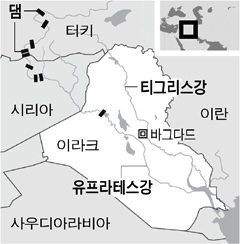
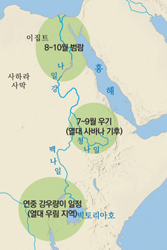
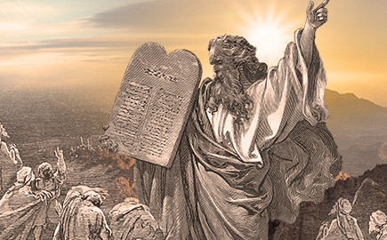
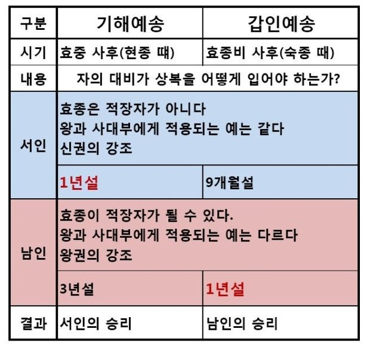

# 우락까이
**Date:** 2026. 2. 23. 8:32
**Category:** 다이어리
**Original URL:** https://blog.naver.com/xpfkwh56/224192277333
---

**1.** **Inanna**

**​**

수메르의 여신,

​

아마? 적어도 수메르에서는

제일 처음 나온 신으로 추정

​

홍수, 창조, 지하세계 여행,

죽음과 부활 같은 종교적

핵심 서사의 틀이 다 존재함

​

2. 왜 하필 수메르가 시작?

​

​

쟤네가 **운**이 좋았음

​

​

**3. 그럼 얘네는요?**

​

수메르 = 오픈소스, 파생작 다수

이집트 = 맥 OS

​

수메르는 주변 국가랑 교류가 많았고,

각자 입맛대로 자기들이 골라 쓰면서

​

서사가 보충, 수정, 삭제 되었지만,

​

이집트는 독자 생태계 로 발전해서

주변에 영향력을 그보다 덜 미쳤음

​

**4. 그리스/로마 신화는 뭐임?**

​

수메르 = 리눅스 커널

​

그리스 = 아치

로마 = 아치 포크

​

**\* 그리스 리스킨**

**​**

구약 = 우분투

​

포크임 그냥

​

**\* 인인나 → 모놀리식**

**비너스 → 마이크로 서비스**

**​**

수 천년 간의 리팩토링이

우리가 아는 종교의 역사

​

1) 창조/홍수/에덴 → 수메르

2) 천국/지옥/사탄/심판 → 조로아스터교

3) 부활/구원 → 이집트(오시리스)

4) 철학적 틀 → 그리스 (로고스 개념 등)

​

결론은? **기독교 = 윈도우**

​

**\* Mega Merge**

**​**

히브리가 독자 개발한 3개는 NT 커널,

나머지는 다 외부 드라이버 설치한 것임

​

**5. 독자 개발한 세 가지에 대하여**

​

1) 유일신 개념

​

**다신교 장점 = 설정 완성도 높음**

​

인인나(이슈타르)가 우리 신임? 맞음

​

인인나는 풍요의 여신인데,

그럼 하늘은 누가 관장해요?

​

하늘, 땅, 바람, 대기, 물,

이런 것이 있어야

풍요가 오는 것 아님?

​

어 ,, **'아누'** 라고 있어

그게 뭔데요?

​

하늘의 신이야, 인인나 아빠임

​

**\* 누더기로 급조 설정을 만들기 시작**

**​**

**다신교 단점 = 어렵고 현학적**

​

제삿상에 피자를 올리네 마네,

홍동 백서를 지키네 마네,

​

동일 문화권에서도 마찰이 생김

​

하물며, 2개가 섞인다면 어떨까?

​

**며늘아, 너 왜 절 안 해?**

**우상숭배 하면 안 돼요**

**​**

신이 많으면 많을수록 의례가 복잡

​

삼국지 읽고, 일본에 대망 이라고

노부나가니, 뭐니 읽어볼라 치면

​

첫 페이지부터 누가 누구의 남매고,

형이고, 사돈의 팔촌에 어쩌고 저쩌고

​

복잡해서, 눈에 들어오지도 않음

​

너 우리 종교 배울래? 해서,

응 배워볼게 했는데,

​

기다려봐 하고 먹고 살기 바쁜데,

​

누구는 사랑의 신이야,

누구는 죽음의 신이야,

​

이러고 있으면 듣다가 걔 집에 감

​

근데 하나로 통일해서, 야훼만 외워

하면 아주 간단히 설명해 줄 수 있음

​

구약에 야훼가 현대인 시각에서

비논리적인 이유도 이를 증명함

​

악신/선신의 정체성을 하나로 섞어서,

​

좋게 말하면 입체적이고 나쁘게 보면

얘가 뭐 하자는 것인지 알 수가 없는 것

​

**2) 계약 개념**

​

기존에 있는 신들은 다 **'이유'** 가 없음

​

그냥 신이 정하면 따라가는 것이라서,

인간은 수용하는 것 밖에 할 수 없는데

​

히브리 신앙은 신앙이

**신과 민족의 약속** 임

​

의인이 50명 있으면 살려줄게,

50명 많아요 깎아주세요

​

같은 것도 이 종교에만 가능함

​

**\* 시끄럽다고 홍수?**

**​**

**→ 그 말은 급격한 도시화로 인한**

**사회문제로 인하여 ,, 어쩌고 저쩌고**

**​**

원래는 인간이 신한테

흥정을 할 수도 없었음

​

이 개념은, 서구 문명에서

추후 사회 계약론으로 발전함

​

**3) 율법 개념**

​

작가 중에, 소포클레스 라고 있음

그리스 비극을 쓴 유명한 사람인데

​

이 사람이 쓴 작품 중

하나가, **안티고네** 란 것임

​

**\* BC 440~**

**​**

안티고네의 가족이 있었는데,

그 가족이 사건에 휘말려서 죽음

​

법률에 의하면, 묻어주면 안 됨

근데 안티고네는 오빠를 묻어줌

​

왕이 안티고네를 꾸짖음

​

**왜 법을 어기고, 반역자를 묻었냐**

​

안티고네가 그 말에 이렇게 말함

​

**신법은 인법의 위에 있다**

​

[](#)

​

내 가족의 시체가 썩어가는데,

그걸 묻는 것이 어찌 죄란 말이냐

​

​

히브리는 입법부가 **'신'** 임

그래서 그냥 그걸 따르면 됨

​

**6. 발생하는 문제**

​

신이 입법을 한다?

​

장점 = 정당성, 정통성 끝판왕

단점 = **업데이트가 불가**

​

그래서 이 해석을 **제사장** 들이 함

​

**\* 안식일은 노동을 하면 안 된다,**

**엘레베이터 버튼을 누르는 것은**

**그럼 노동인가? 노동이 아닌가?**

**​**

**영양제를 맞는 것은**

**식사인가? 아닌가?**

**​**

북한의 정확한 명칭은?

조선 민주주의 인민 공화국

​

> 신성 로마 제국은 딱히 신성하지도 않고,
>
> 로마도 아니었으며, 제국은 더더욱 아니었다
>
> 볼테르

​

신은 어디 있긴 있다는데 못 봤고,

왕은 율법의 아래에 있기 때문에

​

말이 좋아, 권력 분산이지

실제로는 **제사장 과두제** 임

​

여기에 불만을 가진 인물 등장,

​

해석을 왜 제사장이 독점?

율법의 본질은 **사랑** 이다

​

그 말에 제사장들이 반박함

​

**니가 율법을 알아?**

**너 어디 신학 대학 나왔어?**

​

**\* 마가 11:28**

​

나는 **신의 아들** 이다

​

7. 놀랍게도, 예수 본인이

​

내가 **'메시아'** 다 라고

대놓고 말한 기록에 대해서는

아주 아주 많은 논쟁이 있음

​

**\* 내 생각에는 아마도**

**메타포 정도 아니었을까**

**​**

**되도 않는 말로 깝치지마,**

**약간 이런 느낌으로 했을 듯**

**​**

바울이 예수를

신격화 했다는 것은

정설에 가깝게 보이고,

​

**\* 신을 만든 마케터**

**​**

그로부터 먼 훗날 **니케아 공의회** 에서

아리우스파, 아타나시우스파가 붙게 됨

​

cf. 예송논쟁

​

예수는 위대한 존재지만, 신의 피조물

vs 예수는 신 그 자체 성부와 성자는 동일

​

캐삭빵에서 **성부, 성자는 하나다** 가 이기고

아리우스파는 이단으로 낙인이 찍히게 됨