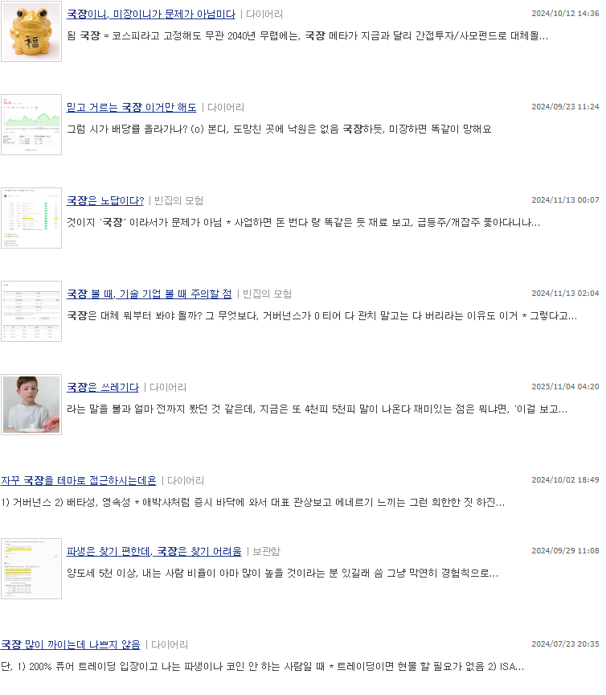

# 했제?
**Date:** 2026. 2. 24. 17:22
**Category:** 다이어리
**Original URL:** https://blog.naver.com/xpfkwh56/224194262302
---

​

다른 사람들 이야기 쫓아다니기

이 바닥에서 이건 죽겠단 소리임

​

삼전 2배 올랐다는데, 그 사이

섹터 스몰캡은 3-5배씩 올랐고

​

**\* 삼전을 살거면 증권주를 사든,**

**차라리 지수를 사는 것이 더 맞음**

​

늘 변하지 않는 재료는 **'가격'** 임

​

돈까스가 9천원인데,

치즈 돈까스가 5천원?

​

이거 이상한 것 같은데?

라고 **아는 것** 이 더 중요

​

유튜브, 블로그, 리포트 뒤지면

​

치즈가 돈까스에 올라갈 때,

그걸 치우는 비용이 어쩌고 저쩌고

​

별나라 얘기 하면서 합리화 하는데

이거에 안 속는 것이 꽤 어렵읍니다

​

상식을 지키는 유일한 방법은

상식을 지키고 유지하는 것임