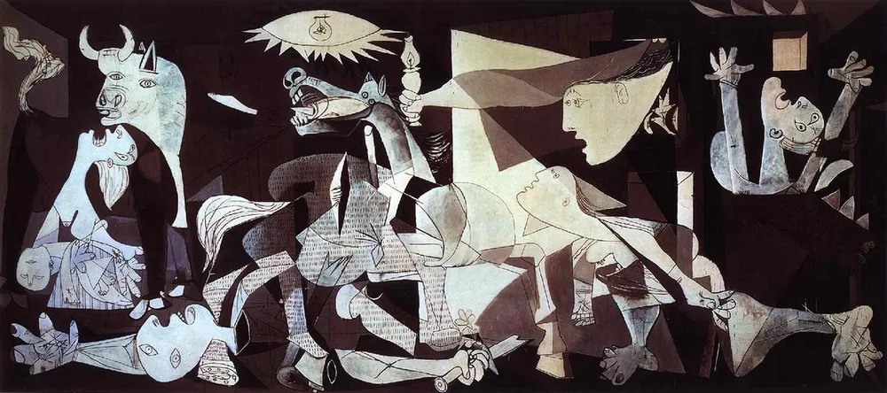

# 대심문관
**Date:** 2026. 2. 25. 20:22
**Category:** 다이어리
**Original URL:** https://blog.naver.com/xpfkwh56/224195811376
---

게르니카 - 피카소

​

1. 이반은 지식인이고, 무신론자

알료사는 신학을 공부하는 꿈나무

​

도대체 종교를 왜 믿지?

형은 동생이 이해가 안 감

​

동생에게 이죽거리며 입을 뗌

내가 만든 재밌는 얘기 해줄까?

​

2. 때는 16세기 세비야,

종교재판이 벌어지는 야만의 시대

​

전날 대심문관의 명으로

백여 명의 이단자가 화형당함

​

신의 아들이, 세비야 거리에 나타남

​

화려한 재림도 없고,

부인하는 자도 없음

​

조용히 사람들 사이에 섞임

장님을 고치고, 죽은 소녀를 살림

​

대심문관 등장,

손가락을 들어 체포를 명함

​

군중은 침묵 속에 길을 열어줌

대심문관이 길을 축복하며, 연행함

​

감옥에서는 철문이 열리고

대심문관이 등불 하나를 들고

홀로 신의 앞에 마주 섬

​

왜 돌아온 것이냐,

방해하지 마라

​

당신이 거부한 세 가지를

우리가 대신 해냈다

​

사탄이 광야에서 건넨 세 가지 유혹

​

1) 돌을 빵으로 만들어라

2) 성전에서 뛰어내려라

3) 나를 경배하면 세상을 주겠다

​

대심문관이, 이어 말하길

​

> 무섭고 지혜로운 사탄이 광야에서 네게 건넨
>
> 세 가지 제안보다 더 진실한 것은 이 세상에 없었다

​

빵은, 추천 알고리즘

​

뭐 먹을까? → 배민이 골라줌

뭐 볼까? → 넷플이 골라줌

뭐 살까? → 쿠팡이 골라줌

​

선택의 자유가 있지만,

선택이 피곤하니까 넘김

​

**우리가 빵을 주니,**

**인간은 빵을 따라왔다**

​

기적은, 즉각적인 결과물

​

코딩 해 줘 → 1초만에 나옴

글 써 줘 → 2초만에 나옴

그림 그려줘 → 3초만에 나옴

​

**과정의 생략이 곧 기적,**

**​**

**인간이 기적을 보면**

**어떻게 를 묻지 않음**

**​**

**대신, 또 해줘 라고 함**

​

하나의 답을 주니, 평화로워졌다

​

AI 가 그렇게 말했으니까,

지피티한테 의료 질문, 법률 질문,

투자 질문, 답이 맞든 틀리든

​

권위 있는 톤으로 말하면 믿음

​

검색조차 100개의 결과 중,

하나를 골라야 했지만 AI 는

아무튼 하나를 콕 찍어서 줌

​

자유와 모든 이에게

충분한 빵은

결코 양립할 수 없다

​

인간은 스스로 둘을 공정하게 나눌 수 없다

​

너는 인간을 너무 높이 평가했다

인간은 반역자이되 태생이 노예다

​

카이사르의 칼을 받았으면 인류에게

보편적 통일과 영원한 평화를 줄 수 있었다

​

인간의 세 번째이자 마지막 고통은

모두가 함께 하나로 합쳐지려는 욕구이니까

​

나 역시 광야에서 메뚜기와 풀뿌리를 먹으며 살았다

나 역시 네가 인간에게 준 자유를 축복했었다

​

나 역시 네 선택된 자들, 강하고

위대한 자들의 대열에 합류하려 했다

​

그러나 나는 환상에서 깨어나

그 광기에 봉사하기를 거부했다

​

나는 돌아와서 네 실수를

바로잡은 자들의 대열에 합류했다

​

너는 인간을 존중한 게 아니다

인간을 과대평가한 것이다

​

심문관이 침묵했을 때, 그는 잠시 기다렸다

죄수가 답하기를, 그 침묵이 그를 짓눌렀다

​

죄수가 내내 조용히, 그의 눈을

똑바로 바라보며 듣고 있었음을 그는 보았다

​

노인은 그가 무슨 말이든,

쓰라리고 무서운 말이라도,

답을 해주길 바랐다

​

그러나 갑자기 그가 일어나, 조용히 다가와,

늙은이의 핏기 없는 90세의 입술에 가만히 키스했다

​

그것이 전부였다

​

키스가 늙은이의 가슴에 타오른다

그러나 노인은 자기 생각을 바꾸지 않는다

​

그 이야기를 듣고 있던 알료샤가

일어나서 이반의 입술에 키스함

​

이반 " 표절이군 "

​

카라마조프가의 형제들 《대심문관》