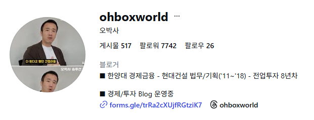
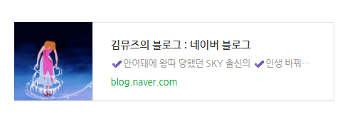
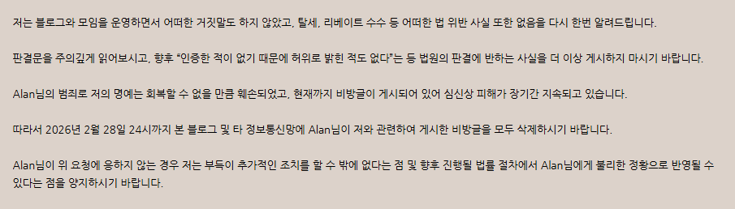
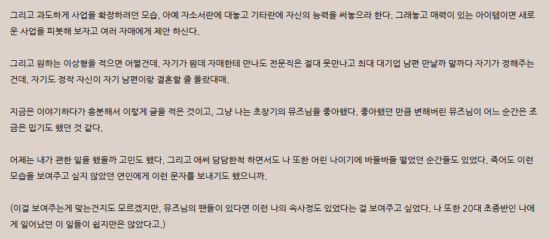
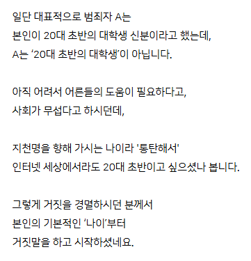
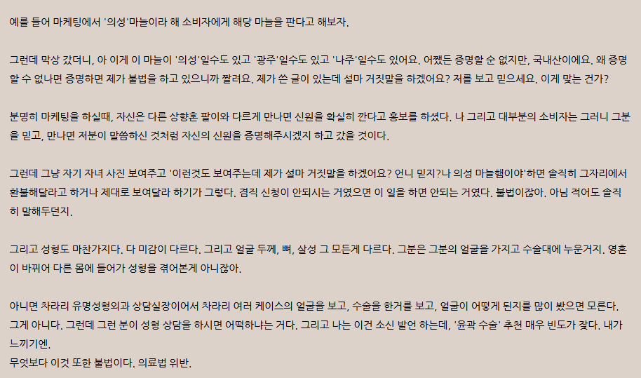

# 김뮤즈 사건 궁금증
**Date:** 2026. 2. 26. 0:07
**Category:** 다이어리
**Original URL:** https://blog.naver.com/xpfkwh56/224196030022
---

1. 피해자는 학력, 경력, 재산, 남편의 직업,

모범 납세자 여부 등을 허위로 밝히거나

​

차명계좌를 사용하거나, 탈세 혹은 병원으로부터

리베이트 받는 등의 행위를 한 사실이 없었다

​

2. 그럼 재판 당시에, 본인 스카이 졸업 여부,

재산 규모, 대기업 재직 여부, 남편의 직업,

​

이런 것들이 **전부** 규명이 되었다는 것임?

​

​

비포어,

​

​

에프터

​

**\* 한양대 경금 Fact**

**현대건설 재직 Fact**

**​**

당연 사실 여하가 엄격히 확인된 것은 아니지만

내가 아는 바에 따른 진실은 다음과 같음

​

​

**1) 본인이 PR 했던 멘트**

​

안여돼에 왕따 당했던,

뭐 그럴 수 있다 치고

​

**'SKY 출신의'**

​

2) 대기업도 당장은 못 찾겠는데,

있던 글 기준으로는 있지 않았나?

​

명문대 졸업 후, 대기업 취직하구,

변호사 상향혼 성공했구, 워킹맘 임

​

이게 내 기억이 맞다면 맞는 듯한데

​

​

3. 이 댓글의 경우,

​

당연히 탈세는 불법이 맞는데,

리베이트 수수는 불법이 아님

​

**\* 저격 글에는 신랑 계좌로**

**돈 받았단 얘기 있던 것 같은데**

**​**

현금 파이프라인 하나 더 늘린 것이

자본주의에서 어찌 죄가 될 수 있겠음?

​

근데 성형 컨설팅을 해주는 사람이

병원과 뭔가 접점이 있었다면 상식적으로

그거 쓰는 입장에서는 알곤 싶을 것이고,

​

이해관계에 영향이 있을 수도 있겠다고

짐작하는 것은 아마 어려운 일이 아닐 것

​

4. 본인이 그리도 억울하면,

순리에 맞게 하면 될 일 아닐까

​

55만원, 66만원을 지불한 사람이 있고

전부는 아니지만 그 지불한 사람 중 하나는

상당히 부정적인 경험을 했다는 것이고,

​

​

이러나 저러나, 원래 **'팬'** 이던 사람이랑

**'재판'** 을 하고 있는 상황이란 것이 팩트임

​

**\* 신뢰가 없는데 50-60 짜리**

**컨설팅을 결제하는 것은 비상식**

**​**

​

이건 무슨 **프로토콜** 이 있나?

블로그 가서 원문 읽어봤는데,

​

포스팅에서 썼던 내용과 달리

20대 초반 대학생이 아니라고 함

​

지천명을 향해 가시는 나이라는데,

그럼 그래도 **40대 이상** 의 누군가?

​

**그렇다면 40대 이상의 누군가가**

**김뮤즈 성형 컨설팅을 받은 것임? ,,**

​

내일 모레 오십인 사람이 컨설팅 받고

성형하구 이뻐져서 상향혼하려고? ,,

**​**

**\* 글이 다 지워져서 근거는 없지만,**

**구독층을 생각하면 참 ,, 믿기 어려운**

​

김뮤즈 컨설팅 **선 서류/후 결제** 아님?

​

이게 20대 초반이든, 40대든 간에

1초면 고객 중 누가 했나 확인되는데

​

**\* 이런 구조 때문에 컨설팅 파트에서**

**제대로 된 후기를 찾기도 어려운 거고**

​

정 본인이 억울하면, 재판에서 이겼어

이게 아니고 그걸 밝히면 될 문제일 듯

​

애초부터가 저기에 있는 글이 수강생이

아니었으면 성립 자체가 안 되는 것 아님?

​

" 수강생 아닙니다 " → 저격글 붕괴

" 수강생 맞습니다 " → 내용 해명 필요

​

근데 글 싹 내리고 고소 후,

판결문 첫 페이지만 오픈??

​

​

5. 갓직히 재판까지 갈 것도 없이,

​

애초에 처음 저런 얘기 나올 때부터

글 싹 지우고, 꼬르륵 할 것이 아니라

​

맞는 것은 맞다, 아닌 것은 아니다

풀었으면 지금보다는 나았을 듯함

​

1) 신원을 확실히 깠다,

근데 쟤가 거짓말을 한 것이다

​

2) 윤곽 추천 빈도가 잦다?

아니다 허무맹랑한 모함이다

​

3) 자매들한테 사업 제안 했다?

그런 적 없다, 등등 처음 나왔던

​

의혹들을 그냥 해명 하면

판결문 **없어도** 납득이 갈 듯

​

6. 나 역시 소송을 하구 있는 입장에서

당사자 재판이니 몇 가지 더 풀어봄

​

1) 로알람은 자기가 탈세, 세무조사

이런 것에 아무 문제 없었다고 주장함

​

당연하지, **'번 적이'** 없으니까

​

그래서 걔가 강의를 판촉하는 과정에서

기망이 있었나? 없었나? 를 따지는 중임

​

게시 **'행위'** 인가? **'표현'** 인가?

또한 중요하게 다루고 있는 중임

​

2) 오박사는 내 주장이 전부

싹 다 허위사실 이라고 주장함

​

자기는 가정폭력 전과가 없다고 함

실제로도 가정폭력 전과가 없음

​

진짜 와이프인지, 해킹을 당한 것인지

본인 블로그에 올라온 글/영상이 있을 뿐

​

영상도 머리채 잡고 뚜드려 팬 것도 아님

쿠션을 집어 던졌다는 것만 확인할 수 있음

​

그걸 **'가정폭력'** 으로 보냐도 복잡하구,

가정폭력**'범'** 으로 보냐 역시 복잡하구,

​

알아야 되는 공익적 사실인지 또한

하나 하나가 다 짚어야 될 부분들 임

​

**\* 이런 것들은 한가해야 할 수 있지요**

**​**

몇 건을 고소 당한 것인지는 안 풀었구,

변호사는 늘 **'다'** 결백하다고 주장하시지만

​

**'2건'** 의 통매음 불송치 소식을 봤고,

​

**'성범죄'** 라는 표현이 법률적 기준인가?

아니면 정황상, 나올 법한 이야기인가?

​

라는 것부터 길어지는 것이 한 둘이 아님

​

텔레그램에서 투자 조언을 한 사람이

유투면허 보유한 오씨인지, 없는 오씨인지

이런 것들은 아직 이야기 시작도 안 함

​

판결문 보고 드는 솔직한 생각은,

**법 몰라서 500 벌금 맞았구나** 그 뿐임

​

7. 뭐 얼마를 벌었는 줄도 모르겠구,

​

더 솔직히는 얼마나 대단한 명예를

훼손 당한 것인지도 모르겠는데

​

남의 집 딸래미 누구는 님 말만 듣구

수술대에 올라가서 뼈를 깎았고,

​

님 믿고 돈 내고 컨설팅 받았던 일부는

속는 놈이 바보다 같은 소리도 들음

​

억울하다고 결백하다고

블로그에 글을 쓸 입장인가?

​

나는 잘 모르겠네?

​

그나마 확실한 것은 컨설팅에서

지덕체에서 **'체'** 를 강조했다든데

​

그 하나는 분명히 알 것도 같음

​

나는 4천년 전 점토판에서도

​

인간을 꺼내 볼 수 있는

사람임을 자부하는데,

​

정작 동시대에 사는 사람은

보고 싶어도 볼 수가 없네요