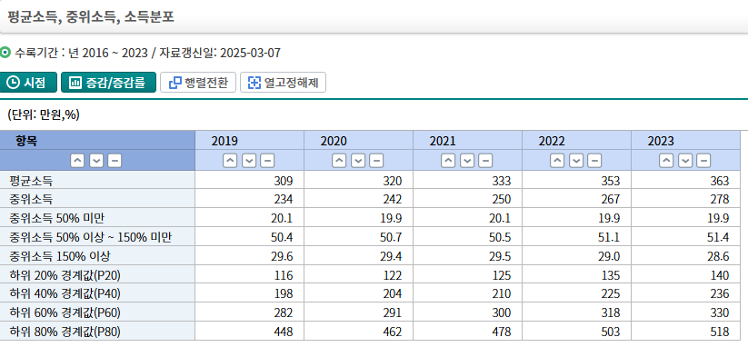

# 셋 중 하나는 당연히 오르죠
**Date:** 2026. 2. 26. 13:05
**Category:** 다이어리
**Original URL:** https://blog.naver.com/xpfkwh56/224196611021
---

1. 매/전/월

​

전세부터 봅시다, 오를까요?

전세가 오르려면 2개가 있어야 됨

​

1) 그 돈이 집주인 손에 있을 때

이익이 커야 하고

​

2) 반대로 세입자 손에 있을 때

이익이 작아야 됨

​

가능성 = 낮음

​

**2. 월세 수익률은 몇 퍼?**

​

장사꾼들이 나랏님 찬스로다가

돈 아껴서 누리는 그런 것 제외하면

​

맥스로 **죽어라 올려도** 5% 쯤임

​

지금에서 약 2배 정도 올릴 수 있음

여기에 디테일이 있는데,

​

70만원 짜리 월세 140 내고,

​

200짜리 월세 400 낼 순 있어도

500 월세 내던 사람은 1천 못 냄

​

**\* 이사를 가지**

**​**

**3. 매매**

​

퐁락이다, 폭등이다 이전에

이 판에 누가 **꾼** 인질 봐야 됨

​

뉴스에 비싼 아파트 몇 억 떨어졌다

어쩐다 해봤자 크게 의미가 없는 점이

​

1) 첫째로 그거 버리고 갈 곳이 없고

2) 둘째로 판들 애초에 다 내 돈도 아님

​

내가 연봉이 20억인데, 3억 깎겠데

그래 깎아라 **어차피 그게 그건데** 싶은

그게 부동산에도 똑같이 적용되는 것

​

**\* 부동산에 투기자금 들어가면 나라 망한다,**

**이렇게 생각하는 것이 지배적인 정서지만**

**아닌 말로 그게 있어야 도로도 닦고 돈을 씀**

​

기분 좋은 뉴스 = 올랐다 (x)

기분 나쁜 뉴스 = 내렸다 (x)

​

기분 좋은 뉴스 = 내일도 여기 살 수 있다 (o)

기분 나쁜 뉴스 = 잘하면 쫓겨날 수도 있다 (o)

​

보유세에 질색팔색 하는 이유가 이거임

엉덩이 무거운 사람을 움직이게 하니까

**​**

**4. 그래서 어떻게 될 것이라고 본단 것?**

​

1) 전세가 유지될 수 있던 이유

​

전세가 싸니까 (x)

정보 비대칭 (o)

​

돈 냄새 좀 맡아봤다는 2030 들한테

서울 집 살래? 하면 으엥? 소리부터 함

​

그돈씨 소리가 절로 나오기 때문

**그냥 하나 있어야 되는 것 정도지**,

​

집 한 채 들고 있으면 졸업이다 라는

생각도 전 세대보다는 낮을 확률 큼

​

80년 반영구 임대랑 자가랑 뭔 차이임?

차이가 당연히 있지! vs 진짜 모름

​

그래도 차가 있어야 기동력이 생기지

vs 운전하기도 귀찮고, 주차는 어디에?

​

이처럼 인식이 달라지면 규칙도 달라짐

​

간단히 보면, 결국 집 담보로 걸고

사채 쓸 수 있는 권리가 있던 건데

​

시간이 지나면 없어지는 것이 **당연**

​

**2) 월세가 저렴할 수 있었던 이유**

​

전세가 있어서, 보유세가 없어서 등등 (?)

​

​

**그냥 돈이 없어 (o)**

​

**\* 17/18 이든, 25/26 이든**

**해당 비율 자체가 잘 안 바뀜**

​

그냥 돈이 없음

​

돈이 없는데 어떻게

들어가서 산다는 것임

​

어라? 근데 어디는 월세 폭등하구,

들어온단 사람이 줄을 서고 있구 등등

​

돈 많은 사람 들여올 수 있으면 되는데,

걔라고 재고 따지는 것 없지는 않을 것임

​

**3) 집을 케이크 먹듯 쉽게 사는 법**

​

나라에서 저리로 빌려주는 돈을 쓴다

나라에서 밀어주는 세제 혜택을 쓴다

​

내가 집을 사야 될까? 지금 타이밍 일까?

**관치금융** 이라서 저거만 보고 움직이면 됨

​

내 조건에 엄청 유리하네? → 사면 됨

나는 해당 사항이 없잖아? → 실력 게임