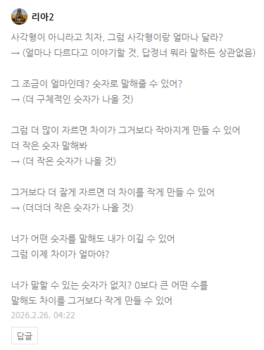

# 엄마표 극한 파훼법
**Date:** 2026. 2. 26. 5:02
**Category:** 다이어리
**Original URL:** https://blog.naver.com/xpfkwh56/224196194696
---

​

1. 게임의 승리 조건

​

누구든 더 작은 수를 말한다 (x)

상대가 **무엇을 말하든** 누를 수 있다 (o)

​

0 보다 큰 모든 실수에 대해서는

늘 오차를 그 밑으로 만들 수 있음

​

이 때, 엄마랑 아이랑 둘이서 서로

0.000000001, 0.00000000001

내가 더 작아, 니가 더 작아 하면 안 됨

​

아이가 제시하는 숫자 보다

무조건 더 자동으로 작은 숫자

이리 걸어놔야 논리가 유지됨

​

아이 = 0.0000001

엄마 = 난 그거에 /10

​

아이 = ㅇㅇ 묻고 떠블로 감

그럼 나도 그거에 /10

**​**

**엄마 = 더 작은 숫자를 너가 찾았네?**

**​**

2. 아이가 할 수 있는 반박

​

오차를 누를 수 있다? Ok

​

근데 오차를 **'누를 수'** 있다는 것이

**'오차'** 가 있다는 것에 대한 증명 임

​

없는데 어떻게 누름?

​

오차가 존재한다 → 누를 수 있다

→ 오차는 언제가 0 이 아님을 입증함

​

**3. 재반박**

​

오차가 0 이 되는 순간은 필요 없음

​

어떤 기준을 제시하든 그 밑으로

만들 수 있다는 걸 보이면 되는 것

​

어떤 숫자를 가져와도 누를 수 있다

​

→ 그 숫자는 반드시

어떤 양수보다 작다

​

→ 이 숫자보다 작은 - 가

아닌 숫자는 **'0'** 밖에 없다

​

어!?

​

**4. 아이의 반박**

​

**'진짜'**, **'하나만'** 남음?

​

수직선을 긋고 좌우에서 조이면 됨

​

혹시 빈틈이 있나? 하고 찾아봤는데,

일단 제가 찾은 지식 내에서는 없었음