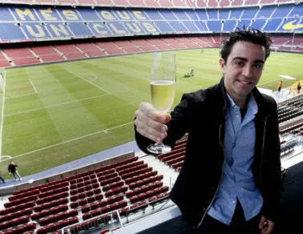

# 노벨 문학상을 처음 받은 사람은?
**Date:** 2026. 2. 27. 1:00
**Category:** 게시판
**Original URL:** https://blog.naver.com/xpfkwh56/224197372918
---

1. 정답은, 쉴리 프뤼돔

​

**아저씨, 누구세요?**

으음, 대단한 분이라고 함

​

2. (유산에서 발생하는)

이자는 다섯 등분하여

​

물리학 분야에서 가장

중요한 발견이나 발명을 한 사람,

​

화학 분야에서 중요한

발견이나 개발을 한 사람,

​

생리학 또는 의학 분야에서

가장 중요한 발견을 한 사람,

​

문학 분야에서 이상주의적인

가장 뛰어난 작품을 쓴 사람,

​

국가 간의 우호와 군대의 폐지 또는

삭감과 평화 회의의 개최 혹은

추진을 위해 가장 헌신한 사람에게 준다

​

3. 노벨상 가치는 **상상초월** 이었음

​

상금은 **131년 전에 만든 기금** 으로,

현재 이자만 줘도 두당 10억씩 떨어짐

​

국가를 초월하는

명예의 전당 헌액,

​

막대한 명성과

상금 약 100억 이상

**​**

**뉴스가 안 될 수가 없었음**

​

죽음의 상인이 무려 100억짜리

횃불을 전달하는 프로메테우스로

탈바꿈 할 수 있는 수단이기도 했음

​

4. 도박꾼들은 아마 문학상은

**둘 중 하나가 받지 않을까?** 했음

​

**1) 톨스토이**

​

러시아 소설가, 세계 문학사

역대 최강 후보 중 한 명

​

호메로스, 셰익스피어와

동급에 있다고 거론되는 레벨

​

**\* 둘은 고정이고, 나머지는 잘 바뀜**

**약간 이순신, 세종대왕 같은 느낌?**

**​**

러시아 귀족 가문 출신,

영지에 농노를 거느린 백작

​

근데 평생 자기 특권에 괴로워

몸서리를 쳤던 독특한 인간

​

대표작은 전쟁과 평화,

안나 카레니나, 등이 있음

​

행복한 가정은 모두 엇비슷하고

불행한 가정은 저마다의 이유로 불행하다

​

귀족 부인, 안나 카레니나

공무원 남편과 결혼 생활이 건조

​

젊은 장교 브론스키와 불륜

안나는 모든 것을 버림

​

사람 사는 것이 1877년이나,

2026년이나 달라봐야 다를까?

​

기출에 의하면, 이 패턴 결론은 뻔함

​

처음에야 죽고 못 살던 놈이

사랑이 점점 식고, 안나 카레니나는

​

불안, 질투, 의심, 고립에 시달리다

기차에 몸을 던져 자살

​

4천년 인류 문학사를 관통하는 결론은

파멸적인 선택을 하면 파멸이 오게 되고,

구원을 추구하면 구원을 얻게 된다는 것

​

전쟁과 평화, 톨스토이가

**'영혼'** 을 담으려고 했던 책

​

전쟁, 사랑, 죽음, 신앙,

인간이 겪을 수 있는 것들을

하나의 소설에 담으려고 했고

​

당시 시대적 기준으로는 텍스트가

도달할 수 있는 정점이라 평가 받음

​

톨스토이는 강남좌파

혼자 살았으면 되는데

문제는 처자식이 있음

​

마누라 소피아

속이 타서 죽을 것 같음

​

남편이라고 하나 있는데

​

사유재산을 거부하고,

저작권을 포기하려 함

​

육식을 거부하고, 채식주의를 함

비폭력주의에 심취

​

무정부주의자이자, 종교를 부정해

러시아 정교회에서 파문을 당함

​

82세의 나이에, 부부 싸움 끝에 가출

기차를 타고 어디론가 가다가 사망

​

생전, 노벨상 시스템에 대해 적극 비판

​

수능에 나온 내 작품 해석?

그거 틀렸는데? 무슨 짓들임?

​

문학은 마음으로 읽는 것,

줄세우기? 너무 천박하네요

​

노벨상 위원들은

톨스토이가 부담스럽

​

마누라 소피아는 톨스토이에게

제발 트위터 좀 하지 말라는데,

​

톨스토이 키보드는 멈추지 않음

​

**2) 에밀졸라**

​

프랑스 소설가, 자연주의 문학의 창시자

문학의 **'카테고리'** 를 만들어낸 인간

​

자연주의가 뭐임?

​

졸라 이전의 문학은 크게 두 갈래였음

​

낭만주의 : 감정, 영웅, 이상

" 인간은 아름다운 존재 "

​

**열린 결말, 배드 엔딩, 그런 것 몰라**

​

나는 찝찝함 없는 깔끔한 엔딩이 좋아

행복하게 오래오래 살았으면 좋겠어

​

사실주의 : 있는 그대로의 현실 묘사

" 현실을 그대로 그리자 "

**​**

**좋은 것이든, 나쁜 것이든, 현실은 현실**

**​**

아름다운 것은 아름답게 그려야 하고,

추한 것은 추하게 그려야 근본 문학 임

​

졸라는 한 단계 더 나감

" 소설은 정교한 실험 이다 "

​

인간을 유전, 환경, 시대와 같은

구조적 요소들의 산출물로 봄

​

작가는 인물을 특정 환경에 놓고,

어떤 결과가 나오는지 관찰하는 실험자

​

감정이나 도덕 판단을 배제하고,

인간을 생물적/사회적 대상으로

다루고 관찰하겠다는 것이 졸라 ,,

​

사실주의가 그저 현실을 보여준다면,

​

**자연주의는 인간은 도대체 어째서**

**이렇게 될 수밖에 없는가를 증명함**

​

에밀 졸라의 대표작은 목로주점

​

파리 노동자 계급

여자의 인생이 있음

​

세탁소를 차려 성공하지만

남편의 알콜 중독, 가정 파탄,

본인도 알콜 중독, 극빈, 사망

​

졸라가 이 소설에서 한 것은,

파리 노동자 구역의 말투, 냄새, 온도를

정확하게 있는 그대로 가져왔다는 것

​

당시 독자들은 충격을 받았음

​

이 새끼 이거, 남자 아님 여자 임

글 보니까 이거 평택 노가다꾼 임

​

직접 겪지 않았으면

이런 디테일 못 나옴

​

이런 추잡한 걸 왜 쓰느냐 는 비난과

진짜 현실을 처음 봤다 는 찬사가

​

동시에 쏟아진 문제작으로 여겨짐

​

여러 작품이 있는데, 요즘으로 따지면

**'송곳'** 같은 작품을 하나 썼던 적 있음

​

노동 문학의 최고봉으로 꼽히며,

마르크스도 졸라를 높이 평가,

​

이 작품 하나로 졸라는

불란서 블루컬러 계급의

영웅이자, 대변자가 됨

​

1898년, 졸라를 단순한 문학가

그 이상의 존재로 만든 사건이 있음

​

유대인 프랑스 군인 누구누구가

간첩 혐의로 누명을 쓰고 유죄 받음

​

실제로는 당연히 무고였고

진범이 따로 있었는데,

​

군부가 반유대주의와

체면 때문에 진실을 은폐

​

우리한테는 **꽤 익숙한** 기출 임

​

졸라가 목숨이 두 개 달렸는지,

신문 1면에 대통령에게 보내는

공개서한을 실명 걸고, 발표함

​

**'나는 고발한다 (J'accuse...!)'**

​

지식인(intellectuel) 이라는

단어 자체가 이 사건에서

처음으로 탄생한 표현 임

​

**\* 행동하는 양심, 깨시민의 원조**

**​**

졸라를 지지한 교양인 그룹을

지칭하면서 처음 쓰인 말

​

그로부터 4년 뒤,

​

자택에서 일산화탄소 중독으로 사망

굴뚝이 막혀있었다는 공식 발표

​

근데 수십 년 뒤, 한 굴뚝 공사업자가

​

" 드레퓌스 사건 보복임"

이라고 고백했다는 썰이 있음

​

암살인지 사고인지, 아무도 모름

목숨이 하나였구나 라는 것만 증명됨

​

노벨상 위원들도 갑갑할 따름임,

​

에밀 졸라는 드레퓌스 사건으로

프랑스 정부/군부와 적대하는 상태

​

이거 첫 노벨상인데, 정치적 논란을

갖고 있는 인물한테 상을 줘도 될까?

​

문학 분야에서 **이상주의적인**

가장 뛰어난 작품을 쓴 사람,

​

에밀 졸라의 작품이 지리긴 하는데,

소재가 창부/알콜 중독자/강간/살인

​

쟤는 인간의 가장 추악한 면을

파헤치고 고발하는 작가인데,

​

노벨상에 부합하는 사람이 맞냐?

​

한 놈은 상을 거부하는 사람,

한 놈은 상이 거부하는 사람

​

5. **깨진** 꽃병 - 쉴리 프뤼돔

​

이 마편초 꽃이 시든 꽃병은

부채가 닿아서 **금이 간 것**

​

**살짝 스쳤을 뿐이겠지**

**아무 소리도 나지 않았으니**

​

하지만

​

**가벼운 상채기는**

**하루하루 수정을 좀먹어 들어**

​

**보이지는 않으나 어김없이 이어나가**

**야금야금 병 둘레를 돌아갔다**

​

맑은 물은 방울방울 스며 나오고

**꽃의 물기는 말라들었다**

​

그럼에도 아무도 까닭을 모르고 있었다

**손대지 마라! 금이 갔으니**

​

아끼고 귀여워 매만지는 손도 때로는 이런 것

남의 맘을 스쳐 상처를 준다

​

**그러면 마음은 절로 금이 가**

**사랑의 꽃은 횡사를 한다**

​

사람들의 눈에는 여전히 온전하나

마음은 미세하게 깊은 상처가 자라고

흐느낌을 느끼나니

​

**손대지 마라! 금이 갔으니**

​

​

**6. 에필로그**

​

쉴리 프리돔도 할 말은 있음

​

이 사람도 활발한 학술 활동을 했던

하버드 물리학 교수 정도는 됨

​

뉴턴, 아인슈타인이랑

같은 위치가 아닐 뿐이지

​

**\* 실상, 도달할 수 없는 이정표**

**​**

**정말 압도적으로 탁월하다면**

**옆에 나란히 설 수는 있어도**

**그 흔적을 지우는 것은 불가능**

**​**

당시 프뤼돔은 부상과 질병으로

파리 외곽 자택에서

고립된 채 누워있었고,

​

시상식에 직접 참여할 건강도 아니라서

프랑스 장관이 대리 수령함

​

받은 상금은 젊은 프랑스 시인들을 위한

문학상 기금으로 기부했고,

​

본인이 받은 상이

깨진 꽃병이기도 했지만,

​

깨진 꽃병을 쓴 사람 답게

금이 간 걸 알면서도

우아하게 받아들었음