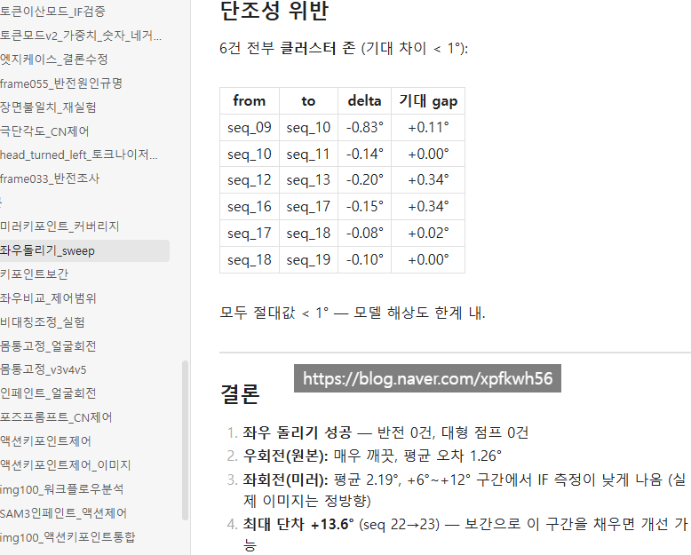
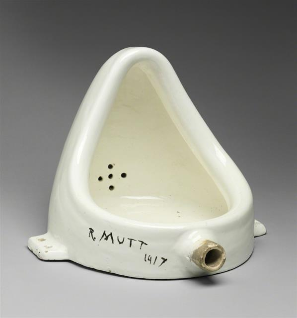
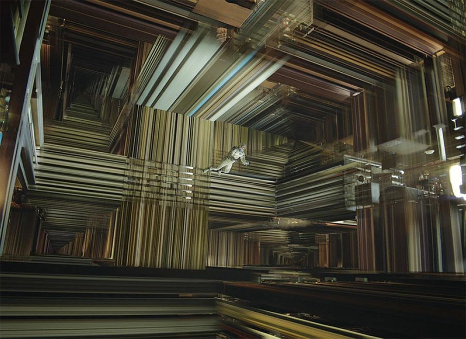

# 보르헤스와 윌리엄 골딩
**Date:** 2026. 2. 27. 0:11
**Category:** 게시판
**Original URL:** https://blog.naver.com/xpfkwh56/224197333018
---

1. 보르헤스, **다이아몬드** 수저

​

보르헤스의 친가는 아르헨티나 건국과

전쟁사를 온몸으로 써 내려간 집안으로,

​

할아버지는 아르헨티나 내전에서

활약한 전설적인 전쟁 영웅이었음

​

외가는 하나도 빠짐없이 기술적 전문직,

문화적 전문직들로 도배된 상태였고

​

자연스럽게 **'글로벌 인재'** 로 성장함

​

영어를 먼저 배웠는지, 스페인어를 먼저 배웠는지

본인조차 기억이 나지 않는다고 회고할 정도에다

​

9살에 오스카 와일드의 행복한 왕자를

스페인어로 번역해, 신문에 기고했는데

​

사람들은 보르헤스의 작업물을 보고

**'당연히'** 그의 아버지가 했다고 여겼음

​

보르헤스의 아버지는

**변호사이자 심리학 교수** 였는데,

​

집엔 수천 권의 원서가

가득한 거대한 도서관이 있었고

​

그 도서관에서 철학, 문학, 과학 서적을 읽으며

지적 자극으로 가득찬 풍요로운 유년기를 보냄

​

청소년기에는 유럽으로 유학을 갔고,

​

자연스레 독일어와 불어를 익혔으며

당대 문학가들과 교류하며 시간을 보냄

​

태어나보니, **돈/명예/권력** 이 다 있었던

보르헤스에게도 딱 하나 결함이 있었는데,

​

가문에 대대로 내려온 유전질환이 그것

​

무려 8번이나 안과 수술을 받았지만

가문에 흐르는 실명의 저주를 피할 수 없었고

​

수십만 권의 장서를 지니고 있었음에도

한 권의 책도 볼 수 없는 말년을 보내게 됨

​

2. 보르헤스의 작품 몇 가지를 소개함

​

**1) 유다에 관한 세 가지 이야기**

​

유다는 예수의 제자였으나 배신해,

작은 돈을 받고 밀고한 사람임

​

유다 때문에 예수가 죽었다는 해석이 지배적이고,

전통적으로 기독교에서는 최악의 악인으로 꼽힘

​

유다가 **'왜'** 배신했는가?

라는 것으로도 해석이 많음

​

어떤 신학자가 유다에 대한 파격적인 논문을 발표함

세 단계에 걸쳐, 점점 더 과격한 주장으로 나아감

​

유다에 관한 첫 번째 해석 :

유다의 배신은 우연이 아니라 **필수** 였다

​

예수가 십자가에 못 박혀야

서사적으로 인류가 구원되니까,

누군가는 배신해야 했음

​

유다는 자발적으로 배신자 역할을 맡은 것

자기 영혼을 희생해서 구원의 계획을 완성시킨 영웅

​

신학자의 주장에, 학계 반응은 **흠터레스팅 ,,**

​

유다에 관한 두 번째 해석 :

유다는 가장 낮은 자리를 **자처** 했다

​

유다는 배신자라는 가장 비천한 역할을

스스로 자처해, 인류 역사에 있어

영원히 저주받는 자리를 스스로 선택함

​

학계 반응은, **'조금 선을 넘는데?'**

​

유다에 관한 세 번째 해석 :

예수가 신이 아니고, **유다가 신이다**

​

기독교 2천년 역사의 핵심 포인트는,

예수가 인류의 원죄를 **'대속'** 한단 것임

​

모든 죄를 홀로 다 짊어지게 되면서

성경의 아다리가 완성되는 것인데,

​

신학자의 해석에 따르면

​

그 행위 자체가 유다로 인해

완성되었다는 소리 임

​

예수도 죽었고, 유다도 죽었음

​

근데 예수는 원죄를 짊어졌다는데

사람들한테 사랑받고 추앙 받잖음?

​

**'진짜'** 원죄는 유다가 짊어진 것임

​

대속자 라는 지위가 신의 자격이라면

그 논리에 따르면 신은 유다라는 결론

​

신학자는 이 논문 발표 후, 죽게 됨

​

**2) 비밀의 기적**

​

어느 재능 넘치고 촉망받는 극작가가

나치에 체포되었고, 총살형 선고를 받음

​

극작가는 평생의 역작이 될

엄청난 작품을 쓰던 중이었는데,

​

아직 그게 완성이 안 됨

​

총살 당하기 12시간 전,

극작가는 신에게 간절히 기도함

​

저에게 1년만 시간을 주세요

작품을 끝내고 죽게 해주세요

​

총살 직전,

병사들이 총을 겨눔

​

구령이 떨어짐

시간이 멈춤

​

빗방울이 공중에서 멈추고,

병사들이 청동처럼 굳음

​

극작가의 몸도 움직일 수 없음

하지만 의식은 생생하게 살아있음

​

극작가는 머릿속에서 작품을 씀

​

한 글자, 한 글자, 기억만으로

고치고, 다듬고, 수정하고

머릿속에서 완벽한 작품을 완성함

​

정확히 1년이 지남

​

시간이 다시 흐름,

​

정지된 총알이 날아오고

극작가의 머리가 뚫리며 죽음

​

바깥 세계에서는 구령과 죽음 사이에

단 1초의 시간도 지나지 않았음

​

아무도 그 1년의 시간을 모름

작품은 극작가의 머릿속에만 존재하고,

그의 죽음과 동시에 사라졌음

​

**3) 기억의 천재 푸네스**

​

시골 청년 하나가 말에서 떨어져, 불구가 됨

​

그런데 그 이후로 모든 것을 완벽하게

전부 기억하는 초능력을 얻게 됨

​

나뭇잎을 보면 모든 결을 기억함

하늘을 보면 구름의 모든 순간을 기억

하루 전체를 떠올리면 하루를 전부 기억

​

한번 본 사람의 얼굴을 모든 각도,

모든 조명, 모든 색깔을 다 기억함

​

청년은 **'일반화'** 를 할 수 없음

​

1시 11분에 앞에서 본 강아지와

1시 12분에 옆에서 본 강아지는

​

청년에게 있어 다른 존재임

​

개 라는 개념을 만들려면 수백 마리 개의

차이를 무시하고, 공통점만 추출해내야 됨

​

그게 추상화, 그게 사고력

​

청년은 그 차이를 무시할 수 없어서

스스로 개념을 만들어내는 것이 불가능

​

​

보르헤스는 청년에게 잊는 능력이 없어,

그는 지성을 발휘할 수 없었다고 평론함

​

**4) 피에르 메나르, 돈키호테의 저자**

**​**

20세기 프랑스 작가 피에르 메나르가,

세르반테스의 돈키호테를 다시 쓰려고 함

​

다시 쓴다는 것은 표절한단 것이 아님

현대어로 번안한다는 것도 아님

단순한 2차 창작이나, 패러디도 아님

​

세르반테스와 완전히 똑같은 텍스트를

자기 힘으로 새롭게 창작하겠다는 것임

​

원본과 글자 하나도 바뀌지 않음

결과물은 세르반테스 원본과 100% 동일

​

차이는, 원본은 세르반테스가 썼고

메나르 버전은 메나르가 썼다는 차이 뿐

​

화자는 두 텍스트를 문예 평론하면서,

당연하다는 듯이 이상한 주장을 함

​

똑같지만, 메나르의 것이 더 풍부하다

​

세르반테스가 쓰면 17세기식 수사,

​

메나르가 쓰면 윌리엄 제임스의

실용주의 철학을 거친 20세기

지식인의 의도적이고 대담한 문장

​

샘 - 마르셀 뒤샹

​

당연히 그냥 똑같은 문장인데,

읽은 맥락을 다르게 해석함

​

카테고리가 소설인데, 이 소설은

존재하지 않는 작가에 대한 서평임

​

**5) 바벨의 도서관**

**​**

어떤 사람이 거대한 도서관에 살고 있음

이 도서관에는 무한히 연결된 구조임

​

각 방에는 책장이 있고, 책들이 꽂혀있음

​

모든 책들은 같은 규격이고,

이 도서관에는 모든 언어로 적은

모든 조합의 모든 책들이 있음

​

모든 것들이 적힌 모든 책들이 있음

​

근데 바로 그 옆에 그 책이랑

딱 철자 1개만 다른 책도 있음

​

그리고 두 책의 철자가

딱 1개만 다르다는 내용을

다루고 있는 책도 있음

​

도서관 사람들은 여러 반응을 보임

​

모든 진리가 전부 여기에 있다!

​

하지만 열에 아홉은 모조리

헛소리 밖에 없는 불쏘시개들

​

절망한 이도 있고, 방법을 찾는 이도 있음

​

어떤 사람들은 책을 읽는 것을 포기하고

어떤 사람들은 더 많이 읽어서 구원을 찾고

​

어떤 사람들은 도서관 책의 목록을 담은 책을 찾음

어떤 사람들은 그 목록의 목록을 찾아다님

​

​

인터스텔라에 나오는 저 서재가

바벨의 도서관에서 모티브를 따옴

​

**6) 두 왕과 두 미로**

​

바빌론 왕이 정교한 미로를 만들었음

아라비아 왕을 초대해서 미로에 가둠

​

아라비아 왕은 거의 죽을 뻔 했지만,

간신히 미로를 탈출한 뒤, 이렇게 말함

​

내 나라에 더 대단한 미로가 있다,

언젠가 한 번 초대하지

​

시간이 흘러, 아라비아 왕이

군대를 이끌고 바빌론을 정복함

​

그리고 바빌론 왕을 사로잡아

낙타에 태우고 사막 한 곳에 버림

​

이게 나의 미로다

바빌론 왕은 사막에서 죽음

​

**7) 자히르**

​

화자가 언젠가, 거스름돈으로 동전을 받음

​

그저 평범한 동전인데 한번 보고 난 이후부터

동전에 대한 생각이 머리에서 사라지지 않음

​

화자는 동전 자체를 없애버리려고 함

가게에서 써버렸는데, 그래도 똑같음

​

동전의 이미지는 선명하면서도,

계속 변화하면서 여러 상념으로 바뀜

​

동전으로부터 지난 연인도 보이고,

강박, 중독, 트라우마 등이 변주됨

​

시간이 갈수록 악화됨

잘 때도, 깨어있을 때도,

동전만 생각하며 점점 미쳐감

​

화자는 스스로 예언함

나는 이제 앞으로 동전 외에는

아무것도 지각할 수 없게 될 것이라고

​

하지만 그 끝에는 신을 볼 수도 있다고

​

바벨의 도서관이 모든 정보를

가진 자의 입장에 대한 소설이라면

​

자히르는 오직 하나만

가진 자의 입장을 보여줌

​

**3. 윌리엄 골딩**

​

교사인 아버지와 전업주부 엄마를 뒀음

중산층 가정에서 무난, 평범하게 성장

​

아빠는 과학자를 하라고 했고,

그대로 따랐다가 도저히 안 맞아서

영문학으로 전공을 바꿈

​

영어 선생님으로 재직하던 중,

세계 2차 대전이 터지고 전쟁 참가

​

전쟁에서 살아돌아와, 본인이 다녔던

남학교에서 봤던 애들을 소재로 글을 썼고

​

21번의 퇴짜를 받고, 마침내 출판

그 책의 이름은 파리대왕, 노벨상 수상

​

<https://youtu.be/3w5pQqEJH6U?si=lcXkbe6TEHNABJDJ>

​

**1) 자유낙하**

​

화가 새미는 자기 인생을 회고하면서,

인생을 돌아볼 수 있는 시간을 가짐

​

내가 자유를 잃은 순간은 언제였나?

​

새미는 빈민가 출신의 사생아,

근데 재능빨로 미술학교까지 감

​

두 명의 스승을 만났음

​

T : 세상은 물질이고, 자유의지는 없다

과학 교사에게서 냉정을 포착

​

F : 영혼, 도덕, 선택의 책임이 중요하다

종교 교사로부터 열정을 발견

​

새미는 과학교사가 더 힙하다고 느낌

​

타인의 도구화, 양심 무시력이 있어야

잘 먹고 잘 산다? 틀린 것 같지 않음

​

그러다, 한 여자를 만남

순수하고 아름다운 여자, 베아트리스

​

기토남 새미는 베아트리스를

집착적으로 추구함

​

베아트리스는 새미가 부담스러움

새미의 끈질긴 구애 끝에 관계를 가짐

​

근데 얻고 나니, 흥미를 잃음

버림

​

베아트리스 정신병원 감

전쟁이 터지고, 새미는 포로로 잡힘

​

독방에 갇혀, 완전한 어둠 안에서

그는 전례 없던 공포를 마주하게 됨

​

어둠 속에서 뭔가 축축한게 잡힘

내장? 시체 조각? 모르겠음

​

새미는 비명을 지름

​

독방의 문이 열림, 밖으로 나옴

새미의 손에 쥐어진 것은 젖은 걸레

​

그 순간, 새미의 세계가 다르게 보임

모든 것이 경이로우며, 새롭게 느껴짐

​

새미는 깨달음,

​

자유를 잃은 순간은

베아트리스를 도구로

쓴 순간이었노라고

​

다른 인간을 물건처럼 취급한 순간,

자신의 영혼이 죽고 병들었음을 인식함

​

**2) 첨탑**

​

대성당 주임사제 조슬린은 확신에 차 있음

신이 자기에게 계시를 주셨기 때문

​

대성당 위에 큰 첨탑을 세우는 것이 내 비전

문제는 그게 구조적으로 불가능함

​

깐깐한 건축가 로저가 반대함

조슬린은 무시,

​

신이 떠받쳐 주실 것이다

​

공사 시작

성당이 삐걱거림

​

기둥에서 소리가 남

바닥을 파보니, 진흙과 물

​

성당은 늪 위에 지어진 건물이었음

​

로저가 애원함, 그만두자

조슬린은 빠꾸가 없음

​

어거지로 공사가 진행되며,

인부가 죽고, 사람들이 파멸함

​

시간이 지남에 따라,

조슬린이 차마 인정하기 싫던

진실들이 하나씩 나타나게 됨

​

계시라고 떠들었지만 사실은

신앙을 명분 삼아, 사리사욕을 채워

본인의 욕망을 충족하려 했던 것

​

첨탑은 어떻게든 완성됨

​

조슬린은 죽어가면서 창밖으로

자신이 만든 첨탑을 보면서 끝남

​

**3) 통과의례**

​

19세기 초, 영국에서 호주로 향하는 범선

젊은 귀족 에드먼드는 일지를 씀

​

세상에 공짜는 없음

이 일지는 후원자에게 보낼 여행기임

​

배에 목사 콜리가 탐,

순수하고 어루숙한 사제임

​

사교성도 없고, 눈치가 없음

​

콜리는 계속 배에서 실수를 저지름

뱃놈들은 성직자를 별로 안 좋아함

​

콜리는 불필요하게 선장한테 친한척 함

​

선원들에게 설교하려고 하고,

자꾸 되도 않게 뭘 가르치려고 함

​

이 고문관이 선을 넘기 시작하자,

배에 있던 사람들은 조직적으로

콜리를 모욕하고, 징벌하기 시작함

​

어느 날, 콜리가 술에 취해

선원과 XXXX 하는 것을 들킴

​

그 이후, 콜리가 침대에서 안 나옴

​

그냥 누워만 있음

​

콜리 사망

사인은 모름

​

귀족 인싸 에드먼드는

죽은 콜리의 일지를 발견함

​

같은 사건과 다른 시점,

​

에드먼드는 콜리가 선장에게

말을 거는 것을 보면서,

참 사회성 없다 라면서 핀잔

​

INFP 콜리는 배에서 아무도 자신에게

말을 걸어주지 않아서 외롭고 선장은

​

배의 대장이니까, 이 사람한테 잘 보이면

다른 사람들과도 잘 지낼 수 있지 않을까?

​

하고 마이쮸를 건네줬던 것임

​

선장이 콜리를 의도적으로 무시하자,

선원들이 분위기를 읽고 콜리를 왕따시킴

​

콜리가 갑판에서 설교하려고 하면,

노골적으로 조롱하거나 수치를 줬음

​

예배당에서 콜리가 다과도 준비하고,

같이 읽을 핸드아웃도 다 차려놨는데

가지 말자고 해서 혼자 예배를 드렸음

​

에드먼드는 콜리를 직접 괴롭힌 적 없음

선원들이 조롱할 때, 웃겨서 웃었을 뿐이고

​

콜리가 괴로워하는 것은 알았지만,

그런 것을 다 챙겨주기엔 끝도 없음

​

에드먼드는 그 어떤 악의도 없었음

하지만 결과는 같음

​

4. 보르헤스가 시력을 잃으며

세상을 보는 눈을 잃어갈 때,

​

골딩은 전쟁터에서 눈을 뜸

골딩이 본 인간의 본질은, **'악'**

​

능동적 악,

자기기만적 악,

수동적 악

​

보르헤스는 책에서 세계를 본 자,

골딩은 전쟁터에서 인간을 본 자

​

보르헤스는 생존할 필요가 없던 자,

골딩은 지옥에서 살아돌아온 자