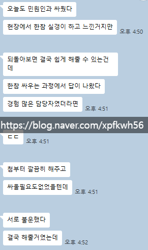

# 이방인
**Date:** 2026. 2. 27. 2:56
**Category:** 게시판
**Original URL:** https://blog.naver.com/xpfkwh56/224197442973
---

​

1. 오늘 민원인과 싸웠다,

아니 어쩌면 어제

​

서울에서 살다 대학을 졸업하고,

​

9수 끝에 지방직 공무원이 된 김토목은

어머님 장례로 내일 이틀 쉬겠다고 말함

​

사람들이 기분 풀고, 좋게 좋게 생각하라 함

​

국가공무원 복무규정 제20조 1항

휴가 쓰는 것은 내 잘못이 아닌데?

​

충주맨이 공직을 관뒀다는 얘기가 나돌고,

대통령은 공직자에 대한 자세를 말했음

​

,, 어공과 늘공의 벽을 허물고 ,,

​

눈 치우느냐 잘 듣진 못 했지만

​

2. 장례식장 도착,

관을 열어보겠냐 물음

​

아니요

​

상조 보험을 만기까지 부었는데

여태 크루즈 한 번을 안 탔네

​

시간도 없는데, 양도나 할까?

유튜브로 여행 브이로그를 봄

​

제설을 검색해서 그런가,

알고리즘에 홋카이도가 뜸

​

사망 보험금으로는

모바일 게임 현질을 했음

​

3. 출근 했는데, 모니터에 붙은

포스트잇을 떼는 데만 10분을 씀

​

신문고를 보려고 하는데,

현장에 뭔 문제가 생겼다고 함

​

외근

​

한국의 2월,

태양이 미쳤음

​

모래가 타고, 바다가 번쩍이고

이마에서 땀이 눈으로 들어옴

짹짹 거리는 민원인과 마주침

​

원한 없음

계획 없음

동기 없음

​

근데 태양이 눈을 찔러,

민원인을 팼음

​

전치 8주, 징계위 열림

​

4. 모친 장례식에서 울었습니까?

아니오

​

장례식 당일에 해외여행 알아봤습니까?

네

​

브이로그도 봤습니까?

네

​

사망 보험금으론 뭘 했습니까?

모바일 게임에 썼습니다

​

엄마를 사랑했냐는 질문에

남들 하는 만큼은요

​

폭행 동기를 묻자,

태양 때문이었습니다

​

팀장님이 머리를 감쌈

​

5. 엄마 장례식에서 울지 않는 인간은

사람도 죽일 수 있다

​

이 남자에게는 공직자의 자세가

처음부터 없었던 것이다

​

징계위가 끝나고, 다시 외근을 감

​

덜컹대는 중고 아반떼 창밖 너머로

은하수가 쏟아져 들어오고 있지만

​

김토목의 네비 도착점은 집이 아님