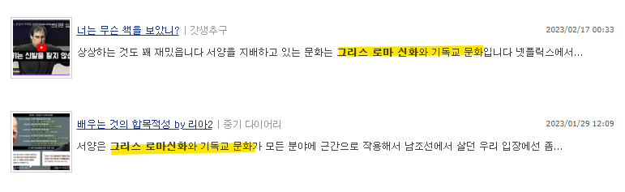
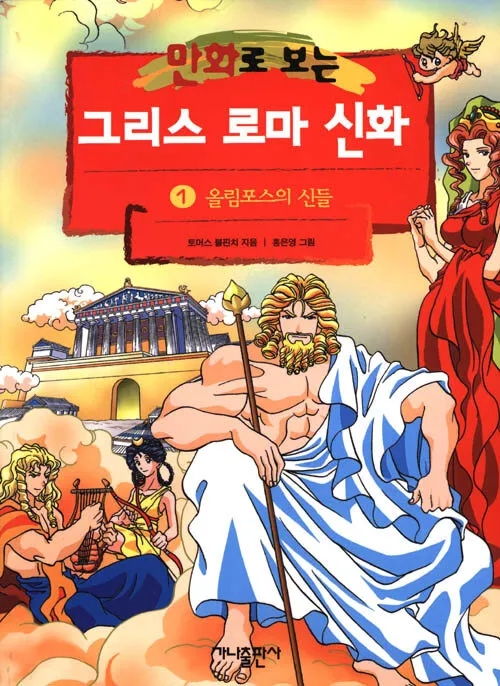

# 답변 몰아서
**Date:** 2026. 2. 28. 13:26
**Category:** 다이어리
**Original URL:** https://blog.naver.com/xpfkwh56/224199148221
---

**1.** **최근에 인상 깊게 보신 책 있나요?**

​

<https://comic.naver.com/webtoon/list?titleId=733766&tab=finish>

[**인생존망**

학교 다닐때 날 지독하게 괴롭힌 너 때문에 난 인생이 망했어.그런데 왜 넌 안 망하고 오히려 더 떵떵거리며 사는거야?너도 한번 내가 되어서 너한테 똑같이 당해봐!!

comic.naver.com](https://comic.naver.com/webtoon/list?titleId=733766&tab=finish)

​

박태준 작가의 인생존망 이라는

작품을 인상 깊게 읽었습니다

​

**2. 쿠키가 비쌉니다**

​

​

**3. 고전을 읽는 이유가 뭔가요?**

​

신화 속에 나오는 신과 영웅들은

저작권에 대해서 관대하기 때문

​

**4. 재밌음?**

​

올드보이 오대수

**오**(이)**대**(푸)**수**

​

어!?

​

**5. 문학의 재미를 알고 싶어요,**

**어떤 것부터 읽어야 좋을까요?**

​

​

저도 뭐 부터 봐야 되는진 모름

​

하지만, 그리스 로마 신화랑

기독교 문화를 알면 **많이** 편함

​

​

어렸을 때, 이거 재밌게 읽었었고

성경은 신천지 때, **'지겹게'** 읽었음

**​**

**6. 가까운 교회 가서 셀모임 하면 됨?**

​

가까운 도서관 방문,

**​**

**'에픽 바이블'** 이라고

책이 있을 수도 있는데

​

이런 걸로 읽는 것을 추천

꼭 저 책이 아니어도 상관없음

​

근데 **'재미'** 있어야 됨

​

**7. 양이 너무 방대해요**

​

1) 오셀로는 셰익스피어 문학 안에서

개종한 무슬림으로 흑인이었는데,

당대에는 열등감을 느끼고 어쩌고 ,,

​

→ 무어인이 느끼는 차별, 열등감

공감 안 됨

​

→ 조선족이나, 전라도 사람으로 치환

마찬가지로 잘 이해가 안 됨

​

→ 키 160cm 남자가 느끼는 열등감

단방에 와닿음

​

이아고는 악인 중의 악인임,

의도를 갖고 작위적으로 괴롭힘

​

블라인드 댓글은 악의가 없음

의도도 없음, 근데 파멸하게 함

​

2) 데카메론 = 잘 안 와닿음

​

→ 숙노 하는 사람들이 썰 푸는 얘기

잘 와닿음

​

무슨 세계관인지는 모르겠지만,

정통 건달 운운하면서 민간인 들을

무시하는 깡패, 맨날 국제 경제 운운하는

유튜브 보면서 음모론에 심취한 상태로

사설 코인 거래소에서 단타치는 도박꾼,

​

밥 한 끼 먹을라치면 QR 에 인증에

코로나로 온 세상이 난리를 치고 있지만

​

피곤하다고 매일 안 씻는 놈,

이불에 숨어서 딸딸이 치는 놈,

​

그 옆에 입만 열면 여자

자빠뜨린 얘기만 하는 놈

​

여기는 전염병이 있는지 없는지

세상 그 누구도 관심이 없는 상황

​

이게 우리가 사는 시대의 데카메론

​

3) 그레고리 잠자가 잠에서 깨어나자,

갑충으로 바뀌어서 어쩌고 저쩌고,

​

**잘 안 와닿음**

​

→ 집에서 살림을 책임 지던 가장이

경제력을 잃고, 집에서 외면 당했다

​

**어쩌라고? 그런 사람 한 둘임?**

**​**

경제력 없는 가장이 가정 내에서

벌레 취급 당하는 것은 **비극이 아님**

**​**

**'그건 그냥 당연한 일'**

​

그레고리 잠자가 26년에 살고 있다면,

돈도 잘 벌어오는 가장이지만 집에서

**'제대로 대우'** 를 받지 못하는 가장일 것

​

벌레로 바뀌지도 않았고,

팔다리도 멀쩡하지만

​

남자는 거실에 앉아있을 수 없음

이유는 잘 모르겠지만 계속 혼남

​

오빠 머리카락이 왜 이렇게 자꾸 빠져?

제발 뭐 썼으면 다시 제 자리에 놔둬!

​

마누라가 쫓아다니면서 찍찍이로

바닥에 테이핑을 하면서 청소를 함

​

자고 일어난 사이에, 깨끗한 베개로

피지에 새어나가 묻은 것은 아닐까

​

수건을 깔고 자고, 일어난 뒤에도

킁킁 냄새를 맡으며 자기를 검열함

​

**'나는 벌레다'**

​

이래야 **'변신'** 스러움

​

카프카의 **등을 보면** 안 보이는데,

**옆에 서서** 같이 보면 더 쉽게 보임