# 삼성은 어떻게 강자가 되었나?
**Date:** 2026. 3. 2. 14:35
**Category:** 다이어리
**Original URL:** https://blog.naver.com/xpfkwh56/224201309899
---

[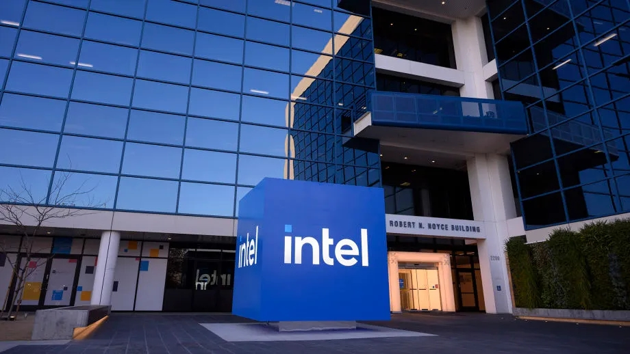](#)

​

1. 주식하는 사람들한테는, 아 그 병신?

정도로 기억되는 역대급 스캠 주식이지만

​

컴퓨터 역사에서 인텔의 자리는

**'오버독'** 끝판왕 에 더 가까움

​

[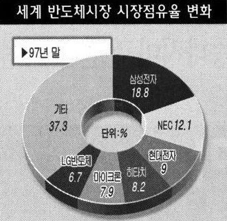](#)

​

때는 97년 말,

​

메모리 반도체 분야는 크게

두 표준이 양립하고 있었음

​

DDR D램 vs 램버스 D램**​**

**​**

**​**

**그뭔씹 ,,**

​

램버스 D 램은, 당대 최고였던

인텔에서 밀던 **신기술** 이었음

​

CPU 속도가 매우 빨라지면서,

​

기존의 RAM 기술로는 데이터 처리 속도가

따라갈 수 없었는데 인텔은 자신들이 만든

​

CPU 를 커버해줄 수 있을 정도로

뛰어난 차세대 RAM 표준 을 원했음

​

**램버스 장점 = 압도적으로 빠르다**

​

돈만 있으면 안 쓸 이유가 없었구,

​

호사가들이 지난 년에 떠드는 소리지만

**'새로운 표준'** 이라는 것도 무척 컸음

​

램버스가 표준 메타가 되면,

​

**기존에 있었던 레거시 기술은**

**그 자리에서 한 줌 쓰레기가 됨**

**​**

[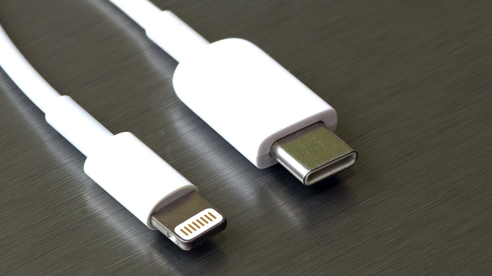](#)

​

내일부터 핸드폰 충전 단자를

딱 1개로 통일하기로 바꾼다면?

​

애플+삼성+그 외 등등

모든 빅테크에서 전부 싹 다

요이땅 하고 다 바꾼다면?

​

그 전에 저거 만들던

애들은 전부 바보가 됨

​

삼성은 원래 자기들이 하던 것 계속 하면

밥 먹고 살 수 있었는데, 램버스 메타 되면

이제 특허값 줘야 밥을 먹고 살 수 있어짐

​

반도체는 돈이 아주 많이 들어가는 장사임

못 줄 것도 없었지만, 줄 형편도 아녔음

​

**2. 램버스 장점 = 압도적으로 빠르다**

**​**

**\* 이론상**

**​**

인텔에서 보장한다고 하니까,

그 시대에 살던 반도체 빅테크들은

​

다 인텔에서 하라는대로 따라갔는데,

삼성 에서는 **다른 판단** 을 하게 됨

​

> 휴대폰 충전기를
>
> 누가 5만원을 주고 사?

​

여기에는 두 가지 해석이 있음

​

**1) 진짜 미래를 봤다**

​

정말 남들은 못 보고 있었던

미래를 통찰한, 지혜라는 시각

​

**2) 램버스 개발 여력이 없었다**

​

개도국 후발주자 입장에서

저걸 따라갈 여력이 없었음

​

그러니까, **그냥 이게 정답이어야 했어서**

어떤 대안 없이 대가리 박았다는 시각 임

​

요즘은 **'전보다는'** 다른 느낌인데,

예전에는 **'전문의 딱지'** 가 당연했음

​

GP = 낙오자 취급이었다는 것

​

근데 지금은?

​

**전문의? 너 집에 돈 많아?**

**공부하는 것 좋아하는구나?** 임

​

GP 따고, 레이쟈 쏘러 다니면서

주식하고, 코인하면 되는데 굳이?

​

램버스 사태에도 **동일한 결과** 뜸

​

3. 삼성은 6년 의대 졸업하자마자

바로 피부미용, 난치성 질병, 재활,

이런 쪽으로 방향을 틀어 넘어갔고

​

마이크론은 군의관 하던 시점부터

마케팅, 원무경영에 관심을 보였고,

​

LG 반도체를 인수한 현대전자 는

**의사는 바이탈이지~** 하고

소아흉부외과 전문의를 향해 달림

​

**\* 현대전자가 손해 본 금액은 15조 정도**

​

지금은 기억도 나지 않는 역사지만,

원래 반도체 기술 탑티어는 **독일**이었음

​

**\* 선도기술 실용화 면에서**

**​**

이 패권이 일본으로 넘어갔다가,

아시아 전역으로 펼쳐진 케이슨데

​

**DDR 은 삼성 외에는 하는 놈이 없었구,**

**자연스럽게 독점을 먹어서 1등을 찍음**

​

투자판에서 제일 위험한 투자는?

믿을 수 있는 지인발, **정보매매** 임

​

인텔에 속은 일본 반도체는 작살이 남

​

채권단의 배려와 막대한 공적 지원으로

하이닉스로 재탄생한 현대 반도체 는

​

다른 것을 할 재주가 없어서,

​

이거라도 해야지 하고 **돈이 없어서**

원래 하고 있던 D렘을 파기 시작했고

​

알고 했는지, 모르고 했는지 삼성 1등

그냥 하다보니 다들 망해서 하이닉스 2등

​

**발이라도 걸치고 있던** 마이크론 3등

그 외, 쩌리들이 점유율을 먹고 있었음

**​**

**4. 반도체 치킨 게임**​

​

[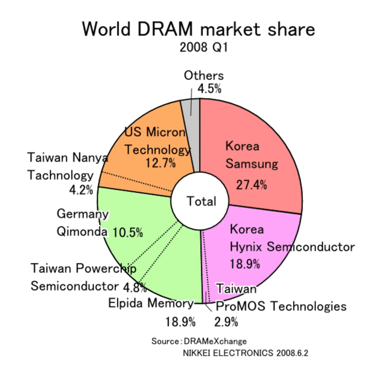](#)

​

97년, 운이 없어서 LG/현대가

죽을 쒀다가 개를 줬던 것과 같이

​

마침 공교롭게도 08년 전후에

대만 반도체에 **흉흉한** 계시가 옴

​

삼성은 반도체 회사?

​

문어발 족벌경영사 답게도,

안 하는 것 빼고는 다 했는데

​

이걸 좀 어려운 말로

**수직 계열화** 라고 함

​

우리는 본사에서 소스부터,

휴지, 젓가락까지 받아 쓰는데

​

쟤네는 발품 팔아서 아무거나 씀

​

1원 싸면 1원 싼 것을 사다가 팔고

1이라도 좋으면 1 좋은 것을 구해 씀

​

대만은 이렇게 싸워선,

도저히 승산이 없다고 봤고

​

삼성의 수직계열화를 깨기 위해,

**치킨 게임** 이라는 승부수를 걸음

​

[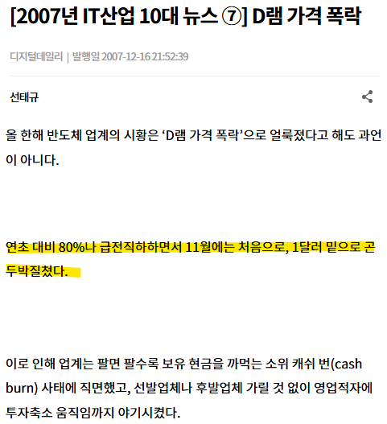](#)

반도체! 신발보다 싸다!

​

26년 기준으로, 태양광 발전을

하기 위해서는 패널이 필요함

​

태양광이 왜 필요함?

AI 하려면 전기 많이 필요함

​

화석 연료로는 미래가 없고

태양광 패널엔 **'은'** 이 들어감

​

**근데 들어간 은값보다 패널이 쌈**

**아메리카노가 들어간 원두보다 저렴함**

​

그래도 이 미친 짓을 멈출 수 없음

​

[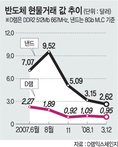](#)

​

그게 당시에도 똑같이 일어났었고,

​

[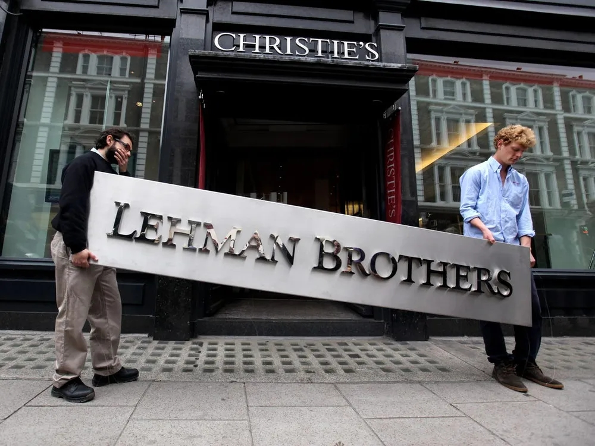](#)

​

리먼 브라더스 사태 까지 터짐

​

하이닉스, 마이크론은 100원 팔면

50원 적자가 생기고, 대만 반도체 난야는

100원 팔면 150원 적자가 생김

​

삼성전자는 반도체에서 밑져도,

다른 것에서 벌어서 메웠고,

​

하이닉스는 한국 정부에서 뒤를 봐줬고,

​

**\* 애국 개미들 덕택에 생존**

**​**

엘피다는 일본 정부가 뒤를 봐줬고,

대만은 처음부터 세금으로 돌아가고 있었고,

​

마이크론은 전 세계의 돈이 모이는

미국 국적 덕택에 현금을 긁어다 버티고 있었음

​

[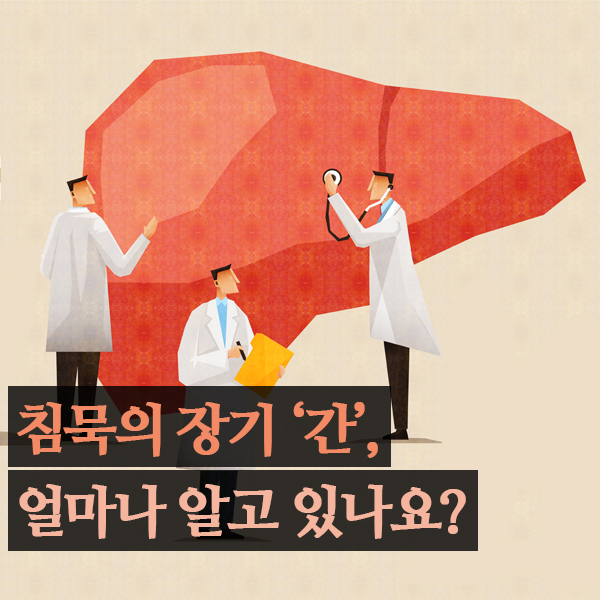](#)

​

메모리 반도체 5위 키몬다는,

​

어, 나 몸이 이상해

공적 지원 안 해주면

우리 조만간 망한다

​

라고 발표했지만, 독일 정부에서는

​

**'망할 회사는 망해야 된다'** 라는

자본주의 원칙을 고수했고, 망함

​

대만과 독일이 죽었으니 끝?

일본 엘피다는 여전히 목이 말랐음

​

**\* 3등**

**​**

**삼성만 죽이면 끝이다**

​

[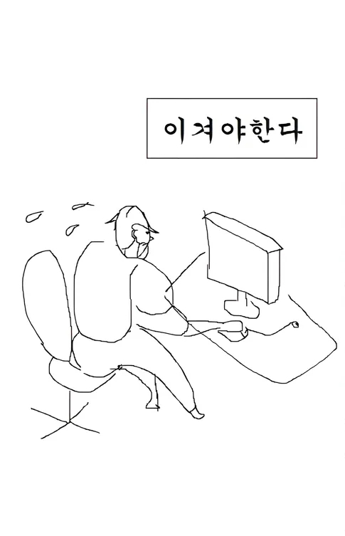](#)

​

메모리 반도체의 왕좌를 뺏기 위해,

시장에 피가 난무하고 있던 어느 날

​

일본은 공적 자금으로 버티고 있었지만,

국내에 **말썽 부리는 친척** 하나가 있었음

​

그 이름은 하이닉스,

공적 자금 지원도 하루 이틀이지

​

[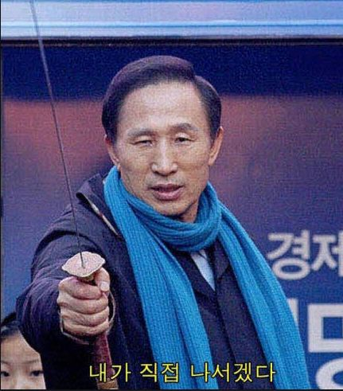](#)

​

계속 세금 넣는 것은

**'신자유주의'** 답지 않았음

​

[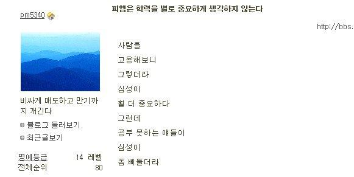](#)

[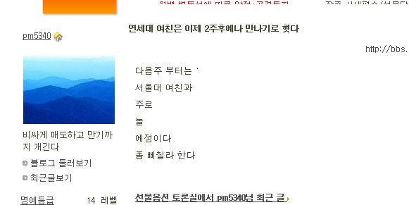](#)

[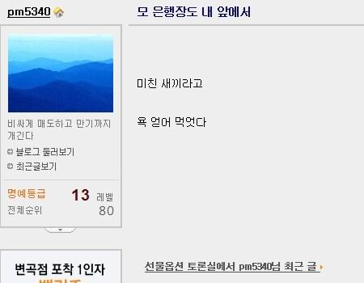](#)

[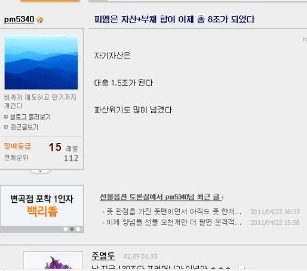](#)

난 지금 130조다 포커머니가 이넘아 ㅎㅎㅎ

​

팍스넷에 **자칭 8조 자산가** 등장

​

> 비싸게 매도하고,
>
> 만기까지 개긴다

​

아직도 그 정체가 누군진 알 수가 없지만,

​

[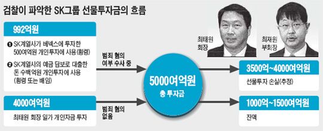](#)

​

SKT 최태원 회장이 선물옵션으로

몇 천억의 손실을 봤다는 뉴스 등장

​

횡령 혐의로, 압수 수색부터 시작해서

회사가 들쑥날쑥 난리가 아니었는데

​

[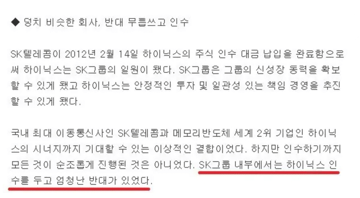](#)

​

그 일이 얼마 있고 난 뒤,

​

돈 먹는 하마 였던 하이닉스가

참 뜬금이 없게도 SK로 인수됨

​

**뭐 전문 경영인이었으면 불가능했겠지만,**

**오너 체제에서는 미래에 대한 혜안을 갖고**

**책임감 있는 결정을 드라이빙 할 수 있고 ,,**

​

[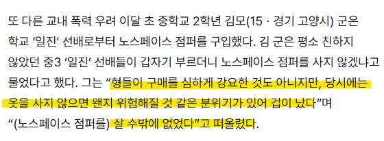](#)

??? : 형이 돈 벌게 해줄게, 파생 같은 것 하지마~

​

결과적으로 하이닉스는

SK 품 안으로 쏙 들어가게 됨

​

마침 아다리도 나쁘지 않았는데,

​

[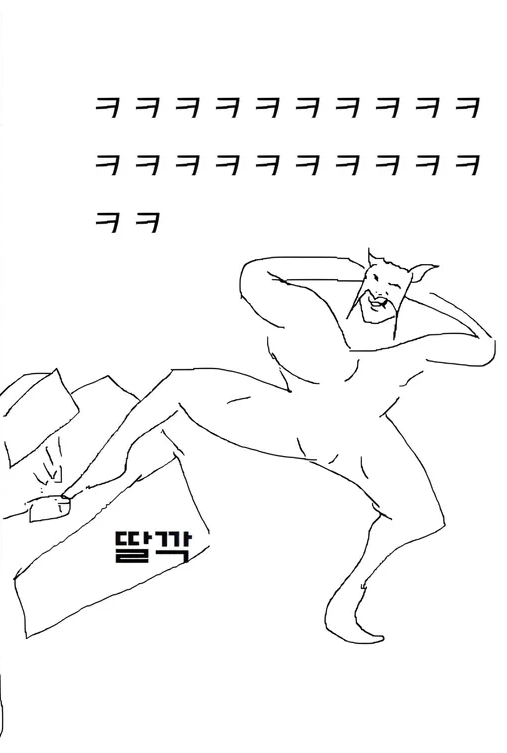](#)

​

SK 입장에선 수직 계열화? **필요가 없음**

​

[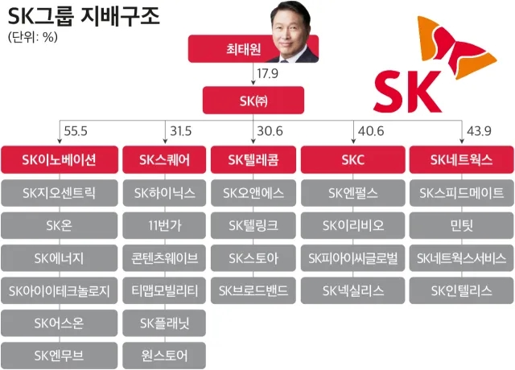](#)

​

에너지랑 통신에서 벌어오는 돈을

그냥 쓰면 되는데, 그걸 왜 하고 있음?

​

[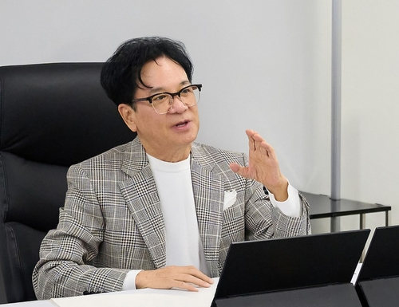](#)

​

비전이 없어서 문제지,

돈이 없는 것이 문제가 아님

​

[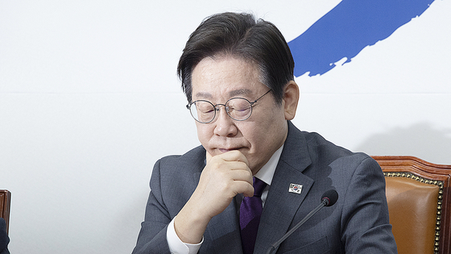](#)

​

**5. 25년 6월, 이재명 대통령 취임**

​

전 대통령한테 최면이나 주술을 걸어서,

​

대통령이 되었다고 해도 이상하지 않은

참 이해할 수 없는 행운을 누린 사람인데

​

이재명 정책에 **'틀린 말'** 은 의외로 없음

​

다만, 그래서 **'누구 돈으로 할 건데?'**

라는 것에 대답을 내릴 수 없을 뿐임

​

[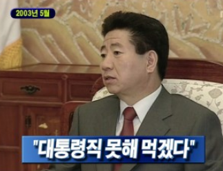](#)

​

제가 뭐 경제 살리겠다고 말이나 했습니까?

말 안 했지만은 그건 당연히, 당연히 잘해야지요!

​

당연히 잘해야 되는데, 7% 못 해서 죄송합니다!

카~ 7% 못 했으면 6%라도 해야 됐을...

했어야 되는 거 아닙니까! 죽을 동 살 동 했는데...

​

**안 됩디다! 이 순간 어찌하면 되겠느냐고**

**아무리 가르쳐 달라고 해도 아무도 안 가르쳐 줍디다!**

**​**

투자를 많이 하게 해라 그래서,

"어떻게 하면 투자를 많이 하겠습니까?" 물었더니...

"출총제 폐지해라!" 랍디다

​

그런데 자세히 연구해 보니까 출총제하고

투자하곤 관계가 없다 합디다

​

뭣 또 이것저것 저것 있습니다. 있는데,

​

다, 다아아~ 짚어 봤습니다

다 짚어 봤는데, 투자를 잘하게 하는 방법은

제가 지금까지 했던 방법: 혁신, 개방, 균형,

사회 투자, 사회적 자본, 그리고 평화! (환호)

​

한 개 빠졌네요. 교육. (환호) 예... 마

잘된 것도 있고, 안된 것도 있지만,

원칙대로 했습니다

​

[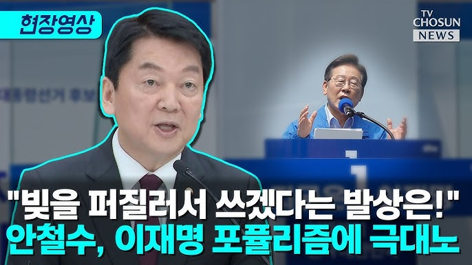](#)

​

세금이 어디서 나오냐!

​

[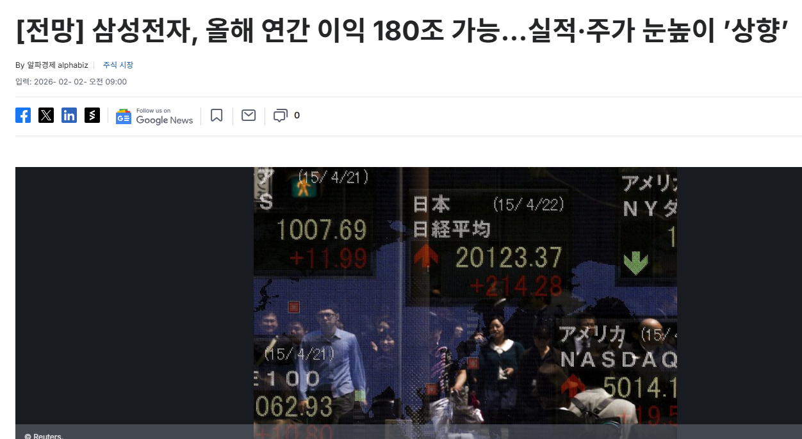](#)

[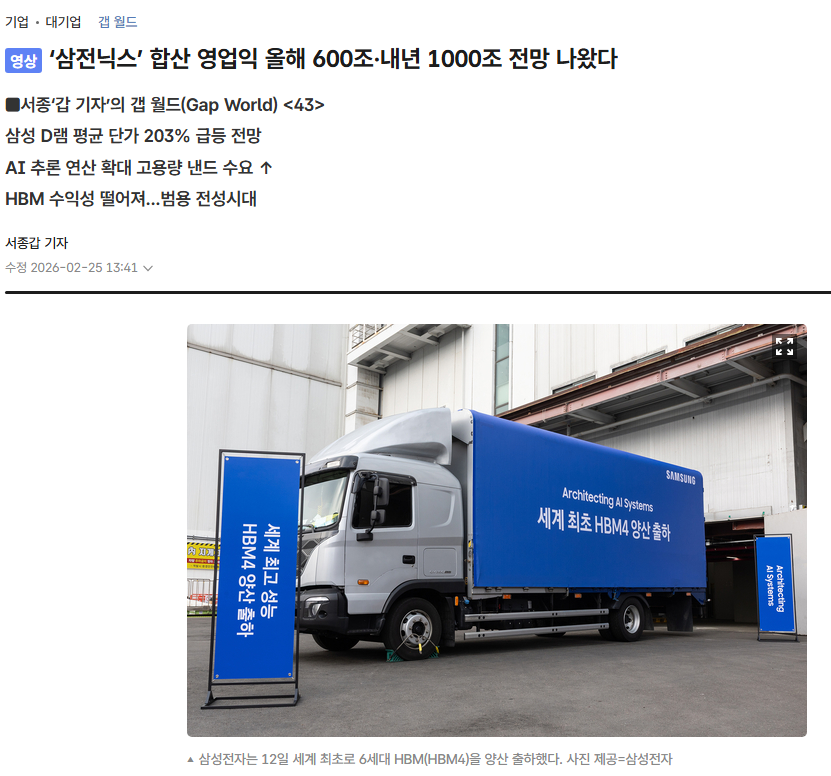](#)

[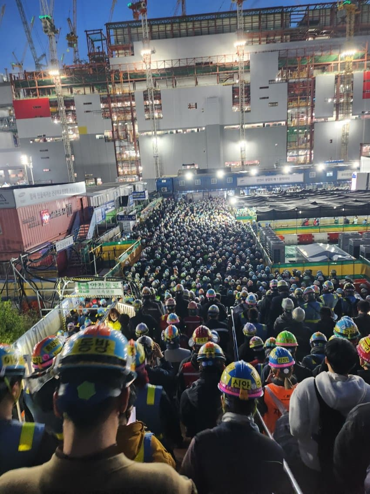](#)

[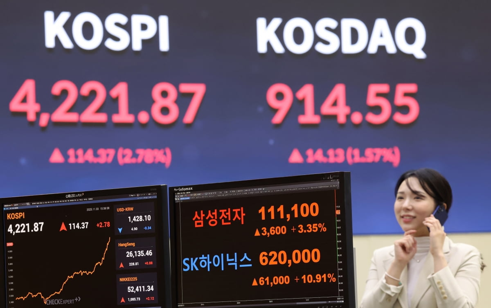](#)

[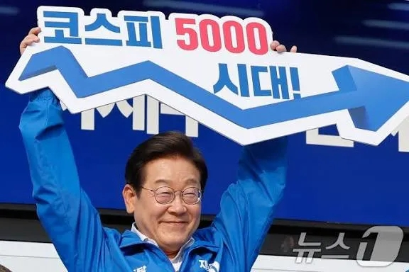](#)

[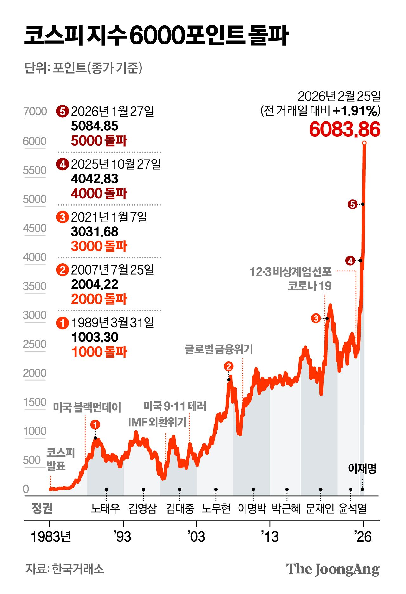](#)

[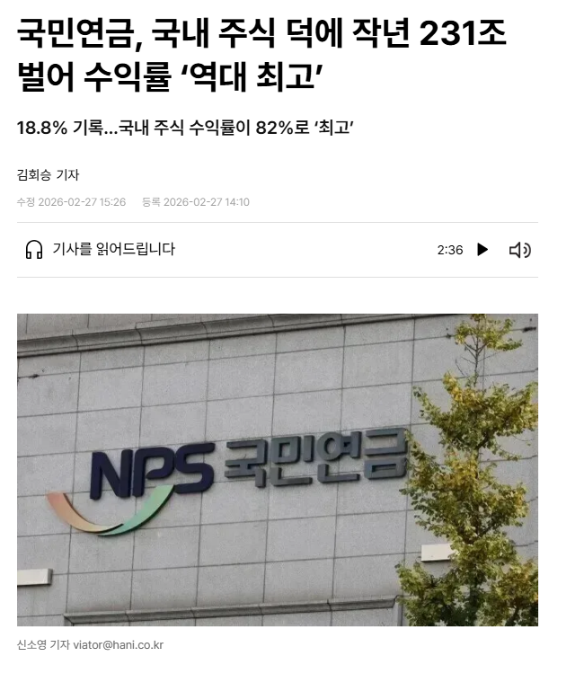](#)

​

인생은 행운과 재능