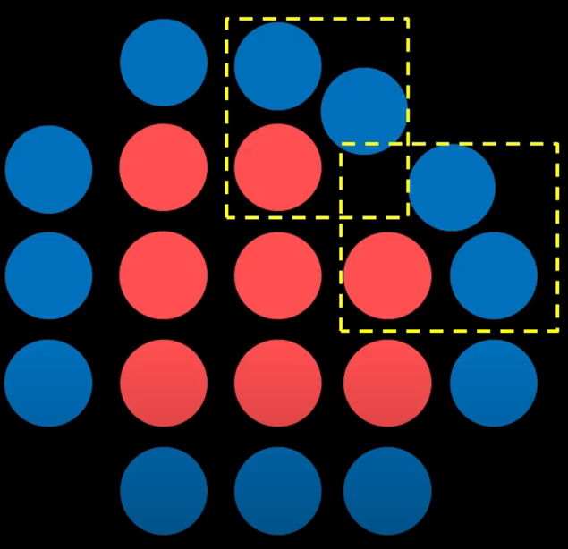
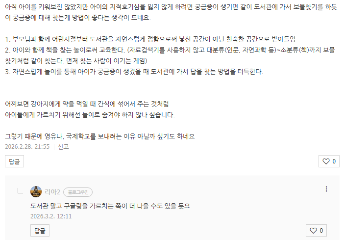

# 선수로 뛰고 있어야 보이는 것
**Date:** 2026. 3. 2. 13:10
**Category:** 다이어리
**Original URL:** https://blog.naver.com/xpfkwh56/224201227551
---

1. 인공지능, 하면 **'아직까지는'** 사람들은

​

좋은 GPU 만 사면 **장땡** 이라고 여기거나

그 외 여러 오해들을 갖고 있는 편이지만

​

**'실제'** 본인이 로컬을 굴리고 있다면,

당연히 알게 되는 것들이 상당히 많음

​

**1) 글카만 중요하다 (x)**

​

**'다'** 중요함

​

하나라도 빠지는 부분이 있으면,

**반드시** 거기에 병목이 생겨나는데

​

보통 커뮤 같은 곳에 질문글 올리면

​

님아 그거 바꿔봤자 체감 못 해요,

라는 대답만 듣게 될 가능성이 높음

​

그럼 실제로 체감을 못 하냐? **'전혀'**

​

쓸 수 있다는 전제 하에 할 수만 있으면

무조건 **최대한** 좋은 걸로 사는 것이 좋음

​

**\* 어려움**

**​**

그리고 이 **'좋은 것'** 이란 것도 복잡

​

제일 좋은 GPU 가 뭐에요? 라는 질문은

한니발/수부타이/나폴레옹/알렉산더 중에

누가 역사상 최고의 명장인가? 같은 질문

​

알렉산더 대왕은 **단 한 번도** 패배한 적 없음

그리고 압도적인 제국을 상대로 다 이겼는데

​

그 제국이 사실은 **썩어가는 빈 강정** 이었고,

**티타늄 숟가락** 이라 **아빠 빨** 도 많이 누렸음

​

경제개발 5개년을 **'이행'** 한 것은 박통이지만

그게 **'박통'** 혼자 만든 것은 아닌 것과 똑같음

​

꽝 붙는 한타를 **'회전'** 이라고 하는데,

수부타이는 60번이 넘는 회전을 다 이김

​

몽골 제국에서 단신으로 평민 주제에

정점으로 오른 자수성가 끝판왕 에다가

​

평생 전투 하면서, **'32개국'** 을 멸망시킴

​

**\* 땅따먹기 레벨 X, 국가 32개를 멸망시킴**

**진시황은 6개국 먹고 자기를 황제라고 칭함**

**​**

알렉산더 대왕이 1개 국가랑 싸우고 있을 때,

수부타이는 **'매번 새로운 국가랑, 다른 메타'** 로

전부 다른 전쟁을 했고, 빠짐없이 전부 이겼음

​

다만, 당시 몽골에서 썼던 전술적 차원은

동시대에 살던 사람들보다 1-2세대 높았음

​

대단하긴 한데, 더 유리한 무기로 싸웠으면

사실 **당연히 이길 법 한걸 이긴 것 아닌가?**

라는 점에서는 애매한 부분이 있는 건 맞음

​

한니발은 20년 가까이, **무보급 원정군**을 꾸림

​

공성보다 수성이 유리하고, 원정보다는

홈에서 싸우는 것이 훨-씬 더 유리한데,

​

극한의 쥐어짜기 가성비 자원 관리로

당대 최강 국가라는 로마랑 싸워 이김

​

**\* 전쟁은 졌지만**

**​**

한니발이 썼던 전술은 2천년 이후의

**현대 사관학교 교과서** 에서도 가르침

​

​

한니발이 왜 졌냐? 본인 전술이

**표준 메타** 가 되면서 그거에 졌음

​

**\* 망치와 모루를 완성시킨 전술가**

**​**

한니발의 전술이 사관학교 교과서에 있는

한 챕터를 차지하고 있다면, 나폴레옹은

**사관학교 시스템** 을 도입하게 만든 인간임

​

같은 시대에, 같은 기술 수준으로 싸웠는데

같은 것도 얘가 하면 달라서 승/패가 갈렸음

​

프로이센에서 **도대체 왜 쟤가 하면 다름?**

이랍시고, 나폴레옹 을 연구하기 시작했고,

​

도련님들 스펙 쌓기 목적으로 만들었던

사관학교를 **'나폴레옹 따라잡기'** 로 바꿈

​

**\* 세계 2차대전 당시, 전격전 메타**

**= 나폴레옹이 가진 승부사 기질을**

**교과서로 가르쳐서 제도권으로 올림**

**​**

넷 중, 누가 최고의 명장인가? 라는 질문은

**질문을 어떻게 하냐에 따라** 정답이 다 다름

​

100만명이 넘는 병력을 운용하면서,

상륙 작전으로 이기려면 누가 최고냐?

​

이거는 **아이젠하워**가 1타인 것과 똑같음

​

**2) 하드웨어가 중요하다**

​

보통, 다음과 같은 도식을 따를 것임

​

어떤 서비스(소프트웨어) 가 좋지?

그 다음은 이제 하드웨어로 넘어감

​

하드웨어를 파고, 파면 어느 시점에는

인프라가 중요하단 결론에 도달하게 됨

​

우선은 전기임, 전기를 **'공짜처럼'**

펑펑 쓸 수 있는 레벨과 아닌 레벨이

생각보다 빨리 오게 될 수 있기 때문

​

**\* 전기 이해 없이, 마구 설비 키우면**

**다짜고짜 두꺼비집이 터질 수도 있고,**

**돈으로 안 되는 것은 없다지만 ,, 빡쌤**

**​**

다음은 **'통신'** 임

​

모델 하나에 50기가, 100기가 짜리를

내 마음대로 다운 받아서 쓰고 싶은데,

​

다운 받는데, 3일 4일 걸린다 이래버리면

그거 기다리다가 기운이 다 빠져서 못 씀

​

한편 기가렌 같은 경우, 가입만 한다고 해서

업/다운 속도가 빨라지는 것도 아니기 때문에

​

내 상황에 맞는 여건을 맞추기도 은근 까다롭

​

**3) 벤치 좋은 모델을 쓰면 만능이다**

​

로컬 굴리면서, 모델 딱 3개 정도만?

써보면 벤치는 **이제 쳐다도 안 보게 됨**

​

그럴 시간에 내가 다운 받아서,

직접 굴리는 것이 더 **확실하니까**

​

여기서 짬바가 더 충족되면,

**'있는 모델'** 을 쓰는 것이 아니구

​

내 입맛에 맞춰서 쓰기 때문에

모델 다양성이 프론티어 모델 1개를

잘 찾아서 쓰는 것보다 고점이 높음

​

2. AI 섹터가 투자 가치가 있나 없나?

이거는 여전히 봐도 **나는 잘 모르겠음**

​

근데 투자 가치와 별개로,

활용 가치는 **'엄청남'**

​

또한, **물 반 고기 반** 임

​

수요는 넘치는데 공급은 없구,

이걸 어떻게 써야 될지 모르는 사람이

​

지천에 깔렸기 때문에

깃발 먼저 꼽는 놈이 임자임

​

**제록스 연구소** 라는 곳이 있었음

​

그 복사기 제록스 만드는 곳 맞는데,

현대 첨단 IT 기술 다수가 여기서 나옴

​

거기 있던 아이디어 1개 훔쳐서

나온 회사가 **애플** 이고,

​

그거 보고, 와 저걸 쌔벼? 하고

따라서 쌔빈 회사가 **마소** 임

​

제록스는 지가 깃발을 들고 있으면서도

자기들이 실제 뭘 들고 있는 줄 몰랐음

​

**3. 결론**

​

​

**로칼 하자 ,,**

​

옆나라에서는 메이지유신이다

뭐다 하면서 시대 쫓아가고 있는데,

​

여전히 과거급제 하나만 쳐다보고

공자왈, 맹자왈 하고 있을 필요가 ,,