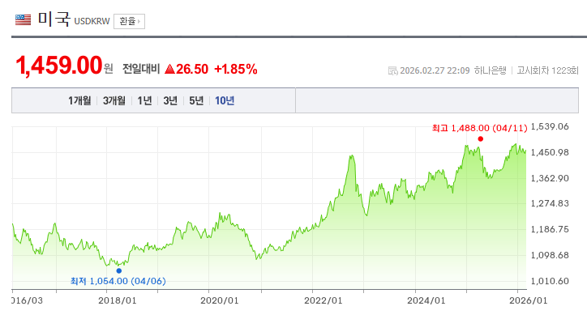
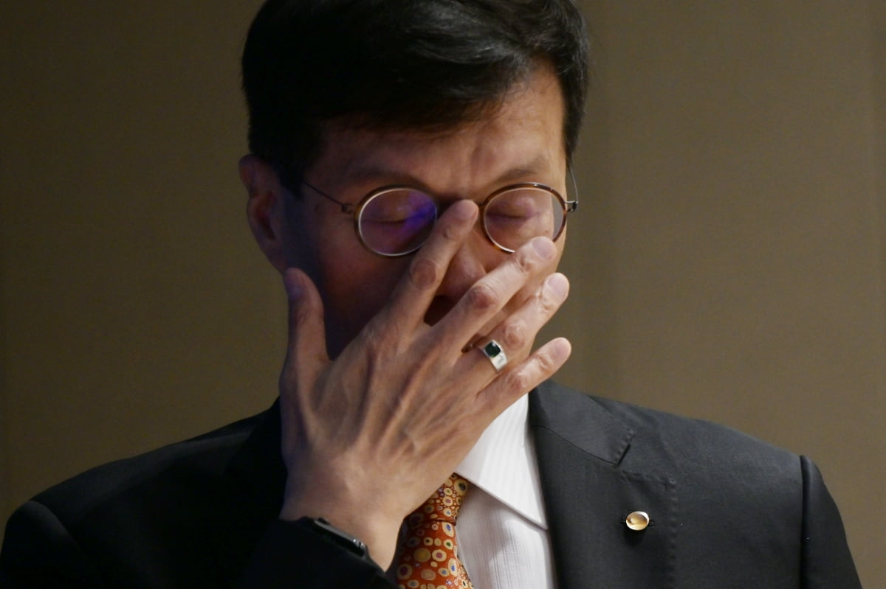

# 환율은 왜 이 모양인가요?
**Date:** 2026. 3. 2. 17:06
**Category:** 다이어리
**Original URL:** https://blog.naver.com/xpfkwh56/224201464625
---

​

1. **뉴 노말** 이라고 하는데,

​

<https://www.bok.or.kr/portal/bbs/B0000347/view.do?nttId=10095936&searchCnd=1&searchKwd=&depth2=201106&depth=201106&pageUnit=10&pageIndex=1&programType=newsData&menuNo=201106&oldMenuNo=201106>

[**최근 유동성 및 환율 상황에 대한 오해와 사실 | 블로그(상세) | 뉴스/자료 | 한국은행 홈페이지**

원화 유동성이 과도하게 늘어 환율이 상승했다는 주장을 객관적으로 평가해 볼 필요 지난해 말 이후 원/달러 환율이 1,400원대 중후반으로 높아진 가운데 일각에서는 국내 유동성(M2)이 과도하게 늘어 원화 가치가 하락하였다는 주장을 지속적으로 제기하고 있다. 하지만 이 같은 주장은 실제 데이터와 현실에 부합하지 않는 것으로 여러 경로를 통해 확대 재생산되고 있으며 합리적이지 않은 환율 절하 기대를 촉발하는 부작용이 크기 때문에 이를 바로잡을 필요가 있다고 판단된다. 이하에서는 통화량 및 환율과 관련한 이러한 주장을 크게...

www.bok.or.kr](https://www.bok.or.kr/portal/bbs/B0000347/view.do?nttId=10095936&searchCnd=1&searchKwd=&depth2=201106&depth=201106&pageUnit=10&pageIndex=1&programType=newsData&menuNo=201106&oldMenuNo=201106)

​

사실 거시경제에 대해서는

국내 1타 무료 리딩방에서,

​

**시간 날 때마다** 알려주고 있음 ,,

​

**\* 내용이 바뀌지도 않음**

**​**

단순히 풀어준다는 것 외에도

엄청 중요한 차이가 하나 있는데

​

여기는 **진짜** 하겠다고 마음 먹으면

그걸 정책에 **진짜** 해낼 수 있단 것임

​

**더 자세히 설명 가능?**

​

일반적인 예언

= 너는 내일 죽을 것이다

​

**죽거나 안 죽거나, 둘 중 하나**

​

지지 않는 전략이라고 해봤자,

인디언 기우제 레벨을 넘지 않음

​

한은식 신탁

= 너는 내일 죽을 것이다

​

**진짜 칼 들고 죽임**

**계시가 이루어졌도다**

​

이게 가능하다는 것 ,,

​

관치 금융에 살고 있으면 나랏일에

거스르지 말란 이유도 이런 이유 임

​

**\* 중앙은행을 JAWS 로 보면 안 됨**

**​**

2. **블로그 거시경제** 에는

저 역시 나름 조예가 있음

​

원화가 헐값이 된 이유는 M2 때문이고,

통화량이 늘어나면서 어쩌고 저쩌고 등등

​

**\* 코인 사라, 부동산 사라, 실물 자산을 가져라,**

**뭐 여러가지로 변주되지만 일단은 저게 핵심임**

**​**

경제/금융 관련해서 블로그를 1년 이상

하고 있는 분이라면 다 아는 그런 얘기들

​

한은에서는 그걸 오래 전부터 반박 했음

​

<https://youtu.be/fJWswthDIXQ?si=9qDn3DLAetfxFWpu>

​

**3. 통화량 증가율 이란 것이**

**실제로 과도하게 높아졌나요?**

​

한시적으로 높았던 적은 있지만,

​

주요 국가들 기준으로 했을 때,

우리가 더 많이 하는 것도 아님

​

**\* 남들 하는 만큼 하고 있을 뿐**

**​**

RP 풀어서 경기 부양 했다던데?

​

100만원짜리 도박 100판 했다고

판돈 1억짜리 도박 했다고 하는 꼴

​

**4. 남조선 경제 체급 대비,**

**유동성이 너무 많다는데요?**

​

오히려 점점 소폭 하락 했고

최소한 **'늘어나는 중'** 은 아님

​

은행 의존도 높은 나라에서는

원래 구조적으로 M2/GDP가 높고

자본시장 중심이면 당연히 낮은 것임

​

같은 돈이 은행 예금에 있으면 M2 에 잡히고,

주식/채권에 들어가 있으면 안 잡히는데

​

님이 경제에 관심 많으니까

모든 사람들이 투자하는 것 같고

​

님이 AI 관심 많으니까 개나소나

다 인공지능 하는 것 같은 것이지

​

통계적으로 보면 둘 다 소수에 속함

​

돈이 많이 풀렸다?

인스타를 끊으세요

​

이게 한은의 입장

​

**5. 돈 많이 풀어서 환율 오른 것 아님?**

**인플루언서들이 원화에 숏 치라던데?**

​

통화량 ↑ 이면, 물가 ↑ 고, 환율 ↑ 가 순서인데

그렇게 따지면 미국 물가가 우리나라 물가보다 높음

​

05년부터 25년까지

20년 장기 데이터로 보면,

​

한미 M2 증가율 차이와

환율의 상관 계수는 .1 밖에 안 됨

​

인플레 기대는 통화 정책이 안정적으로

흘러가는 나라에선 공통적인 현상이고,

​

돈이 남아돌아서, 먹는 것/입는 것 아껴가면서

투자를 하겠다는데 우리가 그걸 뭔 수로 막음?

​

뉴턴도 광기는 예측할 수 없다고 했음

​

**6. 그럼 왜 올랐는데요?**

​

이론적으로는 설명이 안 됨

​

**\* 금리차, 성장률 등등**

​

유로화가 우리 딱 반대에 있는 입장인데,

쟤네는 불리한 조건에서 절상이 일어남

​

**7. 아니, 그래도 이유가 있을 것 아님?**

​

​

진실을 원함? ㅇㅇ

​

**8. 진짜 원인**

​

> 달러 수급 불균형

​

경상수지 흑자로 1,018억 들어왔는데,

해외주식/채권 투자로 1,294억 달러 나감

​

그와 동시에,

​

근거 없는 환율 상승 기대가

자기 실현적으로 작동하면서,

​

달러가 경상수지 흑자보다 더 많이 나감

​

**9. 진짜? ,,**

​

ㅇㅇ 그거 말곤 설명이 안 됨

​

​

10. 얼마 뒤,

​

​

​