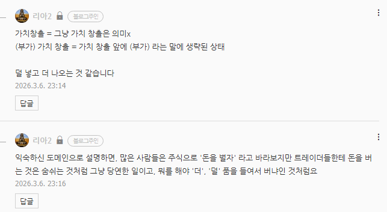

# 당신이 엣지에 있어야 하는 이유
**Date:** 2026. 3. 6. 23:20
**Category:** 다이어리
**Original URL:** https://blog.naver.com/xpfkwh56/224207265479
---

​

1. 얼마 땄냐? 얼마 벌었냐?

돈 벌어서 어디에 쓰고 사냐? (x)

​

2. 샤프 비율은?

드로다운 대비 수익은?

손익비는?

진입/청산 전략은? (o)

​

3. 2번이 안 보이면? 내 의자가 아닌 것

​

내 영역이 아니면 버려야 되나요?

꼭 그런 것은 아님

​

4. 인공지능이랑 비슷,

​

영어, 수학, 코딩 잘 해야

AI 다룰 수 있나요? **그건 아님**

​

근데 최소한 저것들이랑 친해지고

싶은 생각쯤은 있어야 됨

​

5. 번역기 쓰면 영어 실력 안 느냐?

​

반투명 종이를 그림 위에 대놓고

따라 그리면 그림 실력이 안 느냐?

​

아님, 둘 다 하는 만큼

**'정직하게'** 역량이 증가함

​

**\* 배움과 적응은 호모 사피엔스 종특**

**신은 인간이 무엇이든 되도록 설계했음**

​

근데 번역기 있으니까 영어 몰라도 됨

따라 그리면 되니까 데생 안 해도 됨

​

이러면 이제 인생이 피곤해지는 것