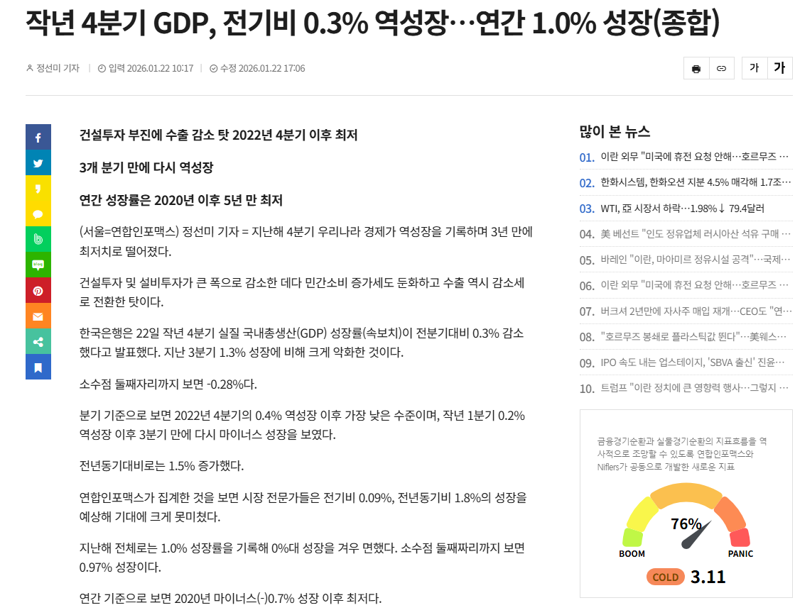

# 남들이라고 부동산 잡기 싫어서 안 잡았낰ㅋ
**Date:** 2026. 3. 7. 0:16
**Category:** 다이어리
**Original URL:** https://blog.naver.com/xpfkwh56/224207312895
---

​

잡으면 좋되니간 못 잡은 것

​

**1) 부동산 경기 활황 시나리오**

​

경제가 아예 박살이 나면 됨,

그럼 제일 먼저 여기에 돈 뿌림

​

**\* 근데 돈 뿌린다고 공급이**

**하루 아침에 되느냐는 글쎄? ,,**

**​**

왜 많고 많은 것 중에

부동산에 쓰나요?

​

빠따가 크니까요

**​**

**2) 이재명 극강 운빨 시나리오**

​

본인 정권 끝날 때까지,

반도체+인공지능 슈퍼사이클

​

+대외경제 빨간불 하나도 없이

무탈하게 하고 싶은 것 다 하고

온화한 형태로 정권 종료

​

근데 결과가 어떻게 되든 간에,

​

차기는 **역대급** 불운

대통령이 될 것으로 봄

​

**내 생각**

​

잘 풀릴 때는 주변에 다 내 편 밖에 없고,

안 풀릴 때는 주변에 다 내 적 밖에 없다

​

솔직한 생각은, **'저게 될까?'**

​

이잼이 명예롭게 퇴진하긴

어려울 것 같다는 생각

​

**\* 지금 시점에서 제조업 경기가**

**안 받쳐준다고 상상을 해보자**

**​**

가까운 기출에서도 김영삼이 있었고,

역사 속에서도 무수히 많은 존재들 있음

​

가치관으로 따지면 난 빨갱이 쪽이 맞긴 한데,

​

부동산 자금이 증시로 이동한다 라는 것이

**'아닌 말로'** 그렇게 바람직한 것도 아니긴 함

​

기주택자 엉덩이 깔아뭉개고 있으면

집값이 반토막 나든, 반의 반토막 나든

알빠노 하고 **어차피** 팔지도 못 하는데

​

주식은 버튼만 누르면 바로 내리 꽂힘

​

다들 아는 이야기지만, **'정상화'** 되려면

서울 집중이 풀려야 되는데 남들이라고

그걸 몰라서 안 하고 있는 건 아니즄ㅋ