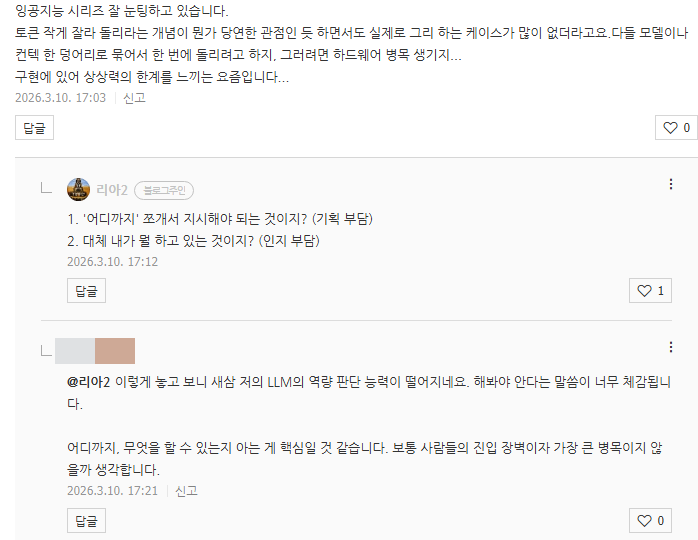

# 거꾸로 하는 것과 바로 하는 것
**Date:** 2026. 3. 10. 18:47
**Category:** 다이어리
**Original URL:** https://blog.naver.com/xpfkwh56/224211618141
---

​

1. 저는 육아에 AI 를 쓰고 있는데,

크게는 세 가지 이유 때문입니다

​

**2. 첫 번째 이유**

​

남의 자식 얘기가, 나는 재밌지만

남에겐 마냥 재밌는 얘기가 아님

​

그래서 대화를 나눌

사람을 찾기 어렵습니다

​

**'나 혼자'** 하는 덕질 이니까요

​

독서 모임 같은 것도 비슷할 겁니다,

​

나는 A 라는 책을 읽고 말하고 싶어

쟤는 B 라는 책을 읽고 말하고 싶어

​

둘 다 **'책을 읽고 말하고 싶지만'**,

**'어떤 책'**을 읽고 싶냐가 다르니까

​

핏이 안 맞아서 깨질 확률이 더 높죠

답은? 고독하게 하는 겁니다

​

**3. 두 번째 이유**

​

> 나도 나를 못 믿겠다

​

이건 제 추측입니다만, 여인의 몸 자체가

임출육에 **'상당한'** 부담을 지불하게 됩니다

​

그래서인지, 객관적이고 정량적으로

상황을 보기가 **굉장히** 어렵습니다

​

좋은 말이 나와도 찜찜하고,

나쁜 말이 나오면 기분이 나쁘니

​

마땅히 누구한테 물어볼 수도 없고,

그렇다고 손 놓고 있을 수는 없는데

​

기계한테 맡기면 **'사실'** 이 나옵니다

​

**\* 신뢰할 수 있는 누적된 데이터는**

**추후 전문가의 개입 효율을 끌어올림**

**​**

**아기가 언제부터 울었어요?**

**→ 음, 최근 며칠 정도요? (x)**

**​**

**뭐 먹었어요?**

**→ 그냥 이유식? (x)**

**​**

**과학자를 무당처럼 쓰면 안 됨**

**​**

**4. 세 번째 이유**

​

스샷에 있는 **'해봐야 안다'** 라는 말의

연장으로 몇 마디를 더 얹자면요

​

제가 쓰고 있는 모델 중 하나는,

​

**동물 연구에서 개, 고양이, 쥐 같은**

**소동물들의 움직임을 포착하는 겁니다**

​

팔/다리의 크기, 길이, 둘레,

좌표점, 운동 방향 등을 측정해

​

아기의 행동 물리량을 산출합니다

​

이게 사람한테 맡겨서 가능한 일이냐?

불가능할 가능성이 압도적으로 높고,

​

무엇보다 **'한 두푼'** 으로

될 일이 결코 아닙니다

​

제가 만약 영상 20개, 50개 보내주면

그거 보고 분석해서 말해주는 일인데

​

**누가 이걸 해줍니까?**

​

인공지능한테 맡기면, 물장구 칠 때

팔다리 허우적거리면서 표면 방향이

​

지금 얼마나 움직이고 있으니까,

F 값이 어느 정도일 것이다도 나옵니다

​

**\* 음, 1호기가 잡고 발로 벽을 밀면**

**자기 몸이 뒤로 튕긴다는 물리적인**

**자연칙을 경험하고 있는 상태구나**

**피아제로 따지면 지금 몇 단계구나**

**​**

제가 **'생물의 동적 운동성'** 을

확인하는 도구를 찾았으니 나왔지,

​

**'육아에 도움 되는 인공지능 모델'**

같은 걸로 검색했으면 못 찾았겠지요

​

<https://pathways.org/>

[**Pathways.org | Tools to maximize your child's development**

We Take the Guesswork Out of Baby's Development FREE, Easy-to-Use, and Trusted Resources 75+ Healthcare Experts 300+ Baby Development Games 70+ million Video Views "Being a first-time mom, it's a little scary because you don't know what to expect and there are so many unknowns. But after discovering...

pathways.org](https://pathways.org/)

​

이런 것은 **'공짜'** 이기도 하구요

​

**\* 전기세, 물값 끝**

**​**

시작도 **'거대아'** 는 몸이 무겁다

​

→ 운동 발달에 지체 있을 수도 있다

에서 시작된 것이었습니다

​

**\* 몸이 무거우니, 움직이기 어려움**

**움직이기 어려우니, 잘 안 움직임**

**잘 안 움직이니 신체 발달이 더딤**

**신체 발달이 더디면서 소아비만 ↑**

**​**

**몸이 무거운 상황에서, 영유아가**

**할 수 있을 법한 운동이 뭐 있지?**

**​**

**→ 물에서 움직이면 더 쉽겠구나**

**​**

**→ 태어나자마자 터미 돌리고,**

**약 1개월 전후 쯤 기초 근력 확인**

**아기 수영 프로그램 루틴 추가함**

​

당연한 말이지만, **해봐야 압니다**