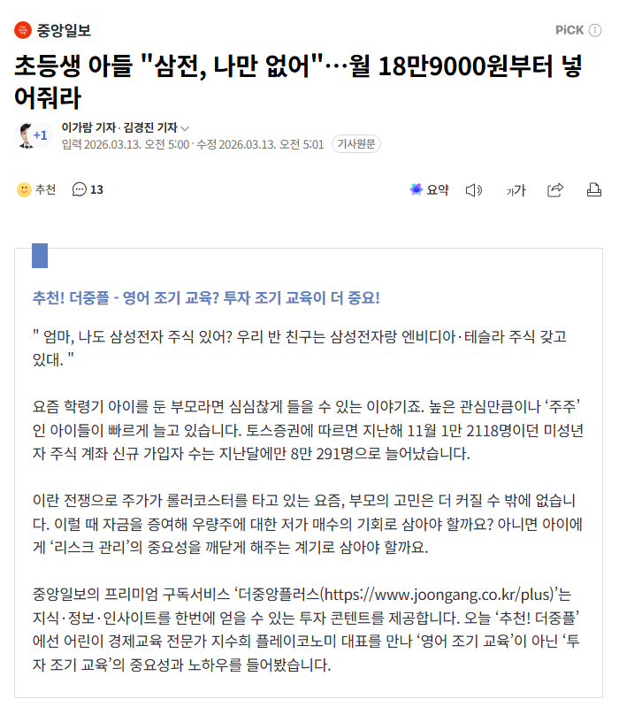

# 어린이 경제교육 이거 아직도 팔리네
**Date:** 2026. 3. 13. 7:44
**Category:** 다이어리
**Original URL:** https://blog.naver.com/xpfkwh56/224214693425
---

​

1. 예전에 몇 번 적었던 적 있는데,

우리 아이 경제 교육시키면 얻는 것

​

1) 학교 다닐 필요 없다

​

2) 선생님 돈 얼마 벌지?

내가 그거 버는 사람한테

고개 조아릴 필요 있나?

​

3) 피차 다 먹고 살자고

하는 짓 아닌가?

​

하나하나, 마냥 틀린 말은 아니지만

​

기대했던 것과 다른 결과

얻을 가능성이 높다고 생각

​

세상에 대한 오만함과 헛바람을 배우기엔

저거만한 것이 없다는 것 쯤은 알겠음

​

2. 그리고 섣불리 일반화할 수 없겠지만,

내 **짜잘한 몇 번의 스타트업 인연** 경험상

​

저런 서비스 파는 분들이 대단하고,

거창하게 무슨 의식 갖고 있진 않았었음

​

무엇보다 **'경제교육'** 이라는 것의

니즈가 결국 **나는 안 되었지만**

​

**너는 일찍 뭐라도 머리에 넣어 달라져봐라**

라는 사교육의 모순점을 타는 장사인데

​

나는 무척 비관적으로 보는 편이다

​

이병철이 아들 셋이 있는데,

​

장남은 아빠 투서로 찔렀다가 팽

차남은 쨌든 파산에 손주는 자살

삼남이라고 나온 것이 이건희 고,

​

이성계가 아들 몇 낳아서

뭐 건졌나만 봐도 답이 나온다

​

3. 그럼 실제로 자식이 집안을 일으키구,

지 팔자를 개척하게 하려면 어찌해야 할까

​

당연히 **'최선의 정답'** 은

​

지 밥 숟가락 지가 알아 빚어서

떠먹고 다니는 것이겠지만서도

​

괜한 헛바람 안 넣고, 길만 안 막아도

부모 할 일은 다 하는 것 아닌가 싶음

​

신랑한테두 내가 자주 강조하는 점인데

​

대단히 어떤 뭔가를 잘 해주는 것보다

문제가 될 일을 하지 않는 것이 더 나음

​

4. 부모의 정 이라는 것은 험한 것이라,

방향을 틀리게 가면 **빠꾸가 없는데**

​

유능한 적보다, 무능한 아군이 무섭다고

​

틀린 방향을 힘차게 달리면

그거보다 무서운 것이 없다

​

5. 아이를 윤택하게 살게 하고 싶으면

자산을 물려주는 것보다 나은 것이 없구,

​

**\* 쥐여준 것도 없는데 훈수 두고,**

**잔소리 해봤자 그거 다 업보만 쌓임**

​

**잃지 않고 지키게 하고 싶으면**

**일찍 시집/장가 보내서 홀딩이 답**

​

공동 명의로 싹 다 묶어버리면

​

최소한 아들 기준으로는

애 엄마가 자식 새끼들 키운다고

헐어먹지 못하게 방파제 할 것이고

​

딸 기준으로는 마누라가 뭐 한다고 하면

​

흐린 눈으로 보는 것이 신랑 패시브라서

그 잔소리에 한번 덜 경솔하게 할 확률 큼

​

없는 살림에 잘 살게 하고 싶으면,

​

1) 제도권 충실하게 밟아서

고소득 연봉 타게 하는 것이나

​

**\* 공무원만 해도 소위 말하는**

**중산층은 늘 무난히 입성함**

**​**

2) 특이점 올 때까지 마음 비우는 것

외에는 아닌 말로 뾰족한 수도 없음

​

그나마도 **살아있을 때, 덕 보는 것도 운**

​

권율은 마흔 여섯에 벼슬을 했고

강태공은 일흔이 넘어서야 세상에 나감

​

6. 정 그나마 뭔가를 해주고 싶다면

가계부 쓰고, 검소하게 살고,

​

한 푼 두 푼 확실한 이익 찾아가면서,

​

**\* 100원 짜리 200원 주고 사지 말고**

​

아, 세상에는 이런 인간도 하나 쯤 있구나

라는 인식 하나 늘려주는 것이 최선일 것임

​

요즘은 모르겠지만 나 학교 다닐 시절에

헌 책방을 가면, 10페이지도 안 푼 문제집이

수두룩 빽빽했었는데, 그랬던 애들이

​

주식이든, 다른 투자든, 사업이든

결과가 잘 나올 리가 있을까?

​

아닐 수도 있지만, 나는 좀 회의적이다

​

똑같이 마음만 앞서서, 일단 산 다음에

평가손 뚜드려맞고 유동성만 공급할 듯함

​

사실 **밑지는 것도 습관** 인데,

​

감가에 대한 개념이 없는 마당에

여기저기 흘리고 다니기나 바쁠 것임