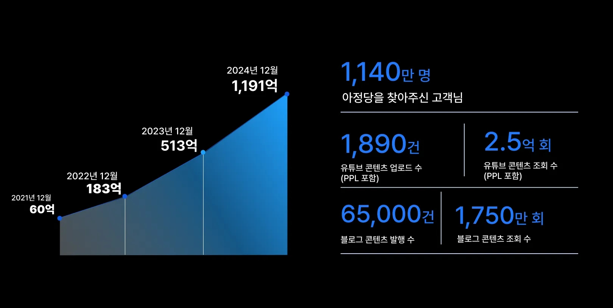

# 어린이 사업 교육, 장사 경험은 어떤가요?
**Date:** 2026. 3. 13. 8:35
**Category:** 다이어리
**Original URL:** https://blog.naver.com/xpfkwh56/224214727521
---

1. 미국이면 차고에서 창업도 가능하고,

​

실제로 중국/미국처럼 시장이 크다면

그런 위인전 일화가 불가능하진 않은데

​

조막손 내수 시장에서 그거 하는 것보다

​

차라리 좋은 학교 들어가서 인맥 쌓고

투자 받는 것이 더 손익비가 좋읍니다

​

2. 나이가 너무 어려, 근데 유튜브 했어

나중에 괜히 잡음 생길 가능성도 있구,

​

**\* 어린 초중시절, 부모님 따라서**

**모델이니 연예인이니 하다가**

**나중에 다른 길 가면 본인도 상처고**

**철 없는 애들이 놀릴 수도 있고**

**​**

**종종 10대 인스타 보면 아찔할 때 있음**

​

장사가 사람을 시험에 들게 할 일이 많아,

주화입마 걸리면 이거도 곤란해집니다

​

괜한 재미 들려서 친구들한테

물건 팔고 문제 생기면 어째요?

​

문제가 없으면 다행이지만,

​

돈 앞에 중심 지키는 일은

어른도 아주 어려운 일임

​

물론 아닐 수 있지만 극단적으로는,

본인 **'신용 팔이'** 를 하게 될 가능성이

현실적 측면에서 아주 높은데,

​

장사는 쨌거나 많이 벌고,

많이 남기는 것이 훈장이라

​

이게 그림이 이상하게

나올 확률이 다분합니다

**​**

**3. 그럼 그냥 놔둬요?**

​

시켜서 되기만 한다면 차라리

이런 쪽으로 방향을 잡아주세요

​

4인 가족 감안하고, 생활비

월마다 이삼백 쓴다고 칩시다

​

**'분명'** 새는 돈이 있습니다

​

더 싸게 살 수 있거나, 알고보면

해골물 먹고 있거나, 쓰는 값에 맞게

​

이런저런 자잘 혜택들 있는데

온전하게 못 쓰거나

**​**

**\* 특히 멤버쉽, 이런 계열들**

​

구질구질하게 아끼지 않아도

응당 누릴 수 있는데 귀찮아서

하지 않는 것들이 분명 있을건데

​

**\* 핸드폰/인터넷 요금제 등등**

​

이거 으른도 할라치면 복잡합니다

​

보상설계는 **위험** 하니까,

​

내가 원래 잡은 예산은 이건데,

​

차액분 너가 얼마 만들어오면

너 줄게 같은 접근은 하지마시고

​

**\* 밖에서 벌어서 안에다 모셔야지,**

**집에 있는 돈 왼손 오른손 해봤자**

**나쁜 버릇만 생길 가능성이 큽니다**

​

가능하면 그런 쪽으로

풀게 하는 것이 좋을 것 같아요

​

증권 계좌 만들면 꽁머니 주는 것도

이거 아닌 말로 귀찮아서 안 하지

​

찾아먹으면 적은 액수는 아니고,

​

**\* 리스크 0, 리턴 100%**

**​**

이런 쪽으로 파면 별의 별

희한한 것들이 매우 많은데,

​

**감각**은 그런 **필드**에서 나옴

​

4. 어휴, 그런 장사 한다고 돈 버나요?

특허를 내든, 어디 뭐 바이오를 하든 ,,

​

​

아정당 매출 1천억