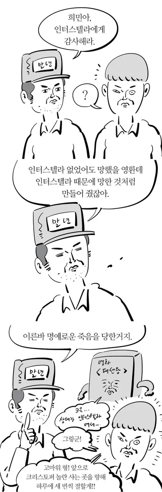

# 잉공지능 사회에 뭐가 살아남나요?
**Date:** 2026. 3. 17. 7:09
**Category:** 다이어리
**Original URL:** https://blog.naver.com/xpfkwh56/224219152270
---

**1. 책임을 지는 직업**

​

인공지능은 감방도 못 가고,

민사 배상도, 벌금도 못 냅니다

​

**2. 자격이 있는 직업**

​

면허가 없으면 할 줄 알아도

직역에 종사할 수 없습니다

​

**3. 공무원**

​

정년 보장

​

**4. 책임 지는 직업의 리스크**

​

인공지능은 책임을 못 지는데,

인공지능을 쓴 사람은 책임을 짐

​

그래서 고성능 인공지능을 쓰거나,

커버칠 수 있는 비용을 지불하게 됨

​

**5. 자격이 있는 직업 리스크**

​

자격은 나만 있는 것이 아님

​

예전에는 자격사 1명이

10명 커버 했다면 지금은

자격사 1명이 100명 커버

​

**6. 결론**

​

​

1) 애초에 영향력 밖이면 노 상관

2) 자기 경쟁력이 굉장히 높던가,

3) 공무원 이던가 둘 중 하나가 답