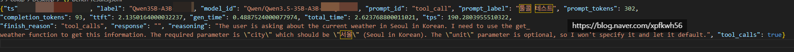

# 5090 을 깎는 여자
**Date:** 2026. 3. 18. 22:14
**Category:** 다이어리
**Original URL:** https://blog.naver.com/xpfkwh56/224221468103
---

​

**1. 합성인가요? 어떻게 가능함?**

​

파워리밋 + 팬커브

+ 클럭-전압 커브

​

노가다 입니다

​

공냉으로도 가능함

물론 수냉이면 더 좋죠

​

아무리 본인이 공냉을 잘 다뤄도

​

결국 **'물'** 과 **'공기'** 의 물리적인

한계 자체는 극복할 수 없기 때문

​

2. 이게 핵심인데,

​

보통 오버클럭은 다들

게이밍 기준으로 생각하니까,

​

클럭 올리면 전력 올라가고 온도 올라가고

결국 스로틀링 걸려서 의미 없는

루프에 빠지기 쉽습니다

​

**\* 인공지능 하는 사람이 적으니까**

​

**근데 LLM 추론 같은 것은**

**메모리 바운드라서 코어가**

**놀고 있는 시간이 길고,**

**​**

**그 덕분에 높은 클럭을**

**유지하는 것이 가능합니다**

​

3. 즉,

​

오버클럭으로 클럭 천장을 올려놓고,

추론 워크로드의 낮은 전력 소모 덕분에

​

GPU 부스트 로직이 클럭을 내릴 이유가 없으니까

3,240MHz가 상시 고정으로 유지되는 거고

​

그 상태에서 갑자기 prefill 체제에서

무거운 연산이 들어와도 클럭이 올라가 있으니까

부스트 올리는 지연 없이 바로 처리하는 구조

​

4. 근데 결국 그게 LLM

에는 쓸모없지 않아요?

​

핵심은 대역폭이랑,

메모리 클럭인데?

​

그리고 메모리 클럭은 렘 클럭 급은 아니지만

함부로 만지면 나중에 뒷골 땡길 수도 있음

​

**5. LLM 한테만 쓴다면 그렇죠**

​

GPU 할당을 조율해서 VLM 이라던가,

​

이미지 생성처럼 코어 클럭에 직결되는

LORA 튜닝 같은 것을 할 때, 웜업으로

​

LLM 추론을 쓰면 코어 안정성이나

전력 효율 면에서 더 이익 챙길 수 있음

​

6. 이걸 어떻게 알았어요?

뭐 보고 배움?

​

하면서 찾은 것

​

그리고 배울 수도 없음

​

사람마다 프레임 워크

구성이 다 달라서

​

​

7. qwen3.5a3b 로도

tps 190-200 터트릴 수 있어요

​

**\* dense 가 아니더라도**

**35b 모델로 100씩 터트리면**

**상당히 쾌적하게 쓸 순 있죠**

​

Hw/Sw 수련을 열심히 하셈

​

누가 ~해서 어떻게 했다더라 (x)

**내가 원리를 알고 실험하고 설계** (o)

​

장비가 중요한 것도 맞지만

그걸 쓰고 있는 사람도 중요함

​

그리고 일전에 제가 글을 못 찾겠는데

한번 적은 적 있는데,

​

tps도 벤치랑 똑같습니다

그거만 봐선 아무 의미도 없어요

​

원리, 본질 이런 걸 알아야 되는 이유는

미래의 나는 봤던 문제보다 처음 보는 문제를

풀어야 되는 일이 더 많기 때문입니다