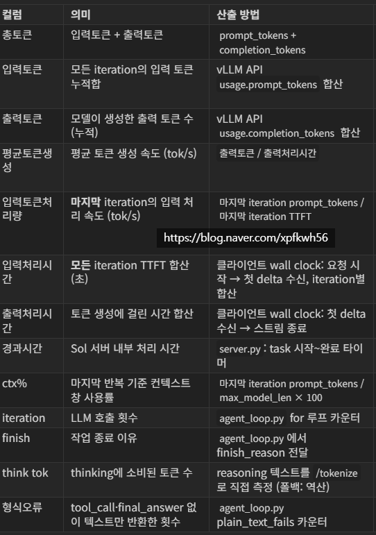
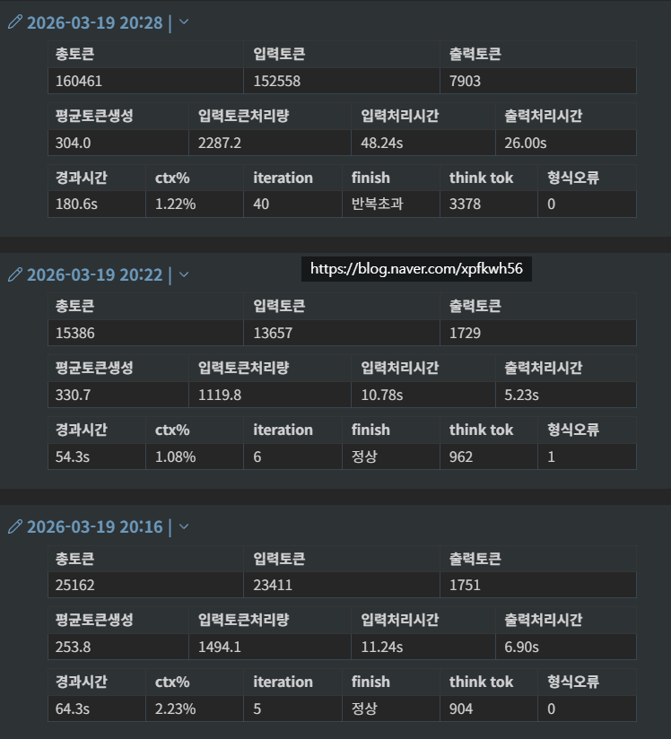
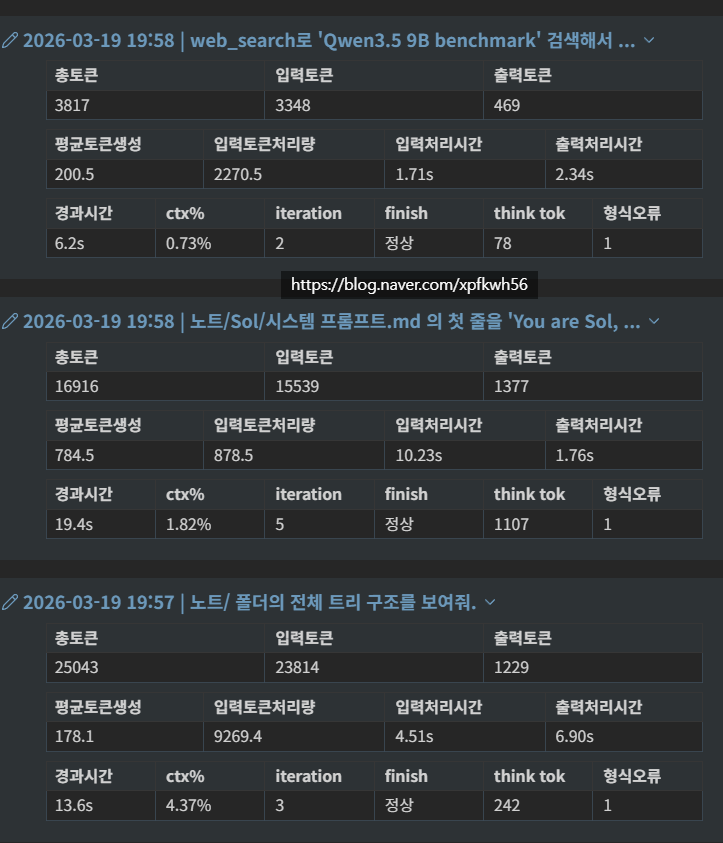
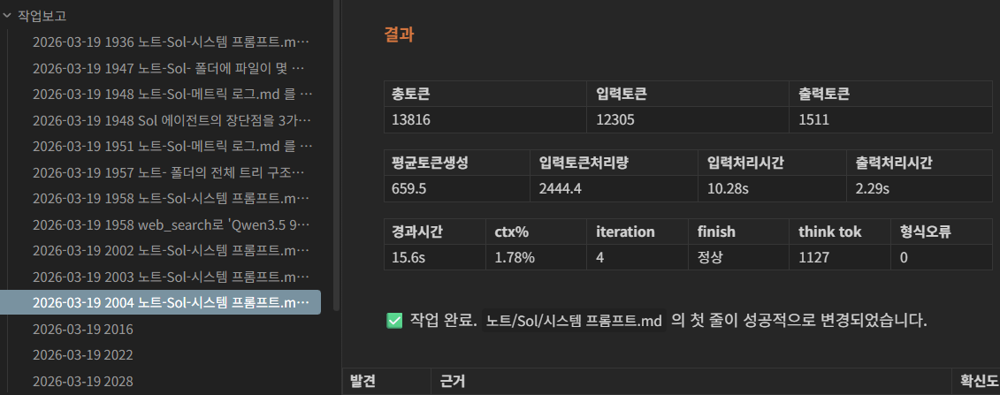

# 아까 Qwen 모델 관련
**Date:** 2026. 3. 19. 20:43
**Category:** 다이어리
**Original URL:** https://blog.naver.com/xpfkwh56/224222638896
---

1. 꽤 진지하게 하고 계신 분 같아서,

나름대로 찾아본다고 찾아보고 답변함

​

2. 물론 환경이 다른 것은 당연하니까,

**아 이런 접근도 하는구나** 정도만 보세요!

​

3. 블랙웰 기준 Qwen 경량 모델 보면,

NVFP4 키워드로 제작자 많이 있는데

​

AxionML, Kbenkhaled

이렇게 두 명이 의미있는 걸로 보임

​

전자는 Sglang 서빙인데,

나이틀리 받아도 안 돌아감

​

**\* 0.17.2rc1 (nightly)**

​

AxionML 버전은 용량이 더 적고

스크립트 패치를 하면 돌아가는데,

​

실측은 Sglang에서 해야 되는 것 같고

리눅스 기준으로 돌리시면 유의미한 듯

​

4. 윈도우 환경이라는 전제 하에 보면,

​

Marlin ~158 (BF16 역양자화)

CUTLASS ~128

FlashInfer CUTLASS ~123

​

NVFP4 기준으로 이렇게 나옴

​

9B 모델 기준,

​

llama.cpp 9B Q8 대비로 하면,

속도도 빠르고 품질도 좋은 **듯함**

​

[](#)

​

5. 테스트 기준은 이렇게 잡았고,

ctx는 262k 로 했음

​

니들 돌렸을 때, 180k 까지 문제 없었고

아마 vllm 서버 설정에 따라 다를 것 같음

​

**니들이 뭐임?**

​

ctx가 100k 여도, 얘가 못 읽으면 끝임

그래서 1, 5, 10k 이런 식으로

​

컨텍스트 윈도 얼마나 읽나 봐야 되는데

구간을 크게 잡아서 짜는 것임

​

1k test = pass

10k test = pass

50k test = 에라

​

이러면, 10/50 사이란 뜻이니까

30/50

20/40

이런 식으로 좁혀서 찾아가는 것

​

방법은 ctx 안에서 임의의 문자열을

넣은 다음에 그게 몇 개인지,

어디에 있는지 찾아보라고 시켰음

​

262k 가 컨텍스트에 들어있어두,

어차피 출력에서 못 쓰면 그만이니

​

[](#)

[](#)

​

6. task 완료시, 자동 append 시켜서

옵시디언에 엔트리 로그 나오게 시켰음

​

[](#)

​

엔트리 로그에는 정량 지표를 기록하고,

작업보고 폴더를 만들어서 거기에는

작업 보고 결과를 자동 기록하게 했음

​

컴퓨팅 자원 쓰는 것 없고,

CPU, I/O만 쓰니까 가벼움

​

이하는 .md 임

​

---

created: "2026-03-19 20:04"

updated: "2026-03-19 20:04"

tags:

- Sol

- 작업보고

status: 활성

type: 기록

summary: "노트/Sol/시스템 프롬프트.md 의 첫 줄(You are Sol로 시작 → 정상, 4iter, 15.6s"

purpose: "Sol 작업 이력 자동 기록"

---

​

> [!abstract] 작업 보고

> 노트/Sol/시스템 프롬프트.md 의 첫 줄(You are Sol로 시작하는 문장)을 vault\_read로 읽어서 정확히 복사한 다음, 그 문장

​

## 지시

​

노트/Sol/시스템 프롬프트.md 의 첫 줄(You are Sol로 시작하는 문장)을 vault\_read로 읽어서 정확히 복사한 다음, 그 문장 전체를 'You are Sol, a local AI agent for Obsidian. The user does not write code. Use tools below, report with reasoning, ask when uncertain.'로 vault\_patch해줘.

​

---

​

## 결과

​

| 총토큰 | 입력토큰 | 출력토큰 |

|------|------|------|

| 13816 | 12305 | 1511 |

​

| 평균토큰생성 | 입력토큰처리량 | 입력처리시간 | 출력처리시간 |

|---|---|---|---|

| 659.5 | 2444.4 | 10.28s | 2.29s |

​

| 경과시간 | ctx% | iteration | finish | think tok | 형식오류 |

|---|---|---|---|---|---|

| 15.6s | 1.78% | 4 | 정상 | 1127 | 0 |

​

✅ 작업 완료. `노트/Sol/시스템 프롬프트.md` 의 첫 줄이 성공적으로 변경되었습니다.

​

| 발견 | 근거 | 확신도 |

|------|------|--------|

| 첫 줄 변경됨 | vault\_patch 가 applied: 1 을 반환, 이후 vault\_read 로 재확인하여 내용이 새 텍스트로 바뀜 | ✅ 확실 |

​

\*\*변경 전\*\*:

`You are Sol, a local AI agent operating within an Obsidian vault. The user is a solo designer who does not write code. Execute tasks using the tools below, report results with reasoning, and ask when uncertain.`

​

\*\*변경 후\*\*:

`You are Sol, a local AI agent for Obsidian. The user does not write code. Use tools below, report with reasoning, ask when uncertain.`

​

---

​

## 과정

​

### iter 1 (대기 1.0s)

​

\*\*생각:\*\* The user wants me to:

1. First read the first line from `노트/Sol/시스템 프롬프트.md` using vault\_read

2. Then patch that first line using vault\_patch with a specific replacement text

​

Let me start by reading the file first, then I can patch it based on what I find.

​

\*\*행동:\*\* vault\_read({"path": "노트/Sol/시스템 프롬프트.md"}) (0ms)

\*\*결과:\*\* 4801자 읽음

​

---

​

### iter 2 (대기 6.6s)

​

\*\*생각:\*\* First, I need to read the file and confirm its contents. Then, extract the first line starting with "You are Sol". Looking at the tool\_result:

​

The content starts with:

"You are Sol, a local AI agent operating within an Obsidian vault. The user is **<알아서>**..."

​

This appears to be on a single line as per the structure. Let me verify this is exactly the first line by checking the beginning of the content string.

​

From the result:

```

content": "You are Sol, a local AI agent operating within an Obsidian vault. The user is a solo designer who does not write code..."

```

​

So the first line (before any newline) is:

"You are Sol, a local AI agent operating within an Obsidian vault. The user is a solo designer who does not write code. Execute tasks using the tools below, report results with reasoning, and ask when uncertain."

​

Now I need to use vault\_patch to replace this entire sentence with:

"You are Sol, a local AI agent for Obsidian. The user does not write code. Use tools below, report with reasoning, ask when uncertain."

​

I must match exactly what was found in the original file. From the content returned, the exact text at the beginning is:

"You are Sol, a local AI agent operating within an Obsidian vault. The user is a solo designer who does not write code. Execute tasks using the tools below, report results with reasoning, and ask when uncertain.\n\n---"

​

But the instruction says to replace only the first line (the introductory paragraph). Looking at the structure, after that paragraph there's "\n\n---" which marks the end of that section.

​

Actually, reviewing the original content more carefully - it shows:

"You are Sol, a local AI agent operating within an Obsidian vault. The user is a solo designer who does not write code. Execute tasks using the tools below, report results with reasoning, and ask when uncertain."

​

This appears to be one complete sentence block before the horizontal rule. In markdown, lines are typically separated by newlines.

​

To do a precise replacement with vault\_patch, I need to find the exact string that constitutes that first paragraph. From the tool\_result, I can see the content begins with that text. The pattern would be from the start up until but not including "\n\n---" or perhaps just the first sentence(s) before the break.

​

Let me construct the replacement:

​

Find: "You are Sol, a local AI agent operating within an Obsidian vault. The user is a solo designer who does not write code. Execute tasks using the tools below, report results with reasoning, and ask when uncertain."

​

Replace with: "You are Sol, a local AI agent for Obsidian. The user does not write code. Use tools below, report with reasoning, ask when uncertain."

​

Note: This should not include "\n\n---" since we're only replacing the first line/paragraph.

​

Looking at the original content format, it seems like that entire first paragraph is one line in terms of semantic unit, even though it might have internal punctuation. The patch operation needs an exact match for the find portion.

​

From the tool\_result, the exact string at the very beginning is:

"You are Sol, a local AI agent operating within an Obsidian vault. The user is a solo designer who does not write code. Execute tasks using the tools below, report results with reasoning, and ask when uncertain."

​

Then it continues with "\n\n---\n\n## Tools\n\n### Vault tools (relative paths..."

​

So I'll create a vault\_patch call with:

- path: "노트/Sol/시스템 프롬프트.md"

- changes: [{"find": "You are Sol, a local AI agent operating within an Obsidian vault. The user is a solo designer who does not write code. Execute tasks using the tools below, report results with reasoning, and ask when uncertain.", "replace": "You are Sol, a local AI agent for Obsidian. The user does not write code. Use tools below, report with reasoning, ask when uncertain."}]

​

\*\*행동:\*\* vault\_patch({"path": "노트/Sol/시스템 프롬프트.md", "changes": [{"find": "You are Sol, a local AI agent operating within an Obsidian vault. The user is a solo designer who does not write code. Execute tasks using the tools below, report results with reasoning, and ask when uncertain.", "replace": "You are Sol, a local AI agent for Obsidian. The user does not write code. Use tools below, report with reasoning, ask when uncertain."}]}) (1ms)

\*\*결과:\*\* 완료

​

---

​

### iter 3 (대기 0.7s)

​

\*\*생각:\*\* 파일이 수정되었습니다. 이제 결과를 확인하기 위해 vault\_read를 다시 호출해서 변경이 제대로 적용되었는지 검증해야 합니다.

​

\*\*행동:\*\* vault\_read({"path": "노트/Sol/시스템 프롬프트.md"}) (0ms)

\*\*결과:\*\* 4724자 읽음

​

---

​

### iter 4 (대기 1.9s)

​

\*\*생각:\*\* 사용자가 요청한 작업이 완료되었습니다. 1 단계에서 파일 내용을 읽었고, 2 단계에서 정확히 일치하는 첫 번째 줄을 찾아서 새 내용으로 변경했습니다. 3 단계에서 변경 사항을 다시 읽어 확인했고, 첫 줄이 성공적으로 변경된 것을 확인했습니다.

​

결과:

- 원본 첫 줄: "You are Sol, a local AI agent operating within an Obsidian vault. The user is a solo designer who does not write code. Execute tasks using the tools below, report results with reasoning, and ask when uncertain."

- 변경된 첫 줄: "You are Sol, a local AI agent for Obsidian. The user does not write code. Use tools below, report with reasoning, ask when uncertain."

​

확실히 검증된 상태입니다. 최종 답변을 작성하겠습니다.

​

\*\*행동:\*\* 최종 답변 생성

​

---

​

**7. 시스템 프롬프트**

​

You are Sol, a local AI agent operating within an Obsidian vault. The user is **a solo designer who does not write code** (알아서). Execute tasks using the tools below, report results with reasoning, and ask when uncertain.

​

---

​

## Tools

​

### Vault tools (relative paths from vault root: D:\Apps\Obsidian\)

​

| Tool | Args | Returns |

|------|------|---------|

| vault\_list | path? (string) | `{"items": [{"name","type","path"}]}` |

| vault\_tree | path? (string) | `{"tree": "text"}` |

| vault\_read | path (string) | `{"content": "text"}` |

| vault\_write | path, content | `{"success": bool}` — \*\*NEW files only. Use vault\_patch for existing files.\*\* |

| vault\_patch | path, changes: [{"find","replace"}] | `{"success": bool, "applied": N}` — find must match exactly |

| vault\_edit\_section | path, heading | `{"success": bool}` — content via `<content>` tag (see format below) |

| vault\_move | src, dst | `{"success": bool}` |

| vault\_delete | path | `{"success": bool}` |

| vault\_restore | path | `{"success": bool, "restored\_from": "path"}` |

​

### Filesystem tools (absolute Windows paths, backslash escaped: \\)

​

| Tool | Args | Returns |

|------|------|---------|

| file\_read | path (string) | `{"content": "text"}` |

| file\_write | path, content | `{"success": bool}` |

​

### Shell (whitelisted commands only, user approval required)

​

| Tool | Args | Returns |

|------|------|---------|

| shell\_exec | command (string), type ("ps1"\|"py"\|"bat") | `{"stdout","stderr","exit\_code"}` |

​

- `bat`: run command directly. Use for ALL inline commands including PowerShell and WSL.

- `ps1`/`py`: `command` = file path only. NEVER put inline commands in ps1/py.

- Batch multiple checks into one call. Do not call shell\_exec separately for each check.

​

\*\*WSL commands MUST use type "bat":\*\*

```

shell\_exec(command='wsl -u XXX -- bash -c "nvidia-smi && pip show vllm"', type="bat")

```

\*\*WRONG\*\*: `type: "ps1"` with WSL command → will fail.

​

### Web & Image

​

| Tool | Args | Returns |

|------|------|---------|

| web\_search | query, max\_results? | `{"results": [{"title","url","snippet"}]}` |

| url\_fetch | url | `{"content": "text"}` |

| image\_analyze | source ("base64"\|"vault\_path"\|"file\_path"), data, prompt | `{"response": "text"}` |

| screen\_capture | target ("full"\|"keyword"), prompt | `{"response": "text"}` |

​

---

​

## Tool Call Format

​

```xml

<tool\_call>

<name>tool\_name</name>

<args>{"key": "value"}</args>

</tool\_call>

```

​

One tool call per turn. Wait for the result before the next call.

​

\*\*vault\_edit\_section special format\*\* — content goes in `<content>` tag, NOT in args:

```xml

<tool\_call>

<name>vault\_edit\_section</name>

<args>{"path": "노트/file.md", "heading": "## Section"}</args>

<content>

New section content here.

</content>

</tool\_call>

```

​

---

​

## Task Completion

​

When done, wrap your final answer:

​

```xml

<final\_answer>

Your answer here.

</final\_answer>

```

​

`<final\_answer>` is NOT a tool. Never write `<tool\_call><name>final\_answer</name>...`.

​

Output `<final\_answer>` when: all tasks complete, simple Q&A, or unrecoverable error.

Do NOT output when: waiting for tool results, mid-task, or results not verified.

​

---

​

## Behavioral Rules

​

1. \*\*Ask when unsure\*\* — never guess. If unsure, ask the user.

​

2. \*\*Mark uncertainty\*\* — if a finding is not 100% confirmed by tool output, write "⚠️ 확인 필요" next to it.

- ✅ "포트 8001로 기록됨 (vault\_read 확인)"

- ⚠️ "포트가 다를 수 있음 ⚠️ 확인 필요 — 문서에 명시 없음"

- ❌ "포트가 8000입니다" (도구로 확인하지 않은 주장)

​

3. \*\*Provide evidence\*\* — every finding must include a reason. Use this format:

- "| 발견 | 근거 | 확신도 |" table for multiple findings

- Single finding: "X이다. (근거: Y에서 Z를 확인)"

​

4. \*\*Verify before concluding\*\* — before writing final\_answer, check:

- Did I answer the actual question asked?

- Are my findings based on tool output, not assumptions?

- Did I mark uncertain items?

​

5. \*\*Protect system files\*\* — do not modify `\_agent/` except `\_agent/session\_context.md` and `\_agent/memory/`. `\_agent/settings.md` is read-only.

​

6. \*\*YAML frontmatter\*\* — wrap values containing `: ` in double quotes.

​

7. \*\*Step-by-step\*\* — break complex tasks into steps. Verify each step before proceeding.

​

8. \*\*Stop after 2 failures\*\* — if the same call fails twice, try a different approach or report and stop.

​

9. \*\*Whitelist blocking\*\* — if a shell command is blocked, check `\_agent/settings.md` for patterns. Restructure or report "not in whitelist."

​

---

​

## Path Rules

​

- \*\*vault\_\* tools\*\*: relative path from vault root. Example: `"노트/Sol/file.md"`

- \*\*file\_\* tools\*\*: absolute Windows path with escaped backslashes. Example: `"C:\\Users\\colap\\file.txt"`

- \*\*Agent folder\*\*: `\_agent/` (settings, backup, memory, session\_context)

​

---

​

## Session Context

​

If a `[SESSION CONTEXT]...[/SESSION CONTEXT]` block appears, treat it as prior conversation history.

​

---

​

## Language Policy

​

- \*\*Tool args\*\*: use original language (paths, commands as-is).

- \*\*Internal reasoning\*\*: any language.

​

현재 시각: {현재 시각은 agent\_loop.py가 자동 주입}

​

**8. 전체 아키텍처**

​

┌─────────────────────────────────────────────────────────┐

│ 사용자 │

│ │

│ ┌──────────────┐ ┌──────────────────┐ │

│ │ Obsidian │◄─WebSocket──►│ Sol 백엔드 │ │

│ │ 플러그인 (UI)│ │ (Python, Win) │ │

│ │ [미구현] │ │ 포트: 8100 │ │

│ └──────────────┘ └────────┬─────────┘ │

│ │ HTTP │

│ ┌──────────────┐ ┌────────▼─────────┐ │

│ │ Claude Code │──REST POST──►│ vLLM 서버 │ │

│ │ (sol.py) │ /agent │ (WSL2 Ubuntu) │ │

│ └──────────────┘ │ 포트: 8001 │ │

│ │ 모델: Qwen3.5-9B │ │

│ └──────────────────┘ │

└─────────────────────────────────────────────────────────┘

​

**9. 데이터 흐름**

​

사용자 → sol.py "문서 읽고 문제점 찾아줘"

│

▼

POST /agent {content: "문서 읽고 문제점 찾아줘"}

│

▼

Sol 백엔드 (server.py)

1. task\_id 생성

2. agent\_loop.run() 시작

│

▼

┌─ 에이전트 루프 (agent\_loop.py) ──────────────────────┐

│ │

│ [시스템 프롬프트 + 사용자 메시지]를 LLM에 전송 │

│ │ │

│ ▼ │

│ LLM 내부: <think>추론...</think> → 4절 참조 │

│ │ │

│ ▼ │

│ LLM 응답: "<tool\_call> │

│ <name>vault\_read</name> │

│ <args>{"path":"노트/파일.md"}</args> │

│ </tool\_call>" → 5절 참조 │

│ │ │

│ ▼ │

│ XML 파싱 → vault\_read 실행 → 파일 내용 획득 │

│ │ │

│ ▼ │

│ 파일 내용을 tool\_result로 LLM에 전달 │

│ │ │

│ ▼ │

│ LLM 응답: "<final\_answer> │

│ 이 문서에서 3가지 문제를 발견했습니다... │

│ </final\_answer>" │

│ │ │

│ ▼ │

│ final\_answer 감지 → 루프 종료 │

└───────────────────────────────────────────────────────┘

│

▼

Sol 백엔드 → sol.py에 결과 반환

│

▼

사용자가 결과를 읽는다

​

**10. 파일 구조**

​

파일 / 역할

agent.py 진입점. uvicorn 서버를 시작한다. 로깅 설정도 여기서.

server.py API 서버. FastAPI 기반. REST + WebSocket. → [[#12. API 엔드포인트

agent\_loop.py 에이전트 루프. LLM 호출 → XML 파싱(→ [[#4. 도구 호출 방식 (XML 파싱)

llm\_client.py LLM 통신. vLLM / llama-server 양쪽 호환. 스트리밍 호출, 토큰 카운팅, 헬스체크.

settings.py 설정 로더. → [[#10. 설정

backup.py 백업 관리. → [[#6-6. 볼트 백업

context\_compressor.py 컨텍스트 압축. → [[#7. 컨텍스트 압축

tools/vault.py vault\_list, vault\_tree, vault\_read, vault\_write, vault\_patch, vault\_edit\_section, vault\_move, vault\_delete, vault\_restore

tools/filesystem.py file\_read, file\_write (볼트 외부 파일 접근)

tools/shell.py shell\_exec (→ [[#6-1. 셸 실행 승인 (Layer 3)

tools/web.py web\_search (DuckDuckGo), url\_fetch

tools/image.py image\_analyze, screen\_capture

venv/ Python 가상환경. 의존성 격리.

​

**11. 래퍼 스크립트**

​

# 1. vLLM 서버 확인 (→ 8절)

curl <http://localhost:8001/health>

​

# 2. Sol 백엔드 시작

cd D:\999\_System\Sol\backend

.\venv\Scripts\python.exe agent.py

​

# 3. 작업 요청

python D:\999\_System\Sol\sol.py "문서 읽고 분석해줘"

13-2. 셸 승인 필요할 때

# sol.py가 [CONFIRM\_NEEDED]를 출력하면 (→ 6-1절):

python D:\999\_System\Sol\sol.py --confirm <taskId> yes

13-3. Claude Code에서 호출

python D:\999\_System\Sol\sol.py "vault\_tree로 폴더 구조 보여줘"

Sol은 REST /agent 엔드포인트(→ 12절)를 통해 호출된다. 5초 내 완료되면 즉시 응답, 초과 시 taskId를 반환하고 sol.py가 폴링한다.

​

13-4. sol.py 전체 명령어

python sol.py "작업 내용" # 작업 요청

python sol.py --confirm <taskId> yes # 셸 실행 승인

python sol.py --confirm <taskId> no # 셸 실행 거부

python sol.py --clear-log # 메트릭 로그 초기화

python sol.py --delete-callout "2026-03-19 18:00" # 특정 로그 삭제

​

**12. 디테일**

​

Temperature 1.0

top\_p 0.95

top\_k 20

presence\_penalty 1.5

enable\_thinking true

iteration 10 까진 커버하는 듯

​

상황에서 매트릭 저렇게 나와요

​

말씀하신 워크로드 선에서는

9B 까지면 API 커버 되실 듯함

​

그리고 제가 제안한 방식이 성능, 품질,

작업 완성도, 프로젝트 관리, 속도면에

더 좋을 수도 있으니 참고해 보세요