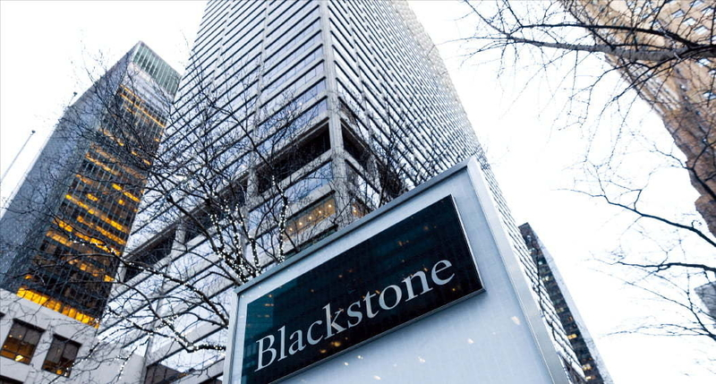
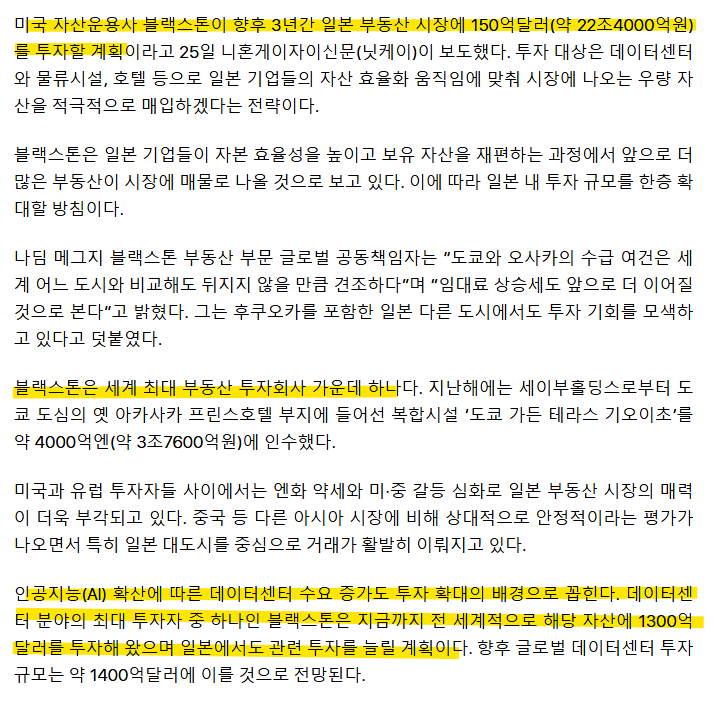
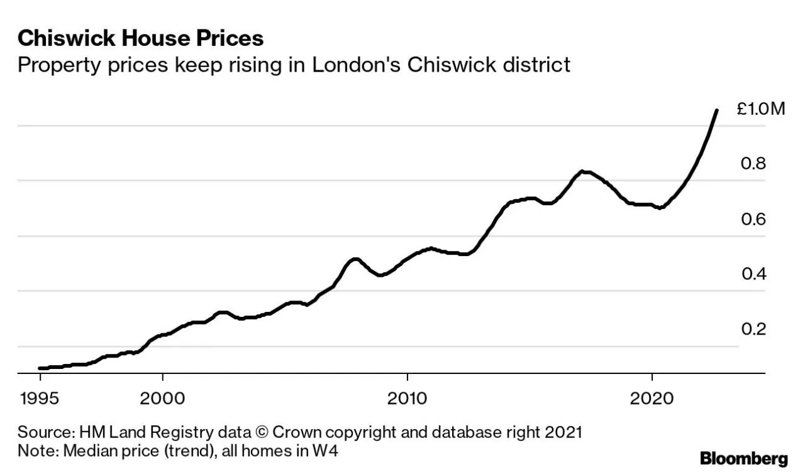
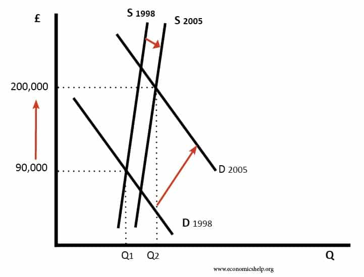
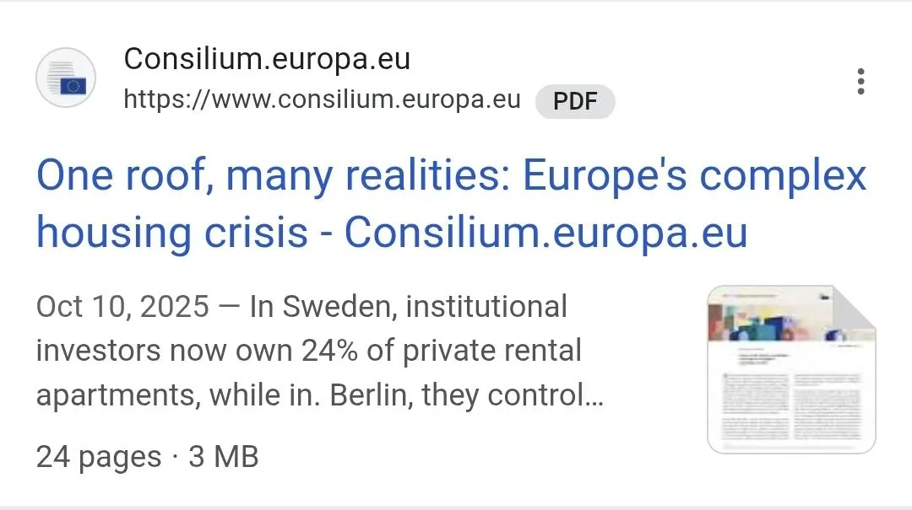

# 월세 메타와 주거 위협
**Date:** 2026. 3. 26. 0:03
**Category:** 다이어리
**Original URL:** https://blog.naver.com/xpfkwh56/224229665785
---

​

1. 블랙스톤 이라는 사모펀드가 있음

사모펀드 라는 말 답게도 **돈 되면** 다 함

​

시장에서 가격 결정이라는 것은

이론적으로는 상품의 벨류에이션에

​

비례하지만, 좋소 운영자들이라면

그게 현실과 다르단 것을 금방 알음

​

그럼 실제 가격은 뭐에 비례하느냐?

**'소비자의 고통 크기'** 에 비례함

​

제 블로그를 오래 봤던 분들이라면

간절한 사람들이 얼마나 취약해지고,

​

그들이 얼마나 지출에 호의적인지

아마 어렵지 않게 이해할 수 있을 것임

​

<https://v.daum.net/v/20260325104203123>

​

2. 블로그 경제학에서 말하는,

**'지주'** 메타를 활발히 사용하는 것이

블랙스톤 이라는 사모펀드 인데

​

얘네가 여기에 흥미를 보이는 이유는

실제 꽤 재미를 본 전례가 있어서 임

​

부동산에 있어서, 토지 그 자체는

​

지구가 개변하지 않는 이상

공급이 거의 변하지 않지만

​

사람이 건설하는 인공적 구조물인

주택은 공급이 유동적이게 됨

​

우리가 다 아는 것 처럼

주택은 물론, 건물 같은 것은

​

하루 아침에 세워질 수가 없고

규제를 비롯한 여러 이슈 때문에

**​**

**'공급'** 을 적재적소에 넣기 어려움

​

특히 주택의 경우는 어떨까?

**'살 집'** 이 없으면 나앉아야 됨

​

한낱 블라거가 망상 정도로 할 법한 짓을

블랙스톤은 **'진짜'** 현실에 구현을 해냈음

​

그들의 전략은 다음과 같음

​

​

3. 선진국 부동산, 특히 대도시 요지에 있는

노른자 땅은 결국 장기적으로 우상향을 한다

​

그렇다면, 사서 **'존버'** 를 타면 되는 것 아닐까?

​

런던, 홍콩, 도쿄, 뉴욕, 서울에 이르기까지

사실 이건 누구나 다 아는 이야기인데,

​

사모펀드를 비롯한 리츠는 이런 걸 진짜 함

​

​

부동산 **'공급자'** 입장에서도

사모펀드의 큰 손이 더 수월함

​

짤짤이로 1개씩 분양 때릴 바에야

B2B로 큰 손 하나를 잡아서 체결하면

손쉽게 현금화를 할 수 있기 때문임

​

만약 이런 짓을 **'전체 부동산'** 을 대상으로

독점적인 지위를 활용해 사용한다면야

​

문제가 될 수 있지만, 이들은 **'1부 리그'** 만

대상으로 하고 있기 때문에 티가 잘 안 남

​

없는 사람들을 대상으로 과세하는 것이나,

부자들을 대상으로 과세하면 문제가 되지만

​

흙수저 맞벌이 대기업 부부를 대상으로

착취하는 것은 용인되는 것과 유사한 셈임

​

​

스웨덴 민간 월세 아파트의 24%는

기관 투자자들이 소유한 기업형 월세고,

​

유력지 또한 메이저 자본은 약 3%,

많아야 10% 내외의 부동산을 갖고 있음

​

문제는 이런 기관 투자자들이

갖고 있는 땅들이 **'핵심지'** 란 것임

​

정확한 비유는 아니지만,

특정 대학가 인근 빌라 전체를

어떤 기관이 독점했다고 가정함

​

그럼, 그 지역 전체를 비율로 할 때

기관이 차지하는 파이는 작지만,

​

**'해당 대학가 월세 수요'** 라는 측면에선

독점적 지위를 갖고 시장에 개입할 수 있음

​

한편, 1급지가 뛰면 2급지, 3급지 아래로

가격을 줄 맞춰서 들어가는 것과 같이

​

기관 투자자 큰 손이, 다량의 부동산을

한 번에 쓸어가면 공급이 감소함과 동시에

**'호가'** 자체가 변형되는 현상 또한 발생함

​

A 지역이 x 원에 거래 되었다고 하면,

그 인근 B 지역은 x원을 기준으로

시세를 설정하는 것이 당연하기 때문

​

이렇게 시세 자체가 '끌려올라가면',

결국 건물을 지을 수 있는 '토지' 자체의

가치도 연달아 상승하게 되면서

​

결과적으로 중산층 이하는

**'집'** 을 소유할 수도 없고,

​

→ 기관만큼 지불할 여력 X

​

**'비싼 월세'** 를 감내하게 됨

​

→ 여기에 살아야 생계가 유지,

그러므로 다른 대안을 선택 못 함

​

4. 해외 선진국의 일부 지역 같은 경우,

문제가 있다, 라는 여론만 일부 있을 뿐

​

실질적으로 개입이 없는 경우도 허다하고

있다고 해도, 법제화가 느려서 이 문제를

문제라고 느낄 수 없게 된 경우들도 있음

**​**

**5. 그럼 우리도 곧 저렇게 되는 건가요?**

​

**우리는 법인이 주거용 취득하면**

**취득세만 10% 가 넘고 종부세 떼면**

**남는 것이 없어서 할 수가 없습니다**

​

6. 결론

​

1) 다주택 지주행세 하는 것은

나랏님이 호랭이를 쫓아 내줬기에

여우가 왕 노릇 할 수 있는 판때기

​

기관이랑 다이 뜨면 개인은 다 깨집니다

​

2) 남조선은 기본적으로

사회주의 DNA 기 때문에

​

자본주의 디스토피아?

여간해서 잘 안 나옵니다

​

3) 규제나, 제약이 내 벌이를 막고,

자본주의 활동에 방해가 된단 주장은

**상상력 부족** 일 가능성이 상당히 높음

​

눈에 보이는 것만 보니까,

다 방해물로 보이는 것

​

그게 본인의 **안전벨트** 인지도,

한 번 잘 생각해 볼 필요 있음

​

우리가 자유시장경제 랍시고

화교 자본 안 막았고,

​

**\* 박통의 공**

​

지하경제 양성화 안 했으면,

​

**\* 김영삼 대통령의 공**

​

26년에 마음 편하게 자본주의

드립 칠 수도 없었을 것임