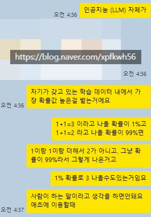

# 잉공지능
**Date:** 2026. 4. 2. 5:08
**Category:** 다이어리
**Original URL:** https://blog.naver.com/xpfkwh56/224237764054
---

​

1. 아주 엄밀한 설명은 아니지만,

실제 이용할 때 알고 모르고 차이 큼

​

2. 그리고 내가 대화를 연달아 하면

답변하는 AI 는 연결된 주체가 아님

​

**매 순간**, 독립적으로

연산하는 인스턴스임

​

**3. 사람과의 차이**

​

사람도 순간, 순간 판단에 따라서

가장 그럴싸한 대답을 하잖아요?

​

그럼 학습된 데이터로부터

모델링된 패턴을 추출해서

패러미터에 압축해놓고,

​

입력이 들어오면 그 가중치를

기반으로 확률 분포를 새로 계산

하는 것과 어떤 차이가 있죠?

​

​

인지과학 측면에서 기술적으로는

거의 똑같다고 봐도 무관한 얘기지만,

​

잉공지능은 벽에 비친 그림자를 보고

사람은 **원형을 본 상태다 라는 차이** 임

​

즉, 원형을 안 보고 말하는 사람이나

흉내 내고 있으면 잉공지능이 더 낫지만

​

구조적으로 잉공지능은 원형을 **못 봄**

**​**

**4. 원형을 보는 잉공지능과 인간의 차이**

**​**

인간은 **'뜨겁다'**, **'아프다'** 를 경험했음

​

그래서 뜨겁다 또는

아프다 라는 어휘에서

​

복합적인 컨텍스트 추론이 가능함

​

근데 잉공지능은 그 데이터 분포가

안 들어왔으면 **'일단'** 못 하고,

​

들어왔어도 모델링 여하에 갈림

​

그래서 찾은 해결책이 **'많이 넣자'** 임

​

겁나 많이 간접 경험을 하면

직접 경험한 사람 수준이 되거나,

​

그거보다 더 나을 수도 있으니

패러미터 크기를 키워서 풀자는 것

​

주류는 이렇게 하면 **'답'** 이 나온다고,

결과야 물론 어떻게 될지 모르지만

​

**'진짜 많이 넣으면 다를걸?'** 에서

**'어, 아닐 수도 있겠다'** 까진 왔음