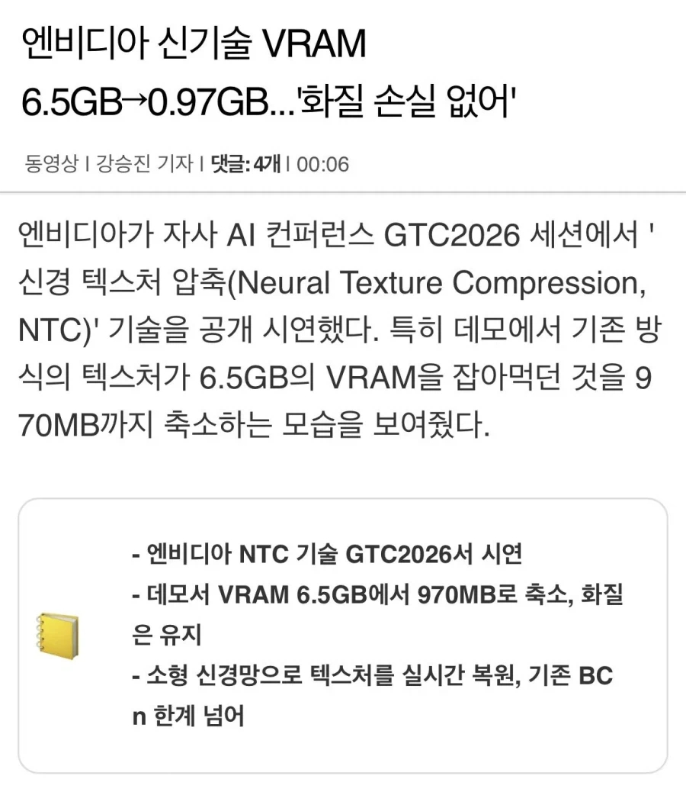

# GPU 와 인공지능 경량화 기술
**Date:** 2026. 4. 6. 18:13
**Category:** 다이어리
**Original URL:** https://blog.naver.com/xpfkwh56/224242887649
---

​

VRAM 12, 24, 36GB 는

각 단계가 올라갈 때마다

​

**'기본'** 100만원 단위씩 오름

​

여기서 대역폭 차이,

그리고 36GB 에서

​

엔비디아 기준, 48 64 96

128 이렇게 넘어가게 되면

​

천만원 단위로도 해결 안 나는데,

​

**\* 5090 이 독보적 지위인 이유**

​

NTC 기술이 VRAM 서빙을

**'6배'** 절약한다고 기술 시연함

​

1년도 아니고, 불과 3개월? 전만 해도

**'더 큰 모델'** 을 굴리는 것이 니즈였음

​

지금은?

​

아키텍처에 대한 이해를 바탕으로,

경량 모델 잘 굴리는 것이 **'실력'** 이 됨

​

프롬프트 엔지니어링 잘 뽑고,

고퀄리티 영상, 이미지 만들어주는

도메인 모델 아는 것이 **'실력'** 이었음

​

지금은?

​

**너 DIT 알아? 어? 몰라?**

**모르면 맞아야지**

​

이거임

​

**\* 클로드고, 제미나이고 증류모델이**

**매일매일 하루에 10개씩은 새로 나옴**

**​**

독일, 일본에 이르기까지 전 세대에서

두 국가는 **'제조업 최강'** 국가였음

​

그들이 망한 이유는,

**'기술력이 후달려서'** 가 아님

​

단지 **'비싸서'** 저리 된 것임

​

자본 시장에서 최고의 재료는

**'저렴하다'** 는 것이고,

​

사람들은 좋은 고기 원물을 찾기보다

미원 스프레이, 허브 솔트 같은 것을

뿌려서 먹으면 더 저렴하단 것을 알 때,

​

**\* 목살에 미원 스프레이 뿌리면**

**B급 고기도 A급 고기로 탈바꿈함**

**​**

그 상품을 소비하고자 하는 수요가

극단적으로 감소할 수 있는 경향 있음

​

**'여전히'** 사람들은 범용 모델을 선호함

나는 그게 **길어야 1년 정도** 라고 생각함