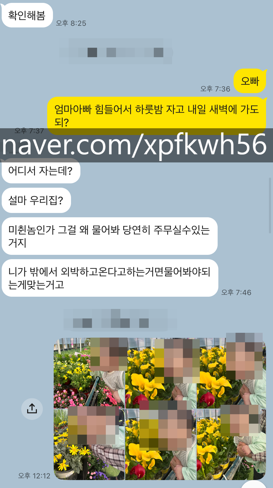

# 실랑
**Date:** 2026. 4. 9. 19:30
**Category:** 다이어리
**Original URL:** https://blog.naver.com/xpfkwh56/224246853057
---

1. 결국 씨도둑질은 몬한다고,

​

1호기 보고 있으면 드문드문

신랑이 겹쳐서 보일 때가 많음

​

아마 내 생각에는 이거는 진짜 ,,

애 낳은 여자들은 다 공감할 듯함

​

2. 일단, 1호기는 겁이 별로 없다

​

머리를 깎아줘도 깎아주나보다

주사를 맞아도 주사를 맞나보다

​

어디서 큰 소리가 나도

큰 소리가 나나보다 만만디로

​

죽고 사는 문제 아니잖음?

이라는 식의 반응이 잦다

​

**\* 딱 키우는 엄마만 느낄 수 있는 감으로**

**애가 확실히 자극에 대한 반응이 무뎌서,**

**대학병원까지 가서 예전엔 뇌도 찍었었다**

**​**

**결론은 그냥 쟤 성향 입니다 로 끝났지만**

**​**

그다지 칭얼대는 편도 아니고,

잘 우는 편도 아니라서,

​

이런 애기면 열도 키우겠다고

말씀하시는 분들이 있는 지경임

​

실제 키우는 입장에서 또한

손이 크게 가는 것도 아니고,

​

어째 알아서 크는 느낌이 더 많다

​

로봇 청소기 틀어놓으면 쫓아다니면서

올라타고 누르고 뽀뽀를 했다가 만졌다가

​

하루 종일 갖고 놀고, 휴대폰 충전줄 있으면

그거 하나만 갖고 1-2시간 내내 갖고 놀음

​

그러다 우우우! 아아아! 하면,

기저귀 갈아달라, 밥 달라 임

​

**\* 언어는 아니지만, 엄마랑은 소통이 됨**

**​**

3. 내가 아는 공포의 정의는

**'미지에 대한 두려움'** 인데,

​

내가 신랑한테 이런 얘기를 했었다

​

아직 1호기가 미지가 뭔지 몰라서

무서운 것과 아닌 것을 모르는 것 같다

​

**\* 애가 겁이 없음**

**​**

그러니, 신랑이 말하길

​

**공포가 왜 미지에**

**대한 두려움이냐?**

**​**

경험해 본 것이 두려운 것 아님?

​

이라고 대답을 하는 것을 보고,

​

이게 살아온 인생을 비롯해서

​

각자 유전자 단위에 새겨져 있는

프로그래밍 자체가 다름을 느낌

​

4. 당연히 재미로 볼 이야기지만,

​

어린 나이에 과부될까 걱정에

엄마가 어디서 듣고 용하답시고

​

딸래미가 피토를 해가면서 번 돈을

복채 몇 차례 뿌리고 다니신 적 있음

​

안 들었으면 모르는데,

일단 듣고 나니 궁금해져서

​

사주 따다가 몇 번 동냥 다녔는데

여복이랑 재복이 좋은 사주로 나옴

**​**

일단 같이 살면서 든 결론은,

**운이 좋은 인간** 은 맞단 점이다

​

5. 신랑은 나와 달리 10대 전반을

정말 나풀나풀 책가방만 들고 다녔다

​

**\* 학생부 보면, 학생 맞아? 소리 나옴**

**​**

으차피 내 남편이니 풀어보자면,

출결이고, 성적이고 다 **쓰레기** 다

​

졸업을 어찌 했나 싶을 정도로 말이다

​

그렇다고 비행을 했거나,

불량 학생인 것은 아니고

​

그냥 공부를 안 하고, 단순히 학교를

잘 빼먹는 그런 학생인 걸로 보이는데

​

이 과정에서, 어머님의 조력도 있었다

​

듣자 하니, 비가 오거나 많이 졸리면

​

병원에 들러서 진단서를 끊어다가

11시 즈음에 느긋하게 브런치 먹고

​

어차피 밥 먹었고 오전 수업은 텄으니,

점심 끝나고 등교를 하고는 했다는데

​

병결 처리를 하거나, 선생님께 연락드려

뒷수습을 하는 것이 다 어머님 몫이었음

​

맨날 그렇게 보낸 것은 아니지만

​

최소한 중학생 시절 기준으로는

졸업 턱걸이 정도 출결의 상태다

​

시아버지는 된다고 되냐 하고 진작 놨고,

큰 사고 안 치니 그런갑다 하는 가풍에서

​

중학생 때부터 대학생처럼 학교를 다녔으니

보면 증말 무슨 생각이었나 싶을 지경이다

​

**\* 난 학교 안 가면 전쟁 나는 줄 알았음**

​

6. 어영부영, 전형빨 운빨로 대학을 갔다가

뒤늦게 정신을 차려서 팔자를 바꾼 케이슨데

​

**\* 성실은 뒷전이고, 실전파에**

**벼락치기 스타일이라 정시로 감**

**​**

**수능 성적은 나보다 아득히 높은데,**

**막상 물어보면 아는 것은 별로 없다 ,,**

​

어찌저찌 또래 대비 좀 일찍

전문 자격증을 딸 기회가 생겨서,

​

또 하나 했으니 그거로 되었다 하고 쭉 놀고

직장 생활도 월급 보는 재미로 다녔다고 한다

​

그렇게 경력 좀 쌓다가, 그래도 아들이라고

​

**\* 시아버님이 별로 신랑을 달가워하진 않는데**

**그래도 늦게 본 아들 하나라고 그건 의미를 두심**

**​**

**자주 뵙지는 않는데 약간 성격이라고 해야 될까**

**그게 나랑 비슷하다는 느낌을 자주 받는 편이다**

**​**

**정확히는 아무것도 없는 베이스에서**

**뭔가를 일군 사람 간의 유대감이 느껴짐**

**​**

운영하던 제조업 받아서 그 시점부터

머리털 나고 첫 창업 받아서 한 것이

신랑의 제 2 인생, 사업 라이프 시작임

​

나도 장사를 해봤지만 이 바닥 자체가

내가 모른다, 는 곧 **목숨을 거는** 행위다

​

근데 신랑은 **'너무 간단하게도'**

대개 남한테 맡겨서 일처리를 한다

​

처세에 딱히 밝은 사람도 아니고,

아닌 말로 비즈니스 토크에 밝지도

​

골프를 치러다니든, 접대에 능하든,

뭐 이런 것도 아닌데 또 맡기고 보면

​

얼렁뚱땅 늘 나쁘지 않은 결과를 얻고

​

**\* 본인 나름의 철학은 있는데,**

**봐도 들어도 별 공감은 잘 안 감**

​

결국 결과만 놓고 보면 잘 풀려 있음

​

그렇다고 본인이 뭘 대단히 주도 하거나,

어떤 퍼포먼스를 내서 뭐를 만드냐? 하면

​

적어도 옆에서 봤을 때, 그건 **절대** 아니다

​

**\* 열심히 하지 않는 것은 아닌데,**

**뭔가 뭔가 ,, 같이 좀 살다 보니까**

**​**

**왜 시아버지가 나한테 그런 말씀을 하셨고**

**나를 아끼는지 여실히 이해할 수 있었음**

**​**

그냥 맡기면 이상하게 귀인 찬스가 잘 뜨고,

저건 핀트가 아닌 것 같은데? 싶은 짓을 해도

​

어찌저찌 느긋하게 시간 지난 다음에 보면

결국 결과는 다 잘 풀려져 있는 느낌이 많음

​

신랑 업종이 제조업이라, 나도 나름대로

장삿밥 좀 먹었다고 걱정 반 쯤인 마음에

훈수를 이래저래 조심히 뒀던 적이 있는데

​

개 어이없는 운빨로 결과가 좋게 나와서

신랑 사업에 대해선 코멘트를 안 하고 있다

​

굳이 비유하자면, 주식계좌를 처음 팠는데,

​

제일 첫 화면에 삼성전자가 나와서

삼성전자? 들어봤는데? 하고 샀더니

​

반도체 쇼티치 터지면서 떡상하는

이런 식으로 인생 살아온 사람인 듯 했다

​

신랑 행운에 대한 가장 극명한 사례는

평소에 복권 사지도 않는데, 주변 지인한테

선물 받은 로또가 3등을 맞은 적도 있음 ,,

​

**\* 직접 본 것은 아니고, 주변 지인들 피셜**

**​**

본인은 나름대로 다 뜻과 이유가 있다지만,

​

무촌 사이에 가까이 보고 드는 총평은

**그냥 제대로 임자 만나본 적이 없으니까**

​

쨌거나 뭐 별 일 있겠어?

가 패시브 스킬인 사람이고,

​

열심히 사는 스타일인 것은 맞지만,

그 집중력이 **'명확히'**, 짧다

​

**\* 성실하지 않은 인간이라는 것 ;;**

​

우다다다닥 하나 해치워놓고,

허송세월 하면서 얼렁뚱땅 살다가

​

또 뭐 하나 나오면 후다다다닥

하는 방식의 라이프 스타일인데,

​

**이래도 되나?** 싶지만, **그래도 되는**

사람도 있구나 라는 결론인 상태다

​

본인이 뭐 하고 있을 때는 아주 아주 그냥

사업하는 남자 특유의, 지금 내가 지구에서

제일 위대하고, 장엄한 일을 하고 있어 모드

​

히스테릭의 레벨이 보통이 아니고,

​

또 전환이 일어나서 나풀나풀 살 때는

**이게 괜찮을까** 싶을 정도로 늘어진다

​

7. 신랑의 압도적 조력자는 어머님인데,

​

사주에 여복이 좋다는 것은

아마 어머님을 말하는 것 같다

​

싶을 정도로, **엄마복** 이 좋다

​

전부는 아니겠지만, 사업하는 남자한테

시집간, 여자들의 다수는 아마도 대부분

**비서 노릇을 하면서** 살게 되기 마련인데,

​

원래 그랬던 분인지, 아니면 가업을

시아버님이랑 함께 일구며 쌓이게 된

짬바에서 온 것인지는 불확실하지만

​

디테일과 내조력이 예사롭지가 않고,

​

신랑의 글자 그대로, **'하잘 것 없는'**

발상을 빌드업해서 퀄리티 있는 실체로

만드는 경우를 상당히 자주 목격했다

**​**

**\* 신랑 주변엔 이런 사람들이 많음**

​

아마, 학창 시절에서의 출결 파트도

​

아들이 늦잠을 자고 있으면

어머님이 요량껏 출결 체크해서

어떻게 하면 우회할 수 있는가?

​

라는 것을 짜서 들어가신 것 같고,

​

뒤늦게 학업에 뜻이 생겼을 때도

뒷바라지에 큰 영향 있었을 것이다

​

어머님은 거의 **캐리아급 서포터** 니까

​

일례로 집에 신랑이 자고 있었는데,

밖에 잠깐 나갔다 오실 일이 있었다

​

그냥 삐삐삐 비번 누르시면 될 것을,

나한테 카톡 보내시고 답장올 때까지

​

기다리셨다가 내가 문 열어주니까

그제야 열고 조심스레 들어오셨는데

​

**미국+중국 총통이 자고 있어도**

**그렇게 조심스럽진 않을 것 같았다**

​

8. 물론 그와 별개로,

신랑은 불속성 효자다

​

어머님이 집에 가끔 오실 때

시간이 길어진다 싶으면

​

댁에 가서 주무시라고 하거나

​

보는 내가 민망할 정도로

어떤 의미로는 선조치, 또는

어머님께 타박을 할 때가 많다

​

**\* 1호기가 저럴 것이라고 생각하면**

**솔직히는 아찔함이 느껴질 정도**

​

퍼스널 스페이스에 대한

기묘한 집착도 있는 편이라,

​

**자기 영역**이 있어야 되는 인간인데

​

**\* 자기 영역, 자기 시간, 매우 중시**

​

나야 뭐 내가 골라 만나는 남자에다

나 또한 흠 많은 인간이라 그런갑다 다

​

우리 부모님이 집 근처로 오셔서,

아기랑 같이 꽃구경을 하러 갈 때 였는데

​

마침 뭐 하고 있는 일이 있다고 해서

바빠서 스킵하고 말았던 적이 있다

​

우리 부모님 입장에서는, 이에 대해서

여기는 관점이 두 가지 일 것 같은데

​

하나는 사업 한다는 딸 서방이니까

아무렴 뭐 바빠서 그런갑다 라는 이해

​

**\* 잘 버는 것도 무시할 순 없는 부분이고,**

**시간은 잘 안 쓰지만 돈은 시원시원하게 씀**

**​**

또 하나는, 마음에야 쏙 들게

사근사근하지는 않더라도 아들이야

**​**

**다들 원래 그런 것이다** 마인드와

괜한 변수로 부부 관계에 지장을

주지 않겠다는 배려 정도로 읽혔다

​

그러다, 어느 날 너무 시간이 늦어져서

신랑한테 카톡을 슬쩍 보낸 적 있는데

​

​

이렇게 대답을 했던 적이 있음

​

내가 전달하려고 했던 바는,

​

엄마 아빠가 여독도 있고

바로 가려면 힘드니까

우리 집에서 하룻밤 주무시고

내일 새벽에 가도 되냐 였고,

​

신랑이 이해한 바는,

​

위 같은 사유 때문에

내가 **'밖에서'** 자도 되냐

라는 질문이라고 이해했는데

​

그게 제정신인가? 라고 생각해서

​

친정 부모님이 집에서 주무셔도

되냐는 질문으로 이해했는데,

​

그걸 왜 물어보지? 라는 생각으로

저렇게 대답을 했다고 한다

​

일단 아무튼 그렇군, 하고 넘어갔는데

며칠 있다가 신랑한테 근데 님아

​

님네 부모님은 집에 올 때마다

전화로 컷하고 애기 보러 온다고

하면 어쩌다가 한 번이나 Ok 인데

​

왜 우리 부모님은 바로 Ok 했음?

이라고 물어보니,

​

우리 엄마 아빠랑

니네 부모님이랑 같음?

​

이라고 장난인지, 진심인지

알기 어려운 대답을 했었음