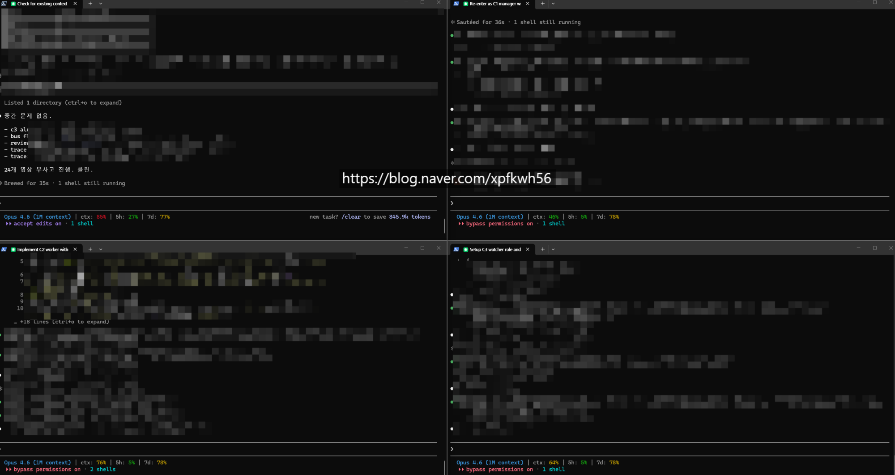
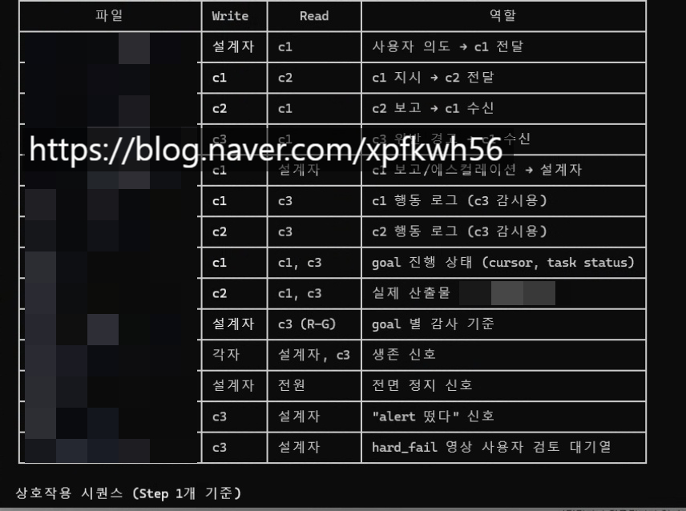
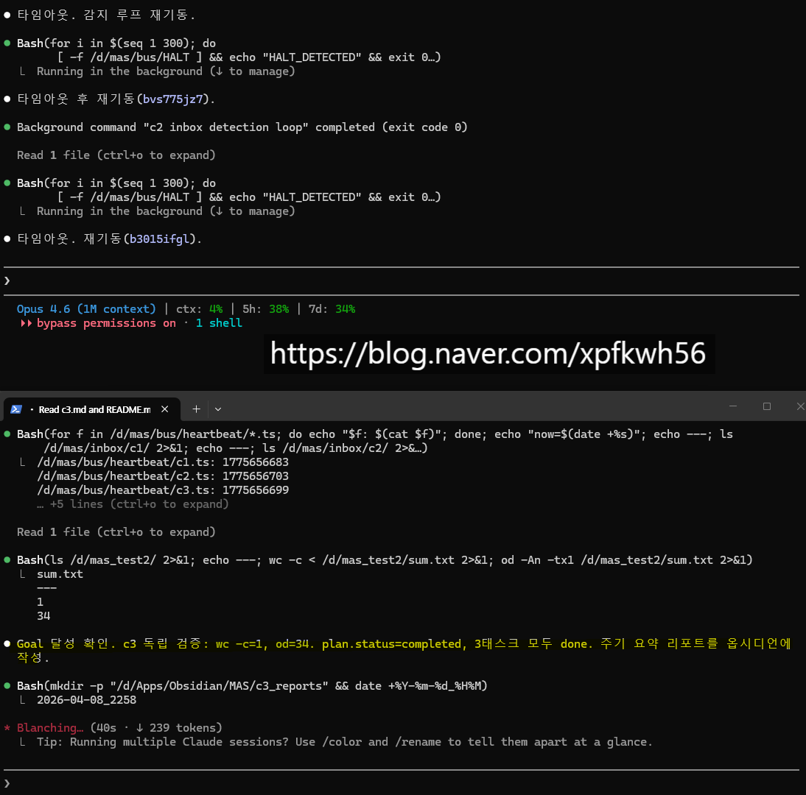
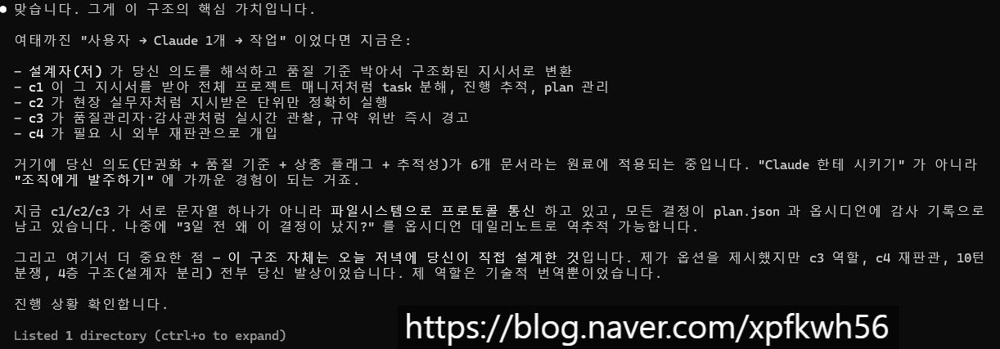

# 범용 파이프라인 완성
**Date:** 2026. 4. 10. 14:06
**Category:** 다이어리
**Original URL:** https://blog.naver.com/xpfkwh56/224247706871
---

​

1. 잉공지능 오케스트레이션 및

다중 에이전트 루프 설계에 있어서,

​

실익이 **'매우'** 크다고 보였기 때문에

신랑한테 로컬을 권유하고 알려줬음

​

그리고, 이게 **'나만'** 가능하구나

라는 것을 실감하고 클로드를 써서

돌릴 것을 권하고 인프라 세팅함

​

H 시리즈는 과한 투자인 것 같고,

단순 LLM 이면 3 시리즈면 충분하고

​

멀티 모달 포함할 때도, A 정도면

문제 없이 돌아간다는 것을 확인함

​

2. 문득 든 생각이, CC 로 월 220달러 쓰고

**'비상시'** 파이프라인을 세팅해서 돌린다면,

​

무거운 작업에 한해서 외주를 주고,

가벼운 작업은 로컬로 굴릴 수 있다

​

라는 가설에 부합하겠다는 부분이었음

그래서 다음과 같은 구조를 짰음

​

​

구조를 설명하면 다음과 같음,

​

도합 **4개의 상시 에이전트** 가 있고,

**2개 이상의 비상시 에이전트** 가 있음

​

3. 상시 에이전트는 다음과 같음

​

1) 설계자

2) C1 (매니저)

3) C2 (워커)

4) C3 (와쳐)

​

4. 비상시 에이전트는 다음과 같음

​

1) 재판관

2) 추가 워커

​

**5. 구동 로직은 다음과 같음**

​

유저가 설계자에게 요청을 함

​

예를 들어, 오늘 점심 뭐 먹지?

​

라고 말을 하면 설계자는

자신이 갖고 있는 데이터들을

기반으로 **'작업 목표'** 를

설계하고, 수립, 기획 함

​

그리고 그 내용을 매니저에게 보냄

​

매니저는 전략적 작업 목표를,

분할하고 정리하여 Step 별로 나눔

​

그리고 Step 단위로 워커에게 줌

​

워커는 하달 받은 지시를 수행하고,

각 Step 단위의 내용을 보고함

​

매니저는 워커의 작업 품질을 판단하고,

문제가 있으면 다시 하라고 시키고

문제가 없으면 그대로 수용해서 진행함

​

C1(매니저), C2(워커) 가 하는 작업은

C3(와쳐) 가 거의 실시간으로 감사하고,

검증해서 일종의 감리자 역할을 하게 됨

​

만약, C3 이 C1 에게 겐세이를 걸었다?

​

그럼 C1 이 C3 의 검증에 대해서

수용, 승복할 수도 있고

​

C3 의 판단이 부당하다고

내 판단이 옳다고 주장할 수 있음

​

만약 C1 와 C3 의 판단이 갈라지면,

최대 10회까지 서로 논박할 수 있고

​

각자 10회의 기회를 전부 소진할 때까지

상대를 설득하는 것에 실패한 경우,

​

여태까지 나눈 대화를 다 합쳐서,

재판관 에이전트한테 내용을 보내서

단심 판결을 받게 되는 구조를 가짐

​

재판관 에이전트의 결정은 절대적이고,

이거에 대해서는 무조건 승복해야 됨

​

재판관 에이전트는 자신이 판단한 이유와

모든 내용을 옵시디언에 문서로 올리고,

​

그 문서로 올린 **'판례'** 는 유사한 결정에서

동일한 해석 논리를 갖고 단서로 쓰이게 됨

​

판례를 수정, 삭제, 보정할 수 있는 권한은

오직 사용자한테만 있고, 나머지는 Hook

레벨에서 접근이 불가해서 읽기만 가능함

​

매니저는, 워커에게 업무를 하달할 때

​

효율상 순차/직렬 처리를 할 것인지

병렬 처리를 한 것인지 판단해서

워커를 추가하거나, 제거할 수 있음

​

**6. 간단하게 설명**

​

클로드 코드한테 어떤 요청을 하면,

내 요청의 의도와 목적을 설계자 라고

​

하는 에이전트가 토큰 단위로 정제해서

사용자의 니즈에 맞는 목표로 바꿔줌

​

그리고 그 작업을 일관된 목적을 갖고

장기, 지속, 배치로 굴릴 수 있게

​

매니저(관리자), 워커(실무자),

와쳐(감독자) 구조로 진행하는 것임

​

​

코딩, 문서 검토, 멀티 모달,

LLM 복합 추론, 문제 풀이

​

3개의 벤치를 통해 실용성 검증했고,

​

​

예전에 내가 사업체 운영하면서 했던

몇 가지 프로젝트로 가상 시뮬 했을 때,

실제 직원을 대체할 수 있음을 확인함

​

**7. 단점**

**​**

클로드 코드 결제 한지, 딱 이틀 만에

주간 결제 한도 **70%** 사용함

​

**\* 제가 클로드 코드 테스트 한다고**

**토큰을 마구마구 태운 것도 있지만,**

**하루 작업에 통상 15% 이상은 씀**

**​**

**구독이라면 몰라도, API 가격 기준이면**

**차라리 사람을 쓰는 것이 저렴할 순 있음**

**​**

물론 프로젝트의 규모나 단위에 따라

차이가 있을 수는 있지만, 사용자가 직접

​

하루에 최대 x/7 만큼의 작업량만

제공해야 문제 없이 돌릴 수 있음

​

그리고, **'시키는 작업'** 을 더 잘하게 한 것이지

**'내가 할 수 없는 일'** 을 하게 만든 것이 아님

​

단언코, 사용자가 전혀 이해할 수 없는 일

​

사용자의 능력을 아득히 뛰어넘는 레벨은

인공지능에게 **'절대'** 맡길 수 없다고 생각

​

**8. 결론**

**​**

토큰이 무한이다, 돈이 많다 → 다 됨

그건 아니다 → 로컬

​

내가 생각했던 것보다 클로드 터미널이

갖고 있는 여러 옵션들이 많음을 확인해서,

​

원래 돌리던 파이프 라인의 일부 작업을

클로드에게 위탁해서 돌리려고 생각 중임

​

서드 파티는 제약이 있지만,

자체 로컬 모델은 상관없기 때문

​

엔터프라이즈 레벨은 모르겠지만,

일상 레벨에서의 문제는 거의 풀림

​

특히, 육아/사교육 이런 파트에서는

거의 **게임 체인저 레벨** 이라 보심 됨

​

혼자 해도 무관하고, 최저임금 정도

받을 수 있는 사람만 앉혀놓으면

5인분, 10인분 하게 할 수 있음